# **BLUEPRINT- Low Code AI Agent Workflow Builder**

Project Named: Wayang  
Company: kayys.tech

Professional Low-Code AI Agent Workflow Builder built on Quarkus.  
It covers Nodes, Workflow Engine, Execution Runtime, Guardrails, RAG, Tools, Agent, Start/End, and supporting infrastructure such as Storage, WebSocket, and LLM Providers, etc.

# **Architecture**

## **Complete Architecture**

Full set of advanced enterprise components (the complete, production-grade superset we discussed) into the single, unified architecture diagram. This diagram keeps your original structure (UI, Gateway, Core Quarkus services, CodeGen, Standalone runtime, Infra) and now includes every additional component/node required for enterprise-grade agent deployments: analytics, evaluator, optimizer, multi-agent coordination, lifecycle & model management, security, reliability, HITL, simulation, memory scorers, agent negotiation/supervision/reflection, and more.

```mermaid
flowchart LR  
  %% \=============================  
  %% UI & Developer Tooling  
  %% \=============================  
  subgraph UI\[Low-Code UI & Developer Tools]
    direction TB  
    Editor\[Editor & Canvas]
    Debugger\[Debugger & Reasoning Visualizer]
    Linter\[Workflow Linter / Optimizer]
    NodeAuthor\[Agent-assisted Node Authoring]
    WSClient\[WebSocket Client]
    CodeGenUI\[CodeGen Settings & Export Panel]
    BIConsole\[Analytics / BI Console]
    HumanPortal\[Human-in-the-loop Console]
  end

  %% \=============================  
  %% API / Gateway Layer  
  %% \=============================  
  subgraph Gateway[API Gateway & Auth]
    direction TB  
    APIGW[API Gateway rate-limit, TLS]
    Auth[AuthN/AuthZ SmallRye-JWT, RBAC]
    Audit[Audit & Provenance Collector]
    AccessPolicy[Access Policy Manager ABAC / RBAC]
  end

  %% \=============================  
  %% Core Quarkus Services (microservices)  
  %% \=============================  
  subgraph Core[Quarkus Platform — Core Services]
    direction TB

    %% Designer & CodeGen  
    Designer[Designer Service CRUD \+ Validation]
    SchemaReg[Node Schema Registry]
    VersionSvc[Versioning Service]
    PluginMgr[Plugin Manager hot-reload, signed artifacts]
    CodeGen[Agent Code/Runtime Generator PAC]
    TemplateLib[Code Templates & Runtime SDK]
    BuildSvc[Build/Compile Service Maven/Gradle/Docker/Native]

    %% Reasoning & Orchestration Brain  
    Planner[Planning Engine task decomposition]
    Orchestrator[Orchestrator Adaptive Orchestration]
    Decomposer[Decomposer Taskifier]
    Reasoner[Reasoner Scratchpad Engine]
    Coordinator[Coordinator Workflow Engine]
    StateMgr[State Manager Global State]

    %% Evaluation / Quality / Optimization  
    Critic[Critic Evaluator Service]
    Evaluator[Evaluator Node LLM-as-judge rules]
    Optimizer[Runtime Optimizer Auto-tuner]
    SelfRefine[Self-Refinement Agent]

    %% Tools, Guardrails & Execution  
    RuntimeHub[Runtime Hub schedules & executors]
    NodeExecutor[Node Executor sandbox sidecar]
    ToolReasoner[Tool Reasoner]
    ToolGateway[Secure Tool Gateway]
    ToolExecutor[Tool Executor API Integrator]
    Guardrails[Guardrails Engine CEL OPA]
    ValidatorSvc[Validator Node Service schema/type]
    EnricherSvc[Enricher / Metadata Service]
    SyncSvc[Data Sync & Ingestion Service]
    DecisionSvc[Decision / Rule Engine CEL]

    %% Memory, RAG, KG, Multimodal  
    MemorySvc[Memory Service episodic/semantic/procedural]
    MemoryScorer[Memory Scorer]
    RAGsvc[RAG Service pgvector / VectorDB adapter]
    KG[Knowledge Graph Service]
    KnowledgeSynth[Knowledge Synthesizer]
    KnowledgeRouter[Knowledge Router multi-RAG]
    Multimodal[Multimodal Inference Service Vision/Audio/OCR]

    %% Model & Inference management  
    ModelRouter[Model Router & Router Policy]
    ModelEvaluator[Model Evaluator / A/B]
    VersionMgr[Model Version Manager]
    InferenceOpt[Inference Optimizer cache/batch/quant]

    %% Analytics, Telemetry & Feedback  
    MetricsCollector[Metrics Collector]
    Analytics[Real-Time Analytics Engine]
    FeedbackMgr[Feedback Loop Manager]
    TraceCollector[Trace & Telemetry Collector OTel]
    BIEngine[BI / KPI Engine]

    %% Governance, Security & Compliance  
    PolicyEngine[Policy Engine CEL Rego]
    EthicsAgent[Ethics / Compliance Agent]
    SecretMgr[Secrets Manager Vault]
    EncryptionSvc[Encryption / Tokenization Service]
    Provenance[Provenance & Lineage Store]

    %% Reliability & Ops  
    FallbackAgent[Fallback Agent]
    RetryManager[Retry/Timeout Manager]
    CircuitBreaker[Circuit Breaker]
    ChaosSim[Chaos / Resilience Simulator]
    Scheduler[Resource Scheduler]

    %% Multi-Agent management  
    AgentRouter[Agent Router / Selector]
    AgentNegotiator[Agent Negotiator]
    AgentSupervisor[Agent Supervisor]
    ReflectionAgent[Reflection / Meta-cognition Agent]

    %% Human-in-the-loop  
    HITL[Human-in-the-loop Manager]
    Escalation[Escalation / Human Ops]
    Labeling[Labeling & Annotation Service]

    %% DevOps / CI  
    CI[CI/CD & Artifact Repo Nexus/Artifactory]
    ArtifactRepo[Artifact Repository]
    PluginScanner[Static Scanner / SCA]
  end

  %% \=============================  
  %% Standalone Runtime Output (Portable Agents)  
  %% \=============================  
  subgraph Standalone[Standalone & Portable Agents]
    direction TB  
    GeneratedAgent[Generated Agent App JAR / Native / Docker / WASM]
    AgentSDK[Embedded Agent Runtime SDK tiny]
    LocalAdapters[Local Adapters Local RAG, Local Model]
    LocalTelemetry[Light Observability Client]
  end

  %% \=============================  
  %% External Systems / Infra  
  %% \=============================  
  subgraph Infra[External Systems & Infra]
    direction TB  
    Postgres[Postgres \+ pgvector]
    ObjectStore[S3 / Blob Store]
    VectorDB[Milvus/Weaviate optional]
    LLMs[LLM Providers Ollama/Triton/OpenAI/vLLM]
    Tools[Third-party APIs / Tools]
    Vault[Secrets Manager Vault]
    K8s[Kubernetes containers, jobs]
    TimeSeries[Time-series DB Prometheus/ClickHouse]
    Tracing[Tracing Jaeger/Tempo]
  end

  %% \=============================  
  %% Connections  
  %% \=============================

  %% UI \<\> Gateway  
  Editor -->|REST / GraphQL| APIGW  
  WSClient -->|WS| APIGW  
  CodeGenUI --> APIGW  
  BIConsole --> APIGW  
  HumanPortal --> APIGW

  %% Gateway \<\> Core  
  APIGW --> Auth  
  APIGW --> Designer  
  APIGW --> Debugger  
  APIGW --> Linter  
  APIGW --> NodeAuthor  
  APIGW --> CodeGen  
  APIGW --> BIEngine  
  APIGW --> HumanPortal  
  APIGW --> AccessPolicy

  %% Designer & Schema & Plugins  
  Designer --> SchemaReg  
  Designer --> VersionSvc  
  Designer --> PluginMgr  
  PluginMgr --> PluginScanner  
  PluginScanner --> Governance[Governance/Approval]
  Governance --> Loader[Loader]
  PluginMgr --> CI  
  CI --> ArtifactRepo

  %% CodeGen Flow  
  Designer --> CodeGen  
  SchemaReg --> CodeGen  
  VersionSvc --> CodeGen  
  PluginMgr --> CodeGen  
  CodeGen --> TemplateLib  
  TemplateLib --> BuildSvc  
  BuildSvc --> ArtifactRepo  
  BuildSvc --> GeneratedAgent  
  GeneratedAgent --> AgentSDK  
  AgentSDK --> LocalAdapters

  %% Orchestration & Planning  
  Planner --> Decomposer  
  Decomposer --> Orchestrator  
  Orchestrator --> Coordinator  
  Orchestrator --> Scheduler  
  Orchestrator --> EventBus[Event Bus Kafka]
  EventBus --> Orchestrator

  %% Reasoning & State  
  Planner --> Reasoner  
  Reasoner --> StateMgr  
  StateMgr --> MemorySvc  
  StateMgr --> RAGsvc

  %% Runtime \<\> Executors  
  Scheduler --> RuntimeHub  
  RuntimeHub --> NodeExecutor  
  RuntimeHub --> StreamingRT[Streaming Execution Layer]
  NodeExecutor -->|pre-check| Guardrails  
  StreamingRT --> Guardrails

  %% Node execution & tooling  
  NodeExecutor --> ToolReasoner  
  ToolReasoner --> ToolGateway  
  ToolGateway --> ToolExecutor  
  ToolExecutor --> Tools  
  NodeExecutor --> RAGsvc  
  NodeExecutor --> MemorySvc  
  NodeExecutor --> Multimodal  
  NodeExecutor --> ModelRouter  
  ModelRouter --> LLMs

  %% Evaluator / Critic / Optimizer loops  
  NodeExecutor --> Evaluator  
  Evaluator --> Critic  
  Critic --> Optimizer  
  Optimizer --> Planner  
  SelfRefine --> Planner

  %% Knowledge & data stores  
  RAGsvc --> Postgres  
  RAGsvc --> VectorDB  
  MemorySvc --> Postgres  
  KG --> Postgres  
  KnowledgeSynth --> RAGsvc  
  KnowledgeRouter --> RAGsvc  
  Provenance --> Postgres  
  Designer --> Postgres  
  VersionSvc --> Postgres  
  ObjectStore --> NodeExecutor  
  SecretMgr --> ToolGateway  
  SecretMgr --> ModelRouter

  %% Analytics & Feedback  
  MetricsCollector --> Analytics  
  Analytics --> TimeSeries  
  Analytics --> BIEngine  
  TraceCollector --> Tracing  
  FeedbackMgr --> Evaluator  
  FeedbackMgr --> ModelEvaluator  
  BIEngine --> Optimizer

  %% Governance & Compliance  
  PolicyEngine --> Guardrails  
  PolicyEngine --> AccessPolicy  
  EthicsAgent --> PolicyEngine  
  EncryptionSvc --> Provenance

  %% Reliability & Ops  
  NodeExecutor --> FallbackAgent  
  NodeExecutor --> RetryManager  
  ToolGateway --> CircuitBreaker  
  ChaosSim --> RuntimeHub  
  Scheduler --> K8s

  %% Agent management  
  AgentRouter --> Orchestrator  
  AgentNegotiator --> AgentRouter  
  AgentSupervisor --> AgentRouter  
  ReflectionAgent --> AgentSupervisor

  %% Human-in-the-loop  
  HITL --> HumanPortal  
  HITL --> Orchestrator  
  Escalation --> HumanPortal  
  Labeling --> CI

  %% Observability & Audit  
  Analytics --> Observability[OTel \+ Prometheus \+ Grafana]
  Observability --> Orchestrator  
  Observability --> NodeExecutor  
  Audit --> Provenance  
  Provenance --> ExplainSvc[Explainability Engine]
  ExplainSvc --> Debugger  
  ExplainSvc --> HumanPortal

  %% Plugin manager loads to runtime  
  PluginMgr --> NodeExecutor  
  PluginMgr --> Designer  
  PluginMgr --> Orchestrator

  %% Standalone runtime telemetry & sync  
  GeneratedAgent --> LocalTelemetry  
  LocalTelemetry --> Analytics  
  GeneratedAgent --> LocalAdapters  
  LocalAdapters --> RAGsvc  
  LocalAdapters --> ModelRouter

  %% CI / Artifacts  
  ArtifactRepo --> PluginMgr  
  ArtifactRepo --> CodeGen  
  CI --> PluginMgr  
  CI --> APIGW

```

### **✔️ Architecture Summary**

#### **What i have:**

* RAG  
* Guardrails  
* Nodes (Agent, Tool, RAG, Start/End)  
* Orchestrator  
* Node Executor  
* WebSocket  
* pgvector  
* Plugin manager

  #### **To modernize the agent stack, add:**

  ##### ***🧠 Intelligence***

* Planner  
* Critic  
* Tool Reasoner  
* Persona Engine  
* Explainability Engine

  ##### ***🧩 Memory & Data***

* Long-term memory  
* Episodic memory  
* World-state store  
* Behavior learning store  
* Knowledge graph

  ##### ***🔐 Safety/Governance***

* Ethical policy engine  
* Provenance tracking  
* Safety sandbox

  ##### ***⚙️ Execution***

* Distributed execution  
* Multi-model router  
* Multimodal inference  
* Streaming execution

  ##### ***🧰 Developer Tools***

* Intelligent node auto-generator  
* Debugger & visualizer  
* Workflow linter

### **Brief legend & notes**

* API Gateway & Auth: central ingress; all UI traffic passes through with RBAC and auditing.  
* Designer, SchemaReg, VersionSvc: workflow design, node schema management, and immutable published versions.  
* PluginMgr: dynamic node/plugin lifecycle (hot-load, signature verification, version rollback).  
* Planner: decomposes high-level tasks into execution plans or modifies plans at runtime.  
* Orchestrator \+ RuntimeHub: adaptive orchestration that accepts plans, rewrites DAGs, and delegates to executors.  
* NodeExecutor: runs nodes in sandboxed environments (JVM classloader sandbox, sidecar containers, or K8s jobs); enforces resource quotas and timeouts.  
* StreamingRT: handles streaming/partial outputs and supports interactive/human-in-loop flows.  
* ToolReasoner \+ ToolGateway: synthesize and validate tool calls; gateway governs calls (schema validation, rate limiting, secret injection).  
* Guardrails: pre/post policy checks (PII, content safety, capability checks). Policies authored in CEL or OPA.  
* Critic: evaluates outputs and triggers re-plan/retry/alternative flows.  
* PersonaSvc: creates role/system prompt variations; customizes agent behavior per persona.  
* Explain: produces human-readable rationales, provenance, and confidence scores.  
* MemorySvc / RAGsvc / KG: long-term memory, RAG embeddings (pgvector), and structured knowledge graph for entity/relationship reasoning.  
* ModelRouter: latency/cost-aware model selection and fallback (local GPU, cloud, vLLM).  
* Multimodal: image/OCR/audio pipelines; unified invocation from nodes.  
* EventBus, Observ, Provenance: event-driven durability, tracing, metrics, and lineage for auditing & explainability.  
* Developer Tools: node auto-generation, linter, debugger, and visualizer improve productivity and safety.

## **Explanation of the Architecture**

## 

Below is a practical, production-grade enhancement plan for a modern AI agent platform that goes beyond RAG and Guardrails.  
These additions reflect current best practices in deep agentic workflows, multi-agent reasoning, tool synthesis, and secure distributed execution.

I divide into:  
1\. Core Intelligence Components  
2\. Execution & Runtime Enhancements  
3\. Data \+ Memory Enhancements  
4\. Governance, Safety & Compliance Enhancements  
5\. Infra, Scaling & Observability Enhancements  
6\. Developer Productivity / Low-Code Builder Enhancements

### **1\) Core Intelligence Components (Modern Agent Patterns)**

#### **1.1 Planning Engine (strategic AI planner)**

Even if nodes include “Agent Nodes”, a dedicated Planner is critical.

Modern agent platforms like OpenAI Swarm, LangGraph, Deep Agents use a planner for:

* Breaking down tasks into steps/sub-tasks  
* Selecting appropriate nodes/tools dynamically  
* Re-ordering nodes at runtime  
* Multi-agent task allocation  
* Conditional branching beyond static workflows

Implementation:

* planning-service with LLM-based and rule-based planners  
* Planner API that returns a DAG or linear execution plan  
* Planner uses RAG, memory, roles, and current world-state (context)

  #### **1.2 Critic / Evaluator Agent**

This is different from Guardrails.

* Guardrails \= safety, policy checks  
* Critic \= quality evaluation, reasoning verification

  ##### ***Critic agent evaluates:***

* Reasoning correctness  
* Tool selection quality  
* Completeness  
* Hallucination risks  
* Output grading against metrics

Critic agent can automatically trigger:

* Re-plan  
* Re-execute node  
* Switch model  
* Ask clarifying questions

  #### **1.3 Orchestrator v2 → Runtime-Aware Orchestration**

Current orchestrator is deterministic.

Modern agent systems require adaptive orchestration:

* Dynamic node selection  
* On-the-fly DAG rewriting  
* Multi-agent negotiation  
* Multi-model inference switching (fast vs slow model)  
* Model cascading (e.g., small → medium → big model)  
* Failure-aware path modification

Add module:  
adaptive-orchestration-engine

#### **1.4 Agent Persona Engine**

Agents now need configurable persona:

* Reasoning style  
* Communication preference  
* Domain knowledge level  
* Behavioral constraints  
* Level of autonomy/permissions

Persona engine generates:

* Custom prompts  
* System role templates  
* Memory-weighting  
* Safety constraints customizing per persona

Useful for your low-code builder: persona becomes a node type.

### **2\) Execution & Runtime Enhancements**

#### **2.1 Tool Reasoner / Tool Synthesizer**

Modern agents (e.g., DeepSeek R1) synthesize new tool calls at runtime.

Add tool reasoning engine:

* Select right tool  
* Generate API call structure  
* Validate call using schema  
* Transform tool response  
* Self-correct tool parameters on failure

Technically:  
A new component before NodeExecutor: ToolReasoner

### **2.2 Secure Tool Gateway**

#### 

To prevent LLMs calling tools directly without control:

* Policy-based tool permission system  
* Rate limiting per tool  
* Input/Output schema validation (JSON schema)  
* Throttling & do-not-call list

New module:  
tool-gateway (sits between agent node ↔ real tool).

#### **2.3 Multi-Modal Execution Engine**

Agents need vision, OCR, speech, embeddings, etc.

Add nodes:

* VisionNode  
* AudioToTextNode  
* ChartUnderstandingNode  
* OCRNode

Add multi-modal inference service:

* Unified interface for image/video/audio/txt  
* LLM \+ multimodal model routing (e.g., CLIP \+ Llama \+ Whisper \+ OCR)

  #### **2.4 Async/Streaming Execution Layer**

Agents today rely heavily on:

* Streaming decisions  
* Interruptibility  
* Re-plan mid-stream  
* Human-in-the-loop feedback

Add:

* StreamingRuntime with resumable executions.  
* Integrate WebSocket \+ Kafka for partial outputs.

### **3\) Data & Memory Enhancements**

#### **3.1 Long-Term Memory Service**

Beyond RAG, add:

* episodic memory (per conversation)  
* semantic memory (learned embeddings)  
* procedural memory (learned agent behaviors)

Long-term memory helps agents “improve” over time.

Memory manager handles:

* Retrieval ranking  
* Memory decay  
* Memory consolidation (LLM triggered)

  #### **3.2 Action History & Behavior Learning**

Agents learn from:

* Past actions  
* Failed workflows  
* Success patterns

Add:

* agent-behavior-store  
* feedback-loop-engine

  #### **3.3 World-State Store**

For multi-step reasoning, agent must know the evolving environment.

A “state” table or Redis cache holding:

* Known facts  
* Intermediate results  
* Global context

This enables stateful agents, not just stateless workflow nodes.

### **4\) Governance, Safety & Compliance Enhancements**

#### **4.1 Ethical AI Policy Engine**

Guardrails protect content, not ethics.

Add:

* Fairness checks  
* Bias detection  
* Cultural appropriateness  
* Domain constraints (e.g., Islamic finance Fiqh rules if relevant)

  #### **4.2 Data Provenance Tracking**

Every piece of data retrieved, generated, or transformed must include:

* source  
* timestamp  
* node id  
* model version

Add:

* provenance-service

  #### **4.3 Safety Sandbox for Reasoning**

Protection from harmful emergent behavior:

* Depth limits for recursive reasoning  
* Time limits  
* Reasoning boundaries (CEL rules)  
* Tool call restrictions  
* Model capability restrictions

  #### **4.4 Explainability Layer**

Agents must explain:

* Why a tool was chosen  
* Why RAG used certain docs  
* Why decision was made  
* How confident it is

Add:

* explainability-engine

### **5\) Infrastructure & Scaling Enhancements**

#### **5.1 Model Router & Load Balancer**

Modern agent platform needs:

* Multi-model routing (local \+ cloud)  
* Auto-fallback  
* Latency-aware selection  
* GPU load-aware routing (Triton / vLLM)

Component:

* model-router-service

  #### **5.2 Distributed Execution Engine**

Allow workflows to run across:

* Kubernetes jobs  
* Serverless functions  
* Edge devices  
* Containers

Use Quarkus remote executor or container-based node execution.

#### **5.3 Knowledge Graph Integration**

Agents are more powerful with graph reasoning:

* KGs from documents  
* Entities / relationships  
* Semantic links for better RAG  
* Graph queries \+ embeddings fusion

Add:

* knowledge-graph-service (Neo4j or ArangoDB)

  #### **5.4 Real-Time Event & Change Reactor**

Agents react to new data instantly (not just workflow invocation).  
Add event triggers:

* Kafka  
* Webhook  
* Cron  
* Database change stream

New nodes:

* EventListenerNode, TriggerNode

### **6\) Developer Productivity / Low-Code Enhancements**

#### **6.1 Intelligent Node Auto-Generation**

AI can generate new nodes:

* Create new tool nodes  
* Create RAG pipelines  
* Create agent persona nodes  
* Generate CEL expressions  
* Generate schema for nodes

Add:

* agent-assisted-node-authoring

  #### **6.2 Debugger / Reasoning Visualizer**

Critical for agentic workflow builder.

Features:

* Show chain-of-thought graph (filtered safe version)  
* Show tool calls  
* Show input/output for each node  
* Show intermediate reasoning steps

  #### **6.3 Workflow Linting & Optimization Engine**

Automatic suggestions:

* Remove unused nodes  
* Optimize ordering  
* Replace heavy LLM with smaller one  
* Precompute embeddings  
* Cache reused tool calls

Component:

* workflow-linter-service

### 

### **7\. Storage**

#### **PostgreSQL \+ JSONB**

* Workflow definitions  
* Node configs  
* Versioning  
* Execution logs

  #### **pgvector**

* RAG embeddings

  #### **Object Storage**

* PDFs, text files, knowledge documents

### **8\. Quarkus Workflow Designer API**

#### **WorkflowController**

* Creates, updates, publishes workflow definitions  
* Stores versioned workflows in PostgreSQL (JSONB)

  #### **NodeSchemaRegistry**

* Defines pluggable node types  
* Properties, inputs/outputs  
* Validation rules  
* CEL expressions for conditions

  #### **Validation Engine**

Validates:

* Node compatibility  
* Input/output wiring  
* Guardrail policies  
* Runtime constraints

### **9\. Workflow Runtime (Quarkus Execution Engine)**

#### **Workflow Orchestrator**

* Loads workflow graph  
* Controls step-by-step execution  
* Manages async and parallel execution  
* Emits events to WebSocket client

  #### **Node Executor**

* Executes each node type  
* Applies timeout, retries, error propagation

  #### **Execution Context Manager**

1. Stores runtime state:  
* Conversation history  
* Variables  
* Memory values

2. Supports persistence checkpoints (for long workflows)

   #### **Guardrails Engine**

Enforces:

* PII protection  
* Safety rules  
* Allow/deny tools  
* Output moderation

### **10\. Node Types (Pluggable)**

#### **Start / End Nodes**

* Control workflow boundary.

  #### **Agent Node**

* Calls LLM  
* Uses chain-of-thought internally (hidden)  
* Response passed to next node

  #### **RAG Node**

* Embedding creation  
* Vector search via pgvector  
* Context assembly for LLM input

  #### **Tools Node**

* Calls APIs  
* SQL query tools  
* Custom developer tools  
* Code execution sandbox (optional)

  #### **Guardrails Node**

* Safety checks before/after agent calls  
* Output moderation  
* Condition Node  
* CEL-based expression branching

  #### **Loop Node**

* Iterative workflow steps

### **11\. External AI & Tools**

Supports:

* LLM providers (Ollama, Triton, OpenAI, Mistral etc.)  
* Embedding models  
* API tool integrations

### **12\. Low-Code UI (Flutter/Web)**

Provides:

* Drag-and-drop workflow canvas  
* Node configuration forms  
* Real-time execution logs (via WebSocket)  
* Node palette (Start, End, Agent, Tools, RAG, Guardrails)

# **Implementation**

Below is a production-grade foundation, future-proof and robust architecture \+ implementation blueprint for a Low-Code AI Agent Workflow Builder implemented on Quarkus. It assumes dynamic node types (pluggable at runtime), versioned workflows, safe execution, RAG support, tooling adapters, eventing, observability, and hardened security. I include:

1\. Two Mermaid UML diagrams (Component \+ Class-level plugin API).

2\. Concrete implementation blueprint (Java/Quarkus responsibilities, important interfaces, DB schema notes).

3\. Operational & infra recommendations (scaling, security, testing, CI/CD).  
4\. Key libraries/extensions to use (with official guidance links).

### **1\) Class/Interface diagram (Mermaid — plugin API \+ core interfaces)**

classDiagram  
  class NodeDescriptor {  
    \<\<value object\>\>  
    \+String id  
    \+String name  
    \+List\<PropertyDescriptor\> properties  
    \+List\<InputPort\> inputs  
    \+List\<OutputPort\> outputs  
    \+String implementationArtifact  // e.g. maven:group:artifact:version or uri  
  }

  class Node {  
    \<\<interface\>\>  
    \+ExecutionResult execute(NodeContext ctx)  
    \+void onLoad(NodeConfig conf)  
    \+void onUnload()  
  }

  class NodeFactory {  
    \<\<interface\>\>  
    \+Node create(NodeDescriptor d)  
    \+void validate(NodeDescriptor d)  
  }

  class NodePlugin {  
    \+NodeDescriptor descriptor  
    \+NodeFactory factory  
    \+Schema manifest  
  }

  class NodeContext {  
    \+Map\<String,Object\> variables  
    \+ExecutionMetadata meta  
    \+Binding getBinding(String name)  
  }

  class ExecutionResult {  
    \+Status status  
    \+Map\<String,Object\> outputs  
    \+List\<Event\> events  
  }

  NodeFactory ..\> Node : creates  
  NodePlugin "1" o-- "1" NodeDescriptor  
  Node ..\> NodeContext : uses  
  NodeContext --> ExecutionResult

### **2\) Implementation blueprint — components & responsibilities**

#### **A. Node Model & Registry (dynamic)**

NodeDescriptor (JSON Schema) — authoritative schema for each node type (id, version, inputs, outputs, properties, capabilities, security metadata). Persist descriptors in DB \+ artifact store.

Node Plugin Package — each node delivered as:

Java module (fat JAR) implementing io.example.nodes.Node interface (below).

A manifest.json (NodeDescriptor).

Optional WASM or container image for non-JVM implementations.

Plugin Manager:

Loads/unloads plugins at runtime (Quarkus DevServices/ServiceLoader \+ custom classloader).

Verifies signatures and allowed registries.

Supports dynamic version resolution (semantic versioning), rollback.

NodeFactory to instantiate node instances for execution (isolated classloader or sandbox).

#### **B. Core Node interface (Java)**

package io.example.nodes;

public interface Node {  
    void onLoad(NodeDescriptor descriptor, NodeConfig config) throws NodeException;  
    ExecutionResult execute(NodeContext ctx) throws NodeExecutionException;  
    void onUnload();  
}

ExecutionResult contains status, outputs, logs, and optional async continuation token.

NodeDescriptor stored as JSONB in Postgres; validated by the Designer API when added.

#### **C. Workflow storage & versioning**

Postgres with JSONB: workflows(id, name, version, definition JSONB, status, created\_at) — keep immutable published versions.

Checkpoints table: workflow\_checkpoints(workflow\_id, run\_id, node\_id, snapshot JSONB, created\_at) for resuming long workflows.

Embeddings table (pgvector): embeddings(id, workflow\_id, doc\_id, embedding vector, metadata JSONB) for RAG.

#### **D. Execution runtime**

Orchestrator (stateless if using event-driven): reads published workflow graph, schedules node executions.

Node Executor: runs node code inside:

* JVM classloader sandbox \+ security manager or  
* Sidecar container (for untrusted / heavy nodes)  
* Apply resource/time quotas, retries, and circuit breaker per node.

Guardrails Engine (policy hooks):

* Pre-check: input sanitization, PII detection, allowed tool/capability check.  
* Post-check: output moderation, redaction, allow/deny.  
* Policies expressed in CEL (Common Expression Language) or Rego (OPA).

Event Bus: Kafka for durable events (node started/completed/failure). Use Quarkus Kafka client for integration. 

#### **E. RAG service**

* Use pgvector extension in Postgres for storing/searching embeddings (keeps metadata and vectors with ACID semantics). Provide:  
* embed(doc) \+ store  
* search(queryEmbedding, topK)  
* Pre-filter by metadata to speed results  
* Consider a hybrid approach: pgvector for small/medium corpus; dedicated vector DB (e.g. Milvus/Weaviate) for very large corpora. 

  #### **F. Security & AuthZ**

* Use SmallRye JWT for auth and RBAC for APIs and runtime (microservices). Secure node plugin management endpoints and node execution permissions. Audit all actions.   
* Node-level capability metadata: each node descriptor declares required capabilities (e.g., network, filesystem, llm\_access), used by Guardrails \+ admin policy.

  #### **G. Real-time & UI integration**

Use WebSockets Next extension for live execution logs, run progress, and visual feedback. Use WS for lower-latency notifications and Kafka for durable eventing. 

#### **H. Observability & Monitoring**

* Integrate OpenTelemetry (traces for orchestration \+ spans per node), Prometheus metrics \+ Grafana dashboards.  
* Log structured JSON to central collector (ELK/FluentD).  
* Track run-level SLOs and store slow-run traces in trace storage.

  #### **I. Tooling & SDKs**

Provide Node Author SDK (Java) with:

* @Node annotation  
* Builders for typed NodeDescriptor  
* Local debug harness (run node in local dev mode)  
* Provide CLI to package and sign plugin artifacts.

  #### **J. Sandboxing & Safety**

Run untrusted nodes in lightweight containers (Kubernetes Jobs/sidecars) or use GraalVM native images \+ policy-enforced SecurityManager replacement.

Rate limits \+ ephemeral credentials for external tools (rotate, scoped tokens).

Guardrails must intercept all external calls (LLM / Tools).

#### **K. CI/CD & Governance**

CI: build plugins, run static analysis, run integration tests in ephemeral Quarkus test environment.

Artifact repository: Nexus/Artifactory with signature verification.

Governance console: approve node plugins for production usage (whitelist only).

### **3\) Database / schema notes (quick)**

workflows table:

* id UUID PK  
* name TEXT  
* version INT  
* definition JSONB (graph \+ nodes \+ node configs)  
* status ENUM  
* created\_by, created\_at

runs:

* run\_id UUID PK  
* workflow\_id FK  
* status  
* start\_time, end\_time  
* last\_checkpoint JSONB

embeddings (pgvector):

* id UUID  
* workflow\_id  
* vector vector(1536)  — type from pgvector  
* metadata JSONB  
* created\_at

### **4\) Security & Compliance checklist**

* JWT \+ RBAC for design & runtime APIs. Audit all run actions.   
* Secrets: use Vault/Kubernetes Secrets; never persist API keys in workflow JSON.  
* PII redaction: Guardrails \+ detection (open-source PII detectors) at both pre/post node hooks.  
* Plugin approval flow: human-in-the-loop approval before allowing nodes to run in production.

### **5\) Example: NodeDescriptor JSON (schema)**

{  
  "id": "com.example.nodes.agent",  
  "name": "LLM Agent",  
  "version": "1.2.0",  
  "inputs": \[{"name":"prompt","type":"string"}\],  
  "outputs": \[{"name":"response","type":"string"}\],  
  "properties": \[  
    {"name":"model","type":"string","default":"ollama:gpt4o"},  
    {"name":"temperature","type":"number","default":0.2}  
  \],  
  "capabilities": [llm\_access],  
  "implementation": {  
    "type":"maven",  
    "coordinate":"com.example:nodes-agent:1.2.0",  
    "signature":"sha256:..."  
  }  
}

### **6\) Sample orchestration flow (sequence)**

1\. UI publishes workflow → Designer validates with NodeSchemaRegistry (CEL checks).  
2\. Publish creates immutable workflow version.  
3\. User starts a run → Orchestrator creates run record, emits run.started on Kafka.  
4\. Orchestrator schedules start node → NodeExecutor runs node in sandbox.  
5\. NodeExecutor calls Guardrail pre-check → if allowed, executes.  
6\. Node uses RAGSvc for context, calls LLM, returns outputs → Guardrail post-check applies.  
7\. ExecutionResult stored; Orchestrator advances to next node(s) (parallel if graph indicates).  
8\. On finish, Orchestrator emits run.completed, traces exported to OTel, metrics incremented.

### **7\) Operational recommendations**

* Scalability: separate Quarkus services for Designer API (stateful), Orchestrator (stateless), Node Executor (scale horizontally), RAG service (co-located with DB for lower latency).  
* High availability: PostgreSQL with replicas, Kafka cluster, LLM multi-region failover.  
* Backpressure: use Kafka and rate limiters in Node Executor.  
* Data locality for RAG: colocate RAG service with Postgres to avoid network hops.  
* Testing: unit tests for nodes, integration tests with embedded Kafka and test Postgres (testcontainers), property-based tests for orchestration invariants.

* 

### **8\) Recommended Quarkus extensions & references**

* WebSockets Next — for real-time UI updates.   
* Kafka / Quarkus Messaging — for event-driven orchestration.   
* SmallRye JWT — for auth & RBAC.   
* Postgres \+ pgvector — RAG storage. 

### **9\) Quick starter checklist (what to implement first)**

1\. Schema: NodeDescriptor JSON Schema \+ DB tables.  
2\. Designer API: CRUD \+ validation \+ versioning.  
3\. Plugin manager: local plugin load/unload \+ signer checks.  
4\. Minimal Node SDK \+ sample Agent Node that calls an LLM adapter.  
5\. Orchestrator \+ single-thread NodeExecutor (local) \+ Kafka eventing in next iteration.  
6\. RAG service with pgvector integration and example ingestion pipeline.  
7\. Guardrails basic engine with CEL/OPA policies.  
8\. WebSocket real-time updates.  
9\. Observability \+ tests \+ security.

## **Architecture Breakdown**

Below I provide zoomed-in Mermaid diagrams for each major component of the enhanced architecture. Each block is a focused, implementation-oriented view (component internals \+ interactions). Copy each Mermaid block into your renderer to inspect. After each diagram I give a short implementation note and the most important responsibilities to implement.

### **Planner → Orchestrator → Critic (task decomposition & feedback loop)**

sequenceDiagram  
  participant UI as UI / Designer  
  participant Planner as Planning Engine  
  participant Orch as Orchestrator  
  participant Runtime as RuntimeHub  
  participant NodeExec as NodeExecutor  
  participant Critic as Critic Service  
  participant Event as EventBus

  UI-\>\>Planner: Submit high-level task (intent)  
  Planner-\>\>Planner: Decompose into plan (steps, nodes, persona)  
  Planner-\>\>Orch: Publish plan (DAG \+ metadata)  
  Orch-\>\>Event: Emit plan.created  
  Orch-\>\>Runtime: Request execution (plan id)  
  Runtime-\>\>NodeExec: Schedule node(s)  
  NodeExec-\>\>NodeExec: Execute node (with Guardrails, ToolReasoner)  
  NodeExec-\>\>Critic: Send outputs for evaluation  
  Critic--\>\>Orch: Quality verdict (ok / replan / escalate)  
  Orch-\>\>Planner: Request re-plan (if needed)  
  Orch-\>\>Event: Emit run.completed

#### **Implementation notes:**

* Planner returns executable plans with node descriptors and persona metadata.  
* Orchestrator supports interrupts: accepts Critic feedback for re-plan.  
* EventBus persists plan/run lifecycle events.

### **Node Plugin Manager & Node Executor (dynamic plugin lifecycle \+ sandboxing)**

flowchart TB  
  subgraph PluginMgr[Plugin Manager]
    ManifestDB[Manifest Store (DB/S3]
    Verifier[Signature Verifier]
    Loader[Classloader / WASM Loader]
    Catalog[Runtime Catalog]
  end

  subgraph Executor[Node Executor]
    Sandbox[Sandbox / Sidecar]
    Quota[Resource Quota Controller]
    Guard[Guardrails Hook]
    Metrics[Execution Metrics]
  end

  ManifestDB --> Verifier  
  Verifier --> Loader  
  Loader --> Catalog  
  Catalog --> Sandbox  
  Sandbox --> Guard  
  Sandbox --> Quota  
  Sandbox --> Metrics  
  Sandbox -->|calls| ExternalTools[ToolGateway / LLM / RAG]

#### **Implementation notes:**

* Plugins are stored with manifests; signatures validated before load.  
* Support JVM classloader isolation and non-JVM runtimes (WASM / container).  
* Sandbox enforces CPU/memory/time quotas and network policies.

### **Guardrails → Provenance → Explainability (safety & traceability)**

flowchart LR  
  subgraph Guardrails[Guardrails Engine]
    PreCheck[Pre-exec policies (CEL/OPA]
    PostCheck[Post-exec policies]
    Redactor[PII Redactor]
  end

  ProvenanceDB[Provenance & Lineage Store]
  ExplainSvc[Explainability Engine]

  NodeExec --> PreCheck  
  PreCheck -->|allow/deny| NodeExec  
  NodeExec --> PostCheck  
  PostCheck --> Redactor  
  Redactor --> ProvenanceDB  
  ProvenanceDB --> ExplainSvc  
  ExplainSvc --> UI[Debugger / Explain UI]

#### **Implementation notes:**

* Every node execution produces provenance records (source, node id, model version, confidence).  
* Explainability uses provenance \+ Critic logs to produce human-readable rationales.

### **RAG Service \+ Memory Service \+ Knowledge Graph (retrieval & long-term memory)**

flowchart TB  
  subgraph RAG[RAG Service]
    Ingest[Ingestion (docs \-\> embeddings]
    Index[pgvector / VectorDB]
    SearchAPI[ANN Search API]
  end

  subgraph Memory[Memory Service]
    Episodic[Episodic Store (runs]
    Semantic[Semantic Memory (embeddings]
    Procedural[Procedural / Policies]
  end

  subgraph KG[Knowledge Graph]
    Entities[Entity Store]
    Relations[Relation Store]
    QueryAPI[Graph Query API]
  end

  NodeExec --> SearchAPI  
  SearchAPI --> Index  
  Ingest --> Index  
  NodeExec --> MemorySvc[Memory Service API]
  MemorySvc --> Semantic  
  MemorySvc --> Episodic  
  NodeExec --> KG  
  KG --> QueryAPI  
  QueryAPI --> NodeExec

#### **Implementation notes:**

* RAG uses pgvector for smaller/medium corpora; provide adapter to external VectorDB.  
* Memory service provides eviction/decay and consolidation mechanisms.  
* KG enriches retrieval results (entity-aware RAG).

### **Tool Reasoner \+ Secure Tool Gateway (synthesize & control tool calls)**

flowchart LR  
  NodeExec[Node Executor] --> ToolReasoner[Tool Reasoner]
  ToolReasoner --> SchemaValidator[JSON Schema Validator]
  SchemaValidator --> ToolGateway[Secure Tool Gateway]
  ToolGateway --> Secrets[Secrets Manager (Vault]
  ToolGateway --> RateLimiter[Rate Limiter]
  ToolGateway --> External[External API / DB / Services]
  ToolGateway --> Audit[Tool Call Audit Log]

#### **Implementation notes:**

* ToolReasoner generates validated API calls (payload \+ headers) using tool schemas.  
* ToolGateway injects ephemeral credentials, enforces rate limits and logs calls.  
* Block unknown tool schemas by default; require admin approval.

### **Model Router & Multi-Model Strategy (cost/latency-aware model selection)**

flowchart TB  
  NodeExec --> ModelRouter[Model Router]
  ModelRouter --> FastModel[Small / Local vLLM]
  ModelRouter --> MediumModel[Medium GPU (Triton/LLM]
  ModelRouter --> LargeModel[Cloud / High-Quality LLM]
  ModelRouter --> Fallback[Fallback / Safety Model]
  ModelRouter --> Metrics[Model Metrics / SLOs]
  Metrics --> Observ[Observability]

#### **Implementation notes:**

* Router chooses model by policy: latency, cost, required capability, confidence.  
* Support cascaded calls (fast model → validator → large model if needed).  
* Track model versions and usage for provenance and billing.

### **Multimodal Inference Service (vision/audio/ocr)**

flowchart LR  
  NodeExec --> MultimodalSvc[Multimodal Service]
  MultimodalSvc --> OCR[OCR Pipeline (Tesseract/TrOCR]
  MultimodalSvc --> Vision[Vision Embedding / CLIP]
  MultimodalSvc --> Speech[ASR (Whisper-like]
  MultimodalSvc --> FeatureStore[Multimodal Feature Store]
  FeatureStore --> RAGsvc  
  MultimodalSvc --> ModelRouter

#### **Implementation notes:**

* Normalize outputs to standard data models (text \+ embeddings \+ metadata).  
* Allow fusion: image \+ text \+ audio into a single context for LLM.  
* Keep heavy processing asynchronous with streaming support.

### **Streaming Runtime & Human-in-the-loop (partial outputs & interrupts)**

sequenceDiagram  
  participant UI as UI (WebSocket)  
  participant Stream as StreamingRT  
  participant Orch as Orchestrator  
  participant NodeExec as NodeExecutor  
  participant Human as Human Approver

  UI-\>\>Orch: start run (request streaming)  
  Orch-\>\>Stream: start streaming session  
  Stream-\>\>NodeExec: start node (stream mode)  
  NodeExec-\>\>Stream: partial outputs (chunks)  
  Stream-\>\>UI: push partial outputs  
  UI-\>\>Human: show partial result  
  Human--\>\>UI: approve / modify / abort  
  UI-\>\>Stream: user decision  
  Stream-\>\>NodeExec: continue / abort / modify params  
  NodeExec--\>\>Orch: final result

#### **Implementation notes:**

* StreamingRT supports resumable tokens and partial provenance.  
* Provide human approvals and steering; integrate with Guardrails to validate approvals.

### **Observability, Audit & CI/CD (operationalization)**

flowchart LR  
  CoreServices[Designer / Orchestrator / Runtime] --> OTel[OpenTelemetry Collector]
  OTel --> Traces[Tracing Backend (Jaeger]
  CoreServices --> Prom[Prometheus]
  Prom --> Graf[Grafana Dashboards]
  CoreServices --> Logs[Structured Logs \-\> ELK/FluentD]
  PluginMgr --> CI[CI/CD & Artifact Repo]
  CI --> Registries[Artifact Repo (signed]
  Audit --> ProvenanceDB  
  ProvenanceDB --> ExplainSvc

#### **Implementation notes:**

* Emit structured metrics and traces for each plan/run/node.  
* CI must sign plugin artifacts; PluginMgr verifies signatures before hot-load.

### **Designer, Schema Registry & Developer Tooling (node authoring lifecycle)**

flowchart TB  
  UIEditor[Editor / Canvas] --> DesignerSvc[Designer Service]
  DesignerSvc --> SchemaReg[Node Schema Registry]
  NodeAuthoring[Node Author CLI / SDK] --> PluginBuilder[Plugin Builder]
  PluginBuilder --> CI  
  CI --> ArtifactRepo  
  ArtifactRepo --> PluginMgr  
  DesignerSvc --> VersionSvc  
  VersionSvc --> Postgres  
  Linter --> DesignerSvc  
  Debugger --> Orchestrator

#### **Implementation notes:**

* Designer validates workflows against NodeSchemaRegistry (JSON Schema \+ CEL rules).  
* Node author SDK produces NodeDescriptor and packaged artifact; CI signs artifact.  
* Linter provides optimization suggestions before publish.

### **Suggested implementation priority (practical roadmap)**

1\. Core: Designer \+ Postgres \+ Versioning \+ basic Orchestrator \+ NodeExecutor (local JVM plugins).  
2\. Plugin pipeline: Node SDK, PluginBuilder, CI \+ Artifact repo \+ PluginMgr.  
3\. Guardrails \+ ToolGateway (basic schema validation \+ secrets from Vault).  
4\. RAG via pgvector \+ MemorySvc (semantic memory) \+ basic ModelRouter (single provider).  
5\. Planner \+ Critic (LLM-based plan \+ evaluation loop).  
6\. StreamingRT \+ Debugger \+ Explainability \+ Observability.  
7\. Multimodal, Knowledge Graph, Distributed Execution, advanced ModelRouter.

## **Code/Agent Generator**

Introducing a Code/Agent Generator component is an excellent strategic extension.  
It solves a real need: big-enterprise dynamic agent orchestration vs. small-team standalone deployable agents, while keeping one unified runtime model and one shared plugin/node ecosystem.

Below is a professional assessment, followed by the proposed architecture extension and how it fits into your Quarkus ecosystem.

### **✔ Why a Code/Agent Generator is Highly Valuable**

#### **1\. Different user profiles**

Enterprise clients need:

* Dynamic workflows  
* Plugin sandboxing  
* Hot reloading  
* RAG pipelines  
* Guardrails  
* Monitoring/observability  
* Multi-agent orchestration

  #### **→ They use the full system, dynamic and heavy.**

Small/medium teams only need:

* One agent  
* Fixed business logic  
* Simple model routing  
* Minimal runtime footprint

  #### **→ They prefer a lightweight executable, deployable as:**

* Single JAR  
* Docker image  
* Mobile agent (via GraalVM native image)  
* Edge device agent

  #### **2\. Aligns with modern agent patterns**

The market is moving toward:

* Agent-as-a-library (embedding in existing systems)  
* Agent-as-a-function (serverless)  
* Portable Agents (run anywhere)  
* Compiled/co-generated workflows

Your Code/Agent Generator enables all of these.

#### **3\. Guarantees consistent behavior**

Because both the giant system and the standalone agent use:

* Same Node definitions  
* Same NodeExecutor  
* Same Guardrails  
* Same ToolGateway  
* Same ModelRouter

Avoid fragmentation or inconsistent agent behavior between the full platform and standalone use.

### **✔ Where this component fits in the architecture**

Here is the macro view with the new component added properly:

flowchart TB

  Designer[Visual Designer / Workflow Builder] --> Validator[Schema Validator]
  Validator --> Orchestrator[Main Runtime Orchestrator]

  subgraph BigSystem[Enterprise AI Agent Platform]
    Orchestrator --> NodeExecutor  
    NodeExecutor --> RAG  
    NodeExecutor --> Guardrails  
    NodeExecutor --> ToolGateway  
    NodeExecutor --> ModelRouter  
    Orchestrator --> Planner  
    Orchestrator --> Critic  
  end

  Designer --> CodeGen[Code / Agent Generator]

  CodeGen --> StandaloneRuntime[Generated Standalone Agent Runtime\\n(JAR / Docker / Native Image]
  CodeGen --> ArtifactRepo[Publish as NPM/Dart/Java Library Optional]

  StandaloneRuntime --> ExternalTools[API / DB / Local Model / Vector Store]

### **✔ Responsibilities of the Code/Agent Generator**

#### **1\. Converts a workflow/agent definition → runnable source code**

Targets may include:

* Quarkus Java project  
* GraalVM native image project  
* Spring Boot (optional)  
* Node.js agent(optional)  
* Python agent(optional)  
* Flutter/Dart packaged agent (mobile AI assistant)(optional)  
* WASM agent (edge IoT)(optional)

This is similar to:

* Temporal Codegen  
* Apache Camel DSL generator  
* LangChain Expression Language compiler

  #### **2\. Includes the required runtime libraries**

It pulls from your main system packages:

* agent-core  
* agent-nodes  
* agent-guardrails  
* agent-memory  
* agent-tools  
* agent-rag  
* agent-model-router  
* agent-observability

And embeds only what the workflow needs → minimal runtime agent.

#### **3\. Compiles DAG into sequential routine calls**

Each node becomes one of:  
Java function  
Kotlin coroutine (optional)  
Async Dart Future (optional)  
NodeJS function (optional)

#### **4\. Embeds all validated and compiled rule/policy logic**

* CEL expressions  
* Guardrail rules  
* Node input/output schemas  
* Tool schemas  
* Model selection rules

  #### **5\. Allows offline/air-gapped deployment**

This is huge for small companies or on-premise clients.

#### **6\. Multi-output packaging**

Options:

* Single JAR  
* Docker (minimal)  
* Native Image  
* Zip bundle (CLI)  
* API microservice  
* gRPC agent

### **✔ Required Subcomponents Inside Code/Agent Generator**

flowchart TB

  subgraph CodeGen[Code / Agent Generator]
    Parser[Workflow Parser]
    Analyzer[Static Analyzer\\n(Schema \+ CEL \+ Security]
    Compiler[DAG Compiler]
    RuntimeSelector[Runtime Target Selector]
    TemplateEngine[Code Template Engine]
    Packager[Packager (JAR/Docker/Native]
    DependencyResolver[Dependency Resolver (Maven, Gradle, NPM, Pub]
    Signer[Artifact Signer]
  end

  Parser --> Analyzer  
  Analyzer --> Compiler  
  Compiler --> RuntimeSelector  
  RuntimeSelector --> TemplateEngine  
  TemplateEngine --> Packager  
  Packager --> Standalone[Standalone Agent]
  Signer --> Standalone

#### **Internals:**

Template Engine → Mustache recommended

Compiler → Converts nodes to function calls with guardrails wrappers

Packager → Supports:

* Maven  
* Gradle  
* Dockerfile generation  
* Native image build

Signer → Produces signed artifacts for secure distribution

### **✔ Architecturally, how to integrate both worlds**

1\. Full system → dynamic, node-based  
2\. Code generation → static, compiled fast

flowchart LR  
  Dynamic[Full Dynamic Runtime] \<--\> SharedLibs[Shared Agent SDK] \<--\> Static[Standalone Generated Agent]

Both share:

* Node definitions  
* Tool schemas  
* Guardrail policies  
* Feature flags  
* Plugin contracts

### **✔ Benefits**

### **✔ Dramatically increases market reach**

* Large companies use the big system.  
* Small companies use autogenerated standalone agents.  
* Developers use SDK directly.

### **✔ Ensures ecosystem lock-in with open standards**

All nodes/tools become reusable modules, not tied to one deployment model.

### **✔ Enables "hybrid agent" strategy**

A company can:

* Run complex multi-agent workflows in HQ  
* Deploy 1–2 portable agents to offline/branch environments

### **✔ Enables future: serverless agent deployment**

Compile agent → Deploy to Knative serverless automatically.

### **✔ Future-proof**

If later you add:

* New node types  
* New RAG techniques  
* Better Guardrails models  
* New agent roles (Planner, Critic, Analyzer)

The standalone agents improve automatically via library updates generated by CodeGen.

### **✔ Recommendation: Add this NEW component formally**

Name suggestion:

* AgentCodeGen Service

or

* Portable Agent Compiler (PAC)

or

* Agent Runtime Generator (ARG)

or

* Agent Packager (APX)

I recommend PAC – Portable Agent Compiler.

# **Zoomed-In Components**

Below are zoomed-in, step-by-step Mermaid diagrams for every major component of the platform, including the newly added Code / Agent Generator and the Standalone Agent Runtime. Each diagram is accompanied by focused implementation notes and the most important responsibilities to implement. 

### **Planner → Orchestrator → Critic (detailed sequence)**

sequenceDiagram  
  participant UI as UI / Designer  
  participant Planner as Planning Engine  
  participant Orch as Orchestrator  
  participant Runtime as RuntimeHub  
  participant Scheduler as Scheduler  
  participant NodeExec as NodeExecutor  
  participant Critic as Critic Service  
  participant Event as EventBus

  UI-\>\>Planner: Submit high-level intent (task)  
  Planner-\>\>Planner: Retrieve context (MemorySvc \+ RAG \+ Persona)  
  Planner-\>\>Planner: Generate plan (DAG, nodes, constraints)  
  Planner-\>\>Orch: Publish plan (planId, metadata)  
  Orch-\>\>Event: Emit plan.created  
  Orch-\>\>Scheduler: Request scheduling (planId)  
  Scheduler-\>\>Runtime: Allocate resources  
  Runtime-\>\>NodeExec: Enqueue node tasks  
  NodeExec-\>\>NodeExec: Pre-check (Guardrails, Quotas)  
  NodeExec-\>\>NodeExec: Execute node (ToolReasoner/ModelRouter/RAG)  
  NodeExec-\>\>Critic: Submit outputs & metadata  
  Critic--\>\>Orch: Verdict (ok / replan / escalate)  
  Orch-\>\>Planner: Re-plan (if requested)  
  Orch-\>\>Event: Emit run.completed

#### **Implementation notes:**

* Planner must be able to call RAG, MemorySvc, and Persona for context-aware decomposition.  
* Orchestrator handles dynamic DAG updates from Planner/Critic (support replan).  
* Scheduler manages resource-affinity (GPU vs CPU) and isolation.

### **Plugin Manager & Plugin Lifecycle**

flowchart TB  
  subgraph PluginMgr[Plugin Manager]
    ManifestStore[Manifest Store (DB/S3]
    Verifier[Signature & Policy Verifier]
    Scanner[Static Scanner (SCA]
    Loader[Isolated Loader (classloader/WASM/container]
    Catalog[Runtime Catalog]
    Governance[Approval Workflow]
  end

  ManifestStore --> Verifier  
  Verifier --> Scanner  
  Scanner --> Governance  
  Governance --> Loader  
  Loader --> Catalog  
  Catalog --> NodeExecutor  
  Catalog --> Designer

#### **Implementation notes:**

* Sign and verify plugin artifacts; enforce SCA and policy check before runtime exposure.  
* Support multiple runtime types (JVM, WASM, container image) and maintain metadata for capabilities.

### **Node Execution Layer Internals (sandboxing, guardrails, quotas)**

flowchart LR  
  NodeExec[Node Executor] --> Sandbox[Execution Sandbox]
  Sandbox --> Quota[Resource Quota Controller]
  Sandbox --> NetPolicy[Network Policy / Egress Controls]
  Sandbox --> PreHook[Pre-exec Hook (Guardrails: CEL/OPA]
  Sandbox --> Execute[Node Implementation (plugin/wrapper]
  Execute --> ToolReasoner  
  Execute --> ModelRouter  
  Execute --> RAGsvc  
  Execute --> PostHook[Post-exec Hook (Guardrails / Redactor]
  PostHook --> ProvenanceDB  
  ProvenanceDB --> ExplainSvc

#### **Implementation notes:**

* Sandbox must enforce CPU, memory, ephemeral filesystem limits; egress policies; and runtime timeouts.  
* Pre/post hooks implement PII detection, policy enforcement, and redaction.

### **Tool Reasoner → Secure Tool Gateway**

flowchart LR  
  NodeExec --> ToolReasoner[Tool Reasoner]
  ToolReasoner --> SchemaValidator[Tool Schema Validator]
  SchemaValidator --> ToolGateway[Secure Tool Gateway]
  ToolGateway --> Secrets[Secrets Manager (Vault]
  ToolGateway --> RateLimiter[Rate Limiter & Circuit Breaker]
  ToolGateway --> AuditLog[Tool Call Audit Log]
  ToolGateway --> ExternalAPIs[External APIs / DBs / Services]

#### **Implementation notes:**

* ToolReasoner synthesizes API calls from node outputs and tool schemas; validate via JSON Schema before dispatch.  
* ToolGateway injects ephemeral credentials and logs each call.

### **RAG Service \+ Memory Service \+ Knowledge Graph**

flowchart TB  
  subgraph RAG[RAG Service]
    Ingest[Ingestion Pipeline (parse \-\> chunk]
    Embedder[Embedding Service]
    Index[pgvector / VectorDB Index]
    SearchAPI[Search API]
  end

  subgraph Memory[Memory Service]
    Episodic[Episodic (run-level]
    Semantic[Semantic Memory (embeddings]
    Procedural[Procedural / agent policies]
    MemoryAPI[Memory API]
  end

  subgraph KG[Knowledge Graph]
    Entities[Entity Store]
    Relations[Relation Store]
    QueryAPI[Graph Query API]
  end

  Ingest --> Embedder  
  Embedder --> Index  
  Index --> SearchAPI  
  NodeExec --> SearchAPI  
  NodeExec --> MemoryAPI  
  MemoryAPI --> Semantic  
  MemoryAPI --> Episodic  
  NodeExec --> KG  
  KG --> QueryAPI  
  QueryAPI --> NodeExec

#### **Implementation notes:**

* Provide connectors to both pgvector (ACID) and specialized vector DBs for scale.  
* MemorySvc must implement decay, consolidation, and retrain triggers.

### **Model Router & Multi-Model Strategy**

flowchart TB  
  NodeExec --> ModelRouter[Model Router / Selector]
  ModelRouter --> FastLocal[Local vLLM (low-cost]
  ModelRouter --> MediumGPU[Medium GPU (Triton / Realtime]
  ModelRouter --> LargeCloud[Cloud High-Quality LLM]
  ModelRouter --> SafetyModel[Safety / Fallback Model]
  ModelRouter --> Metrics[Router Metrics & SLOs]
  Metrics --> Observ

#### **Implementation notes:**

Router uses policies: latency budget, cost, confidence; supports cascading (fast → validator → large).

### **Multimodal Inference Service**

flowchart LR  
  NodeExec --> Multimodal[Multimodal Service]
  Multimodal --> OCR[OCR (TrOCR/Tesseract]
  Multimodal --> Vision[Vision Embeddings (CLIP/BLIP]
  Multimodal --> ASR[ASR (Whisper-like]
  Multimodal --> Fusion[Feature Fusion \+ Metadata Normalizer]
  Fusion --> FeatureStore  
  FeatureStore --> RAGsvc

#### **Implementation notes:**

Normalize outputs (text \+ embeddings \+ metadata). Keep heavy transforms async; stream partial outputs.

### **Streaming Runtime & Human-in-the-loop**

sequenceDiagram  
  participant U as UI (WS)  
  participant Orch as Orchestrator  
  participant Stream as StreamingRT  
  participant Exec as NodeExecutor  
  participant Human as Human Approver  
  U-\>\>Orch: start run (stream=true)  
  Orch-\>\>Stream: open session (runId)  
  Stream-\>\>Exec: start node (stream mode)  
  Exec-\>\>Stream: partial result chunk  
  Stream-\>\>U: push chunk  
  U-\>\>Human: present for approval  
  Human--\>\>U: approve / modify / abort  
  U-\>\>Stream: decision  
  Stream-\>\>Exec: continue/abort/modify  
  Exec--\>\>Orch: node complete

#### **Implementation notes:**

StreamingRT must track resumable tokens and partial provenance. Human approvals must be validated by Guardrails.

### **Designer, Schema Registry, Linter & Node Authoring**

flowchart TB  
  Editor[Editor / Canvas] --> DesignerSvc[Designer Service]
  DesignerSvc --> SchemaReg[Node Schema Registry]
  DesignerSvc --> VersionSvc[Versioning Service]
  DesignerSvc --> Validator[Validation Engine (CEL]
  NodeAuthorCLI[Node Author CLI] --> PluginBuilder[Plugin Builder]
  PluginBuilder --> CI  
  CI --> ArtifactRepo[Artifact Repo (signed]
  Linter --> DesignerSvc  
  Debugger --> ProvenanceDB

#### **Implementation notes:**

JSON Schema \+ CEL for node schema and wiring validation. Linter uses historical run data to suggest optimizations.

### **Code / Agent Generator (PAC) internals — Zoom**

flowchart TB  
  subgraph CodeGen[PAC \- Portable Agent Compiler]
    Parser[Workflow Parser (JSON \-\> AST]
    Analyzer[Static Analyzer (schema, CEL, security]
    DAGCompiler[DAG \-\> Execution Plan Compiler]
    Optimizer[Optimizer (merge nodes, inline constants, precompute]
    TemplateEngine[Template Engine (JTE/Freemarker]
    DependencyResolver[Dependency Resolver (Maven/Gradle/NPM]
    Packager[Packager (JAR / Docker / Native / WASM]
    Signer[Artifact Signer (optional]
    TestHarness[Generated Test Harness (unit/integration]
  end

  Designer --> Parser  
  SchemaReg --> Analyzer  
  Analyzer --> DAGCompiler  
  DAGCompiler --> Optimizer  
  Optimizer --> TemplateEngine  
  TemplateEngine --> DependencyResolver  
  DependencyResolver --> Packager  
  Packager --> Signer  
  Signer --> GeneratedAgent[Generated Agent Artifact]
  Packager --> TestHarness  
  TestHarness --> CI

#### **Implementation notes:**

* Analyzer must reject constructs not permitted in standalone mode (e.g., heavy plugin types) or flag for inclusion.  
* TemplateEngine selects minimal AgentSDK pieces required by the workflow.  
* Packager can emit multiple targets (JAR, Dockerfile, native-image config, WASM bundle).

### **Standalone Agent Runtime (generated agent) internals**

flowchart TB  
  GeneratedAgent --> AgentCore[Agent Core (tiny runtime]
  AgentCore --> NodeRuntime[Node Runtime (embedded plugins or compiled nodes]
  AgentCore --> LocalRAG[Local RAG Adapter (optional]
  AgentCore --> LocalModelRouter[Model Router (local config]
  AgentCore --> ToolClient[Tool Gateway Client (secured]
  AgentCore --> MemoryLocal[Local Memory (persisted]
  AgentCore --> ObservClient[Light Observability (push to central or local]
  AgentCore --> Config[Config (env, secrets injected at deploy]

#### **Implementation notes:**

* Generated agent must support configuration via environment variables or mounted secrets (no hard-coded keys).  
* Use the same Guardrails logic ported into the AgentCore (but may be a reduced policy set).

### **Observability, Audit & CI/CD (zoom)**

flowchart TB  
  CoreServices[Designer / Orchestrator / Runtime] --> OTel[OTel Collector]
  OTel --> Tracing[Jaeger / Tempo]
  CoreServices --> Prom[Prometheus Metrics]
  Prom --> Graf[Grafana Dashboards]
  Logs[Structured Logs] --> LogSink[ELK / Loki / FluentBit]
  CI[CI/CD] --> ArtifactRepo  
  PluginMgr --> ArtifactRepo  
  CodeGen --> CI  
  Audit --> ProvenanceDB  
  ProvenanceDB --> ExplainSvc

#### **Implementation notes:**

* Ensure signals for cost/billing (model calls, GPU usage) are emitted.  
* CI signs artifacts and triggers PluginMgr / CodeGen pipelines.

### **Governance, Provenance & Explainability**

flowchart LR  
  NodeExec --> ProvenanceSvc[Provenance Service]
  ProvenanceSvc --> LineageDB[Lineage DB (Postgres]
  ProvenanceSvc --> AuditLog  
  ExplainSvc --> ProvenanceSvc  
  ProvenanceSvc --> DebuggerUI  
  DebuggerUI --> UI

#### **Implementation notes:**

Provenance records must include nodeId, modelVersion, embeddings used, documents retrieved, tool calls, timestamps.

Prioritized Implementation Checklist (practical)  
1\. Designer \+ SchemaReg \+ Versioning \+ basic Orchestrator \+ NodeExecutor (local plugin support).  
2\. Plugin pipeline \+ PluginMgr \+ CI signing.  
3\. Guardrails pre/post checks \+ ToolGateway (basic).  
4\. RAG (pgvector) \+ MemorySvc minimal.  
5\. ModelRouter simple local/cloud selection.  
6\. CodeGen PAC minimal target (generate single-JAR agent).  
7\. StreamingRT \+ Debugger \+ Explainability \+ Observability.  
8\. Multimodal, KG, advanced planner/critic, distributed executor.

## **Additional Components**

Below is a complete list of additional components/nodes that are mandatory or widely used in real-world modern agentic AI systems—beyond Planner, Orchestrator, Guardrails, RAG, Code Generator, etc.  
These appear in most production-grade agent frameworks (OpenAI Deep Agents, LangGraph, ReAct-style agents, enterprise AI workflow engines, and autonomous system research).

I group them by category, explain why they matter, show how they integrate in your architecture, and provide Mermaid component diagrams for each.

### **✅ 1\. Analytics Node (Real-time \+ Historical Analytics)**

#### **Purpose**

Essential for enterprise AI because:

* Tracks agent performance in real-time.  
* Identifies bottlenecks (slow tools, failing nodes, high cost).  
* Feeds metrics into auto-optimizer.  
* Enables business dashboards.

  #### **Responsibilities**

* Collect node-level metrics (latency, success rate, cost).  
* Aggregate run-level insights.  
* Correlate with model versions and context.  
* Feed signals into Evaluator/Optimizer/Planner.

  #### **Mermaid**

flowchart LR  
  NodeExec --> MetricsCollector[Metrics Collector]
  MetricsCollector --> RTAnalytics[Real-Time Analytics Engine]
  RTAnalytics --> MetricStore[Time-series DB (Prometheus/ClickHouse]
  MetricStore --> BI[BI Dashboard / Grafana]
  MetricStore --> Optimizer[Performance Optimizer]

### **✅ 2\. Evaluator Node (Evaluation / Rating / Score / Guard)**

#### **Purpose**

Before finalizing an output:

* Validate correctness, factuality, toxicity, compliance.  
* Compare to known benchmarks.  
* Perform LLM-as-a-judge checks.  
* Notify Orchestrator if a re-plan or retry is needed.

  #### **Responsibilities**

* Pre-execution static evaluation (schema correctness).  
* Post-execution LLM evaluation (hallucination check).  
* Policy-based scoring (CEI, BLEU etc).  
* Safety evaluation.

  #### **Mermaid**

flowchart LR  
  NodeExec --> EvalReq[Evaluation Request]
  EvalReq --> Evaluator[Evaluator Engine]
  Evaluator --> RuleEval[Rule-based Evaluator (CEL/OPA]
  Evaluator --> LLMEval[LLM-as-a-Judge]
  Evaluator --> Score[Score Aggregator]
  Score --> Critic  
  Critic --> Orchestrator

\---

### **✅ 3\. Optimizer Node (Dynamic Optimization / Self-Adjusting Agents)**

#### **Purpose**

Modern agentic systems optimize themselves:

* Select optimal tools automatically.  
* Change routing (local vs cloud).  
* Determine few-shot vs zero-shot.  
* Rewrite prompts for cost/latency trade-offs.

  #### **Responsibilities**

* Auto-adjust hyperparameters.  
* Optimize tool selection path.  
* Recommend plan simplification.  
* Collaborate with Planner at runtime.

  #### **Mermaid**

flowchart LR  
  Analytics --> Optimizer[Runtime Optimizer]
  Optimizer --> Planner  
  Optimizer --> ModelRouter[Adaptive Model Selector]
  Optimizer --> RAGOptimizer[RAG Query Optimizer]

\---

### **✅ 4\. Sync Node (Data Synchronization / ETL / Ingestion)**

#### **Purpose**

Agents often need fresh data:

* Sync CRM metadata.  
* Pull invoices.  
* Fetch logs.  
* Extract documents.

  #### **Responsibilities**

* Schedule/poll data sources.  
* Batch ingest.  
* Normalize formats.  
* Push updated embeddings to RAG.

  #### **Mermaid**

flowchart LR  
  SyncNode[Sync / Connector Node] --> Extract  
  Extract --> Transform  
  Transform --> Load  
  Load --> RAGIngest[RAG Ingest Pipeline]
  Load --> CacheUpdate

### **✅ 5\. Decision Node (Conditional Logic / Rule Engine)**

#### **Purpose**

Enterprise agents often require deterministic steps:

* If customer VIP → use special model.  
* If cost \> threshold → escalate.  
* If confidence \< 0.7 → ask human.

  #### **Responsibilities**

* Execute CEL expressions.  
* Output route: true/false OR multi-branch.  
* Combine symbolic \+ LLM reasoning.

  #### **Mermaid**

flowchart LR  
  Input --> Decision[Decision Node (CEL]
  Decision -->|true| PathA  
  Decision -->|false| PathB

\---

### **✅ 6\. Human-in-the-Loop Node (Approval / Correction)**

#### **Purpose**

* Required in finance, legal, medical, operations.

  #### **Responsibilities**

* Pause agent flow.  
* Notify human.  
* Collect edits/approval.  
* Resume or reroute.

  #### **Mermaid**

flowchart LR  
  NodeExec --> HITL[Human Review Node]
  HITL --> NotificationService  
  HITL --> UI  
  UI --> Decision  
  Decision --> Orchestrator

### **✅ 7\. Buffer Node (Memory Buffer / Context Management)**

#### **Purpose**

* When context windows are limited:  
* Sliding memory windows  
* Summarization  
* Context pruning  
* Long-term memory checkpointing

  #### **Responsibilities**

* Buffer context for next nodes.  
* Manage conversation windows.  
* Persist episodic memory.

  #### **Mermaid**

flowchart LR  
  NodeExec --> Buffer[Buffer Node]
  Buffer --> Summary[Summarizer]
  Summary --> MemorySvc  
  Buffer --> Orchestrator

### **✅ 8\. Validator Node (Schema / Type / Safety Validation)**

#### **Purpose**

* Validates structure (JSON, XML), format, semantic correctness.

  #### **Responsibilities**

* Validate via JSON Schema.  
* Validate via CEL rules.  
* Optionally reinforce with LLM.

  #### **Mermaid**

flowchart LR  
  NodeExec --> Validator[Validator Node]
  Validator --> SchemaCheck  
  Validator --> PolicyCheck  
  Validator --> SemanticCheck  
  SemanticCheck --> Critic

### **✅ 9\. Enricher Node (Metadata / Lookup / Fusion)**

#### **Purpose**

Enhance raw data:

* add user details  
* add CRM info  
* add company metadata  
* enrich document with tags

  #### **Responsibilities**

* Merge external sources.  
* Add classification labels.  
* Transform into required schema.

  #### **Mermaid**

flowchart LR  
  NodeExec --> Enricher[Enricher Node]
  Enricher --> ExternalSources  
  Enricher --> Metadata  
  Metadata --> Output

### **✅ 10\. Simulation Node (Scenario Testing)**

#### **Purpose**

* Before running agents in production:  
* Test agent behavior on historical data.  
* Evaluate on multiple scenarios.  
* Stress test planning.

  #### **Responsibilities**

* Replay historical inputs.  
* Simulate environment.  
* Collect metrics.  
* Feed Evaluation \+ Optimizer.

  #### **Mermaid**

flowchart LR  
  TestScenarios --> SimulationNode  
  SimulationNode --> VirtualRuntime  
  VirtualRuntime --> Analytics  
  VirtualRuntime --> Evaluator

### **COMPLETE UPDATED LIST OF COMPONENTS / NODES**

Here is full recommended node catalogue for a future-proof, real-world-grade agent builder:

#### **Core AI Nodes**

* Agent Node  
* Planning Node  
* Critic Node  
* Evaluator Node  
* Optimizer Node  
* Guardrails Node  
* RAG Node  
* Model Router Node  
* Knowledge Graph Node

  #### **Data & Context Nodes**

* Buffer Node (context mgmt)  
* Memory Node  
* Sync / Ingestion Node  
* Validator Node  
* Enricher Node  
* Transformation Node  
* Cache Node

  #### **Control Flow Nodes**

* Start Node  
* End Node  
* Decision Node (CEL)  
* Loop Node  
* Retry Node  
* Parallel Node  
* Merge Node

  #### **Interaction Nodes**

* Human-in-the-Loop Node  
* Notification Node  
* Chat UI Node  
* Webhook Node

  #### **Execution Nodes**

* Tool Call Node  
* API Call Node  
* Database Query Node  
* Multimodal Node (Vision/ASR/OCR)  
* Task Queue Node

  #### **Governance Nodes**

* Compliance Node  
* Security Node  
* Redaction Node  
* Auditing Node

  #### **Analytics & Ops Nodes**

* Analytics Node  
* Simulation Node  
* Monitor Node  
* Logging Node

  #### **New Node** 

* Code/Agent Generator Node  
* Standalone Agent Runtime (Portable Agent)

## **Enterprise-grade Nodes List**

Below is the complete, enterprise-grade list of mandatory built-in nodes/components for a modern advanced AI-agent platform.  
I have added all missing components that appear in real-world enterprise systems (LLM orchestration, safety, reliability, observability, governance, lifecycle, etc.).

### **✅ Complete List of Enterprise-Grade Built-in Agent Nodes / Components**

Below is the final full list — grouped by functional domain.  
This is the superset used by modern enterprise agent platforms (OpenAI o1/o3 reasoning engine, Deep Agents, CrewAI enterprise, LangGraph, ReAct++, Azure OpenAI Orchestration, enterprise guardrails stacks, etc.).

\---

#### **1\. Orchestration & Reasoning Layer (Core AI Brain)**

##### ***Component Purpose***

Orchestrator Agent	Top-level conductor of all agents and pipeline flows.  
Planner Agent	Breaks goals into tasks using reasoning models.  
Decomposer / Taskifier	Converts complex request → actionable tasks.  
Reasoner / Scratchpad Engine	Manages chain-of-thought, structured reasoning, multi-step deduction.  
State Manager	Maintains global agent state, memory, context, and ephemeral data.  
Coordinator / Workflow Engine	Executes DAG/graph-based workflows between nodes.

\---

#### **2\. Perception & Knowledge Layer**

Component	Purpose

RAG Indexer	Index documents.  
RAG Retriever	Query vector stores, BM25, hybrid.  
Knowledge Synthesizer	Summaries & merges knowledge.  
Knowledge Router	Chooses best RAG source dynamically (multi-RAG).  
Document Validator	Security & quality checks.

#### **3\. Safety & Governance Layer**

Component	Purpose  
Guardrails Agent	Enforces policy, PII rules, content moderation.  
Safety Evaluator	Evaluates output for hallucination, toxicity, leakage.  
Chain-of-Trust Validator	Validates reasoning integrity, detects hallucination.  
Policy Engine	Enterprise rules (CEL expressions).  
Ethics / Compliance Agent	Finance/medical/legal constraints.

#### **4\. Quality & Performance Layer**

Component	Purpose  
Evaluator Agent	Rates answer quality (BLEU, Rouge, factuality, correctness).  
Critic Agent	Provides expert critique & revisions.  
Optimizer Agent	Suggests better reasoning plan, better prompts.  
Self-Refinement Agent	Performs iterative self-improvement loops.

#### **5\. Analytics & Observability Layer**

Component	Purpose  
Analytics Agent	Collects user behavior, patterns, KPI dashboards.  
Trace & Telemetry Collector	OTEL integration for LLM calls.  
Feedback Loop Manager	Manages thumbs-up/down, corrections.  
Model Evaluator	Evaluates model performance over time.

#### **6\. Execution Layer (Action Agents)**

Component	Purpose  
Tool Executor	Executes external tools, APIs, functions.  
API Integrator	Wraps API calls with retries, fallback, schema validation.  
Workflow Executor	Runs external jobs, microservices, automations.  
Database Agent	Query & transactional operations.  
Search Agent	Web search, enterprise search, SQL search.

#### **7\. Memory Layer**

Component	Purpose  
Short-Term Memory	Per conversation context.  
Long-Term Memory	User profile, preferences, embeddings.  
Episodic Memory	Situational logs.  
Semantic Memory	Knowledge learned over time.  
Memory Scorer	Selects what should be saved.

#### **8\. Lifecycle & Model Management Layer**

Component	Purpose  
Model Router	Selects best model based on task (reasoning vs speed).  
Model Selector	Auto-detects domain → picks model.  
Version Manager	Model versioning/rollback.  
Inference Optimizer	Caching, batching, quantization.

#### **9\. Security Layer**

Component	Purpose  
Secret Manager	API keys, credentials.  
Encryption Agent	Encrypt/tokenize sensitive data.  
Access Policy Manager	RBAC, ABAC, tenant isolation.

#### **10\. System Reliability Layer**

Component	Purpose  
Fallback Agent	Lower-quality backup for failures.  
Retry/Timeout Manager	Automatic recovery.  
Circuit Breaker	Protect external services.  
Chaos Simulator	Stress \+ failure testing.

#### **11\. Human-In-The-Loop Layer**

Component	Purpose  
Human Reviewer Agent	Human approval tasks.  
Escalation Agent	Escalates failures to human operator.  
Labeling Agent	Generates data for fine-tuning.

#### **12\. Multi-Agent Intelligence Layer**

Component	Purpose  
Agent Router	Chooses best agent for task.  
Agent Negotiator	Negotiation between agents.  
Agent Supervisor	Monitors agent conflicts, deadlocks.  
Reflection Agent	Meta-cognition, “agent observing agent.”

✅ This is now a complete enterprise-grade built-in component set.

If you plan to build a next-generation agentic platform, this is the full list modern companies are adopting.

# **ZOOMED-IN COMPONENT**

## **Execution Brain Layer**

(Planner, Decomposer, Reasoner, Orchestrator, Coordinator, State Manager)

(Scheduler, Runtime Hub, Node Executor)

Below is a Mermaid UML-style zoom-in diagram, followed by a component-by-component deep explanation.

\---

### **1️⃣ Mermaid Diagram — Execution Brain Layer (Zoom-In)**

flowchart LR

subgraph Brain[EXECUTION BRAIN LAYER]
  direction TB  
    
  %% High-level reasoning-and-planning  
  Planner[Planner  
  \- Goal decomposition  
  \- Multi-step planning  
  \- LLM / symbolic hybrid]

  Decomposer[Decomposer  
  \- Break tasks into sub-tasks  
  \- Identify required nodes/tools  
  \- Map to workflow graph]

  Reasoner[Reasoner / Scratchpad  
  \- Step-by-step reasoning  
  \- Reflection  
  \- CoT context builder]

  Orchestrator[Adaptive Orchestrator  
  \- DAG walker  
  \- Condition routing (CEL)  
  \- Failure handling strategy]

  Coordinator[Workflow Coordinator  
  \- Node lifecycle  
  \- Asynchronous control  
  \- Multi-agent sync]

  StateMgr[State Manager  
  \- Shared agent state  
  \- Memory references  
  \- BlackBoard storage]
end

subgraph Exec[EXECUTION ENGINE]
  direction TB  
    
  Scheduler[Scheduler  
  \- Execution queue  
  \- Priority & resources  
  \- Backpressure]

  RuntimeHub[Runtime Hub  
  \- Route tasks to executors  
  \- Retry/timeout  
  \- DS scheduling]

  NodeExecutor[Node Executor  
  \- Plugin loader (sandbox)  
  \- Pre/post guardrails  
  \- Tool \+ RAG \+ LLM access]
end

%% External systems supporting execution  
subgraph Stores[Data & Inference Services]
  direction TB  
  MemorySvc[Memory Service]
  RAGsvc[RAG / Vector Search]
  ModelRouter[Model Router]
  Guardrails[Guardrails Engine]
  ToolGateway[Secure Tool Gateway]
end

%% Edges  
Planner --> Decomposer  
Decomposer --> Reasoner  
Reasoner --> Orchestrator  
Orchestrator --> Coordinator  
Coordinator --> StateMgr  
Coordinator --> Scheduler  
Scheduler --> RuntimeHub  
RuntimeHub --> NodeExecutor

NodeExecutor --> Guardrails  
NodeExecutor --> RAGsvc  
NodeExecutor --> MemorySvc  
NodeExecutor --> ModelRouter  
NodeExecutor --> ToolGateway

\---

### **⭐ Detailed Component Breakdown**

Below is a practical implementation view suitable for Quarkus microservices, event-driven orchestration, and containerized runtimes.

\---

#### **🔶 1\. Planner (High-Level Goal Planner)**

##### ***Purpose***

* Transforms a business goal or user query into a structured, multi-step agent plan.

  ##### ***Responsibilities***

* LLM-driven plan generation (Tree-of-Thought, ReAct, A\* Planner)  
* Combine symbolic rules \+ LLM reasoning  
* Evaluate possible execution paths  
* Select needed agents/tools/document sources  
* Produce a formal plan graph (intermediate plan DSL)

  ##### ***Tech Choices (Quarkus)***

* LangChain4j Planne  
* CEL policies to constrain plan  
* Optional local OPS (operator-style) planners

\---

#### **🔶 2\. Decomposer (Taskifier)**

##### ***Purpose***

* Converts the Planner’s abstract steps into concrete workflow nodes that match your node library.

  ##### ***Responsibilities***

* Mapping abstract actions → node types (Agent, RAG, Tool, Guardrail, Evaluator, etc.)  
* Generate DAG or state-machine transitions  
* Identify dependencies & required input/output schema  
* Auto-insert guardrails/evaluators/self-reflection nodes

  ##### ***Flow Example***

Goal: “Summarize customer data and generate sales pitch.”

Decomposer tasks:  
1\. Fetch customer data → DataNode → ToolNode  
2\. Summarize → AgentNode (LLM)  
3\. RAG fetch competitor info → RAGNode  
4\. Create pitch → AgentNode  
5\. Validate → EvaluatorNode  
6\. Output → EndNode

\---

### **🔶 3\. Reasoner / Scratchpad Engine**

Purpose  
Maintains the chain-of-thought (hidden), scratchpad, intermediate decisions, and reflection cycles.

Responsibilities  
Maintain hidden reasoning tokens  
Provide step-by-step justification to downstream nodes  
Integrate Self-Refinement cycles  
Produce "Agent reasoning state" for Evaluator nodes

Methods  
ReAct / Reflexion / Q\*-style reasoning  
Thought caching to reduce compute cost  
Optionally produce visible reasoning summaries (not raw CoT)

\---

#### **🔶 4\. Adaptive Orchestrator (Brain of Runtime)**

Purpose

Executes the workflow DAG or state-machine dynamically.

Capabilities

Forward execution

Backtracking based on evaluator feedback

Dynamic node insertion

Event-driven routing

Conditional routing using CEL expressions

Replan mid-execution if needed

Enterprise Features

Timeout, fallback, retries

Automatic failover path

Multi-agent collaboration

Checkpointing to Postgres or PersistentVolume

\---

#### **🔶 5\. Workflow Coordinator**

Purpose

Handles fine-grained node lifecycle and multi-agent synchronization.

Responsibilities

Manage asynchronous node execution

Wait for predecessor completion

Merge/join from parallel branches

Manage waiting conditions (promises/futures)

Oversee agent handoff between:

Planning agent

Reasoning agent

Tool agent

Guardrails agent

Evaluator agent

Distributed Options

Use Kafka for large-scale distributed workflow

Or Quarkus Vert.x for lightweight async

\---

#### **🔶 6\. State Manager (Blackboard Pattern)**

Purpose

Stores shared knowledge for all agents while execution runs.

Responsibilities

Store intermediate results

Provide snapshotable/global state

Track memory references (episodic, contextual, procedural)

Feed state back into Reasoner and Planner if adjustments needed

Support atomic consistency (ETag, versioning)

Underlying Storage

Postgres (JSONB / key-value)

Optional Redis for high-speed ephemeral state

Optional local KV inside standalone agent runtime

\---

#### **🔶 7\. Scheduler (Execution Queue)**

##### ***Purpose***

* Manages resource prioritization and distributes workload.

  ##### ***Responsibilities***

* Assign tasks by priority (e.g., urgent workflows)  
* Ensure fairness for multi-tenant environments  
* Backpressure controller  
* Limits concurrent RAG/LLM/tool calls

  ##### ***Integration***

* With Kafka or Quarkus Task Scheduler

  #### **🔶 8\. Runtime Hub**

  ##### ***Purpose***

* Routes tasks to execution units.  
* Responsibilities  
* Sends execution request to NodeExecutor  
* Implement Retry/Timeout logic  
* Add distributed-state locks  
* Apply circuit breakers for unreliable tools  
* Implement mini load balancer for executors

  #### **🔶 9\. Node Executor**

  ##### ***Purpose***

* Physical execution engine for nodes (the worker).  
* Responsibilities  
* Loads plugin for node type (isolated class loader or WASM)  
* Executes node logic

  ##### ***Before execution:***

* Guardrails check  
* CEL validation  
* Access control

  ##### ***During execution:***

* Call Memory, RAG, KG, Models, Tools

  ##### ***After execution:***

* Evaluate output  
* Call Evaluator  
* Send result to Coordinator

  ##### ***Isolation Strategy***

* Quarkus isolates each plugin/node using:  
* Classloader isolation (Java)  
* Docker-based isolation  
* WASM sandbox for low-trust extensions  
* gVisor for extreme cases

## **Node Execution Stack**

### **Node Architecture & Execution Stack**

* Plugin Manager  
* Plugin Security \+ Signing  
* Node Registry \+ Node Schema  
* Node Sandbox  
* Guardrails Engine  
* Validator Node  
* Tool Reasoner  
* Tool Gateway  
* Tool Executor  
* LLM Execution Path  
* Metadata Enricher  
* Data Synchronizer

Node Execution Stack — a focused, implementation-ready deep dive into the runtime pieces that actually run nodes safely and reliably in production.

I present (1) detailed Mermaid diagrams for component structure and call flows, and (2) crisp implementation guidance, APIs, security controls, and operational recommendations you can use to implement each piece in Quarkus (or as microservices).

### **Overview Diagram (high level)**

flowchart LR  
  Designer --> PluginMgr[Plugin Manager]
  PluginMgr --> PluginRepo[Manifest Store / Artifact Repo]
  PluginMgr --> PluginScanner[Static Scanner (SCA]
  PluginMgr --> Signer[Artifact Signer/Verifier]
  PluginMgr --> Catalog[Runtime Catalog (Node Registry]

  Orchestrator --> NodeExecutor  
  NodeExecutor --> Sandbox[Execution Sandbox]
  Sandbox --> Guardrails  
  Sandbox --> Validator  
  Sandbox --> Enricher  
  Sandbox --> ToolReasoner  
  Sandbox --> ModelRouter  
  Sandbox --> RAGsvc  
  Sandbox --> ToolGateway  
  Sandbox --> Provenance  
  Sandbox --> Observability

### **1 — Plugin Manager (lifecycle \+ governance)**

flowchart TB  
  subgraph PluginMgr  
    ManifestStore[Manifest Store (DB/S3]
    ArtifactRepo[Artifact Repository (Nexus/Artifactory]
    Verifier[Signature & Policy Verifier]
    Scanner[Static Scanner / SCA]
    Governance[Approval Workflow]
    Loader[Isolated Loader (classloader/WASM/container]
    Catalog[Runtime Catalog (NodeDescriptor DB]
  end

  ManifestStore --> Verifier  
  ArtifactRepo --> Scanner  
  Scanner --> Governance  
  Governance --> Loader  
  Loader --> Catalog  
  Catalog --> NodeExecutor  
  Catalog --> Designer

#### **Responsibilities**

* Ingest plugin artifacts (JAR, WASM, container image).  
* Validate signature \+ integrity (artifact signer).  
* Run SCA / dependency vulnerability scans.  
* Extract NodeDescriptor manifest (id, version, inputs, outputs, properties, capabilities, required permissions).  
* Enforce governance (approval, allowed registries).  
* Load plugin into isolated runtime (classloader / WASM runtime / create sidecar container).  
* Provide runtime catalog via REST for Designer & Orchestrator.

  #### **Data model (NodeDescriptor)**

* id, version, name  
* inputs: \[{name,type,required}\]
* outputs: \[{name,type}\]
* properties: \[{name,type,default}\]
* capabilities: \[network, filesystem, llm\_access\]
* implementation: {type: maven|wasm|container, coordinate, hash, signature}

  #### **Security**

* Artifact signing mandatory for production.  
* Enforce allowlists and denylists.  
* Minimal-capability principle: plugins declare capabilities; admin approves.  
* Store plugin provenance in DB.

### **2 — Plugin Security: Signing & SCA**

sequenceDiagram  
  participant CI as CI/CD  
  participant Repo as ArtifactRepo  
  participant Scanner as SCA  
  participant Signer as Signer  
  participant PluginMgr as Plugin Manager

  CI-\>\>Repo: publish artifact  
  Repo-\>\>Scanner: trigger SCA  
  Scanner-\>\>Signer: pass/fail  
  Signer-\>\>Repo: attach signature  
  PluginMgr-\>\>Repo: fetch artifact  
  PluginMgr-\>\>Signer: verify signature  
  Signer--\>\>PluginMgr: verification result

#### **Practices**

CI pipeline runs SCA (dependency, license, secrets).

Sign artifacts with org key; PluginMgr verifies signatures before load.

Reject artifacts with high CVSS vulnerabilities unless whitelisted.

\---

### **3 — Node Registry & Schema Validation**

flowchart LR  
  Designer --> SchemaReg[Node Schema Registry]
  SchemaReg --> ValidatorSvc  
  ValidatorSvc --> Orchestrator  
  NodeDescriptorDB[NodeDescriptor DB] --> SchemaReg

#### **Responsibilities**

Provide authoritative JSON Schema for each node type.

Validate node configs in Designer and at runtime.

Provide version compatibility checks.

Serve node descriptors for CodeGen and Designer.

\---

### **4 — Execution Sandbox (isolation & quotas)**

flowchart LR  
  NodeExecutor --> Sandbox[Execution Sandbox]
  Sandbox --> Quota[Resource Quota Controller]
  Sandbox --> NetPolicy[Network Policy]
  Sandbox --> FilePolicy[Filesystem Policy]
  Sandbox --> Timeouts[Execution Timeouts]
  Sandbox --> Observ[Observability Hooks]
  Sandbox --> EphemeralFS[Ephemeral FS / Chroot]

#### **Isolation strategies (choose by trust level)**

Trusted plugins: JVM classloader isolation \+ SecurityManager-like policies (use Quarkus classloader \+ custom permission checks).

Untrusted plugins: WASM runtime (wasmtime) or container sidecar (K8s Job) with network restrictions.

High isolation: run in separate Kubernetes Pod with network egress policy.

#### **Quotas & Policies**

CPU, memory, ephemeral disk quotas.

Wall-clock and CPU timeouts.

Egress network policy per plugin capability.

Mount only necessary secrets via ephemeral tokens.

\---

### **5 — Guardrails Engine (policy enforcement)**

flowchart LR  
  PreHook[Pre-exec Hook (Guardrails] --> NodeExec  
  NodeExec --> PostHook[Post-exec Hook (Guardrails]
  PreHook --> PolicyEngine  
  PostHook --> Redactor[Redactor / PII Detector]
  Redactor --> Provenance

#### **Capabilities**

Pre-execution: input sanitization, capability checks, PII detection.

Post-execution: content moderation, redaction, block policy violations.

Policy language: CEL for fast checks; OPA (Rego) for complex policies.

Integration with PolicyEngine for enterprise rules (ABAC, legal compliance).

#### **Implementation notes**

Keep policy execution deterministic and fast — prefer CEL where possible.

Provide sandboxed evaluators for policies (limit resource use).

Block any outgoing tool/API calls if policy denies.

### **6 — Validator Node (schema & type checking)**

flowchart LR  
  NodeInput --> SchemaValidator[JSON Schema Validator]
  SchemaValidator --> TypeChecker[Type & Range checks]
  SchemaValidator --> Orchestrator

#### **Responsibilities**

Ensure node outputs meet expected schema.

Optional LLM-assist validation for semantic correctness.

Produce structured error messages used by Orchestrator for replan.

\---

7 — Metadata Enricher

flowchart LR  
  NodeOutput --> Enricher[Metadata Enricher]
  Enricher --> AddContext[Add user metadata, run info, provenance]
  AddContext --> Provenance  
  AddContext --> DownstreamNodes

#### **Responsibilities**

Add runtime metadata: timestamp, node id, model version, confidence.

Add caller/user context: tenant, user id, locale.

Enrich outputs for RAG indexing and audit lineage.

\---

### **8 — Tool Reasoner (synthesize tool calls)**

sequenceDiagram  
  participant NodeExec as Node Executor  
  participant TR as ToolReasoner  
  participant SchemaVal as SchemaValidator  
  participant Gate as ToolGateway

  NodeExec-\>\>TR: need to call tool X (schema)  
  TR-\>\>SchemaVal: validate synthesized payload  
  SchemaVal--\>\>TR: ok / error  
  TR-\>\>Gate: send call  
  Gate-\>\>External: call  
  External--\>\>Gate: response  
  Gate--\>\>NodeExec: response

#### **Responsibilities**

Convert node outputs into concrete API calls (payload \+ headers) using tool schemas.

Auto-fill defaults, convert types, and validate against tool JSON schema.

Produce retry strategies and sensible timeouts for the ToolGateway.

Provide explainability: why this call was chosen (store reasoning).

\---

### **9 — Tool Gateway (secure proxy)**

flowchart LR  
  ToolReasoner --> ToolGateway  
  ToolGateway --> Secrets[Vault (ephemeral creds]
  ToolGateway --> RateLimiter  
  ToolGateway --> CircuitBreaker  
  ToolGateway --> AuditLog  
  ToolGateway --> ExternalAPI

#### **Responsibilities**

Accept validated tool calls from NodeExecutor.

Inject ephemeral credentials (short-lived tokens) from Vault.

Enforce per-tenant and per-node rate limits.

Implement circuit breakers and bulkhead patterns.

Audit all tool calls with full request/response metadata.

Offer schema-based response sanitizer to avoid leaking secrets.

#### **Security**

No long-lived keys in workflow JSON.

Per-call short-lived credentials with limited scopes.

Logs redact secrets; audit stores hashed identifiers.

\---

### **10 — Tool Executor & API Integrator**

flowchart LR  
  ToolGateway --> HttpClient[HTTP Client Pool]
  HttpClient --> ExternalAPI  
  ToolGateway --> DBClient[DB / SQL Executor]
  ToolGateway --> QueueClient[Task Queue / Job Executor]

#### **Responsibilities**

Execute HTTP calls with retry/backoff strategies.

For DB tools: run queries using parameterized statements and prepared transaction patterns.

For heavy tasks: schedule asynchronous jobs and return tokens/handles.

\---

### **11 — LLM Execution Path (Model Router \+ Invocation)**

flowchart LR  
  NodeExec --> ModelRouter  
  ModelRouter --> LocalFast[Local vLLM (fast]
  ModelRouter --> GPUService[GPU Inference (Triton]
  ModelRouter --> CloudLLM[OpenAI / Cloud Provider]
  ModelRouter --> SafetyModel[Safety / Validator Model]
  ModelRouter --> Tracing

#### **Responsibilities**

Choose model based on policy (latency budget, cost, capability).

Support cascaded inference: fast model → validator → larger model if needed.

Provide request shaping (prompt templating, few-shot injection).

Emit metrics for cost attribution.

#### **Implementation notes**

Keep a model capability registry (which models support function-calling, multimodal, streaming).

Support streaming responses back to UI.

\---

### **12 — Provenance & Observability Hooks**

flowchart LR  
  NodeExec --> Provenance[Provenance API]
  NodeExec --> Observability[OTel / Metrics / Logs]
  Provenance --> LineageDB[Lineage DB (Postgres JSONB]
  Observability --> TimeSeries[Prometheus/ClickHouse]

#### **Responsibilities**

Record each node execution: inputs, outputs, model versions, tool calls, timestamps, runId, nodeId.

Provide immutable audit records for compliance.

Emit structured logs \+ traces \+ metrics.

#### **Implementation Checklist (practical priorities)**

1\. Plugin Manager \+ Registry (mandatory): manifest store, artifact signing, SCA checks.

2\. Node Executor & Sandbox: classloader \+ WASM \+ sidecar path. Implement resource quotas.

3\. Guardrails \+ Validator: CEL pre/post checks and schema validation.

4\. Tool Gateway \+ Tool Reasoner: ephemeral creds, schema validation, rate limits.

5\. Model Router: local/cascade/fallback policies and metrics.

6\. Provenance \+ Observability: immutable lineage, traces, metrics.

7\. Metadata Enricher & Memory calls: ensure node outputs are enriched for RAG and provenance.

8\. Static Scanner & CI flow: integrate SCA in CI and signing.

#### **Example: Minimal Node Execution Sequence (textual)**

1\. Orchestrator schedules node run → NodeExecutor picks a worker.

2\. NodeExecutor loads plugin via PluginMgr (ensure manifest OK).

3\. Pre-hook: Guardrails verify inputs; Schema Validator checks inputs. If denied: return error to Orchestrator.

4\. Node runs inside Sandbox; plugin requests LLM/RAG/Tool via local adapters.

5\. For tool calls: ToolReasoner synthesizes call → ToolGateway injects ephemeral creds → call executed → response sanitized.

6\. Post-hook: Guardrails apply checks and redactor; Provenance recorded.

7\. Node output validated (schema); Enricher attaches metadata.

8\. Results persisted and forwarded to Coordinator/Orchestrator.

#### **Best-practice patterns & notes**

Least privilege: plugin capabilities should be minimal; declare what you need.

Immutable manifests: NodeDescriptor and plugin manifest stored immutably (versioned).

SCA & signing: enforce at CI-level; plugin manager rejects unsigned or high-risk artifacts.

Fail-safe defaults: when a guardrail denies, return safe-mode output and escalate to HITL.

Streaming \+ partial provenance: if node streams partial results, record chunk-level provenance.

Multi-tenant isolation: enforce per-tenant quotas and separate runtime catalogs where required.

Observability & billing: emit model-call costs and node execution time for billing and optimizations.

Local testing harness: provide a local dev mode to run plugins with mocked Gateways (for debugging).

\---

## **Planning Engine (Strategic \+ Tactical Planning)**

### **Deep component breakdown**

flowchart TB  
    subgraph PL[Planning Engine — Strategic & Tactical]
        direction TB

        P\_API[Planning API Layer\<br/\>• gRPC/REST entrypoint\<br/\>• AuthZ: plan:write\<br/\>• Versioned planner profiles]
          
        subgraph Strategic[Strategic Planner\<br/\>(Long-horizon, goal → tasks]
            direction TB  
            GoalParser[Goal Parser\<br/\>– natural-language → structured objective\<br/\>– uses LLM router]
            PolicySelector[Planner Policy Selector\<br/\>– choose planning style (SoTA CoT, ReAct, ToT, Reflexion)\<br/\>– enterprise rules influence choices]
            Decomposer[Goal Decomposer\<br/\>– break into milestones\<br/\>– ToT tree branching with depth control]
            RiskEstimator[Strategic Risk Estimator\<br/\>– checks feasibility, resource estimation\<br/\>– consults cost models, quotas, rate limits]
        end

        subgraph Tactical[Tactical Planner\<br/\>(step-by-step plan refinement]
            direction TB  
            NodeMapper[Node Mapper\<br/\>– resolves tasks → node types\<br/\>– consults Schema Registry]
            ToolPlanner[Tool Planner\<br/\>– selects tools (APIs, DB ops, RAG, LLM]
            MemoryPlanner[Memory Planner\<br/\>– determines semantic/episodic memory needs]
            ParamSynth[Parameter Synthesizer\<br/\>– generate parameters for nodes\<br/\>– CEL/LLM hybrid]
        end

        subgraph Validation[Planning Validation Layer]
            direction TB  
            GuardCheck[Guardrail Compliance Check\<br/\>– PII/Policy/CEL/OPA checks]
            CostCheck[Cost & Token Estimator\<br/\>– estimate plan execution cost]
            ResourceCheck[Resource Capacity Check\<br/\>– concurrency/quota/limits]
        end

        PlanCache[Plan Cache (in-memory \+ Redis option]
        VersionWriter[Plan Version Writer\<br/\>– writes versioned plan to Versioning Service]
        EmitOrch[Submit to Orchestrator\<br/\>– standardized ‘ExecutionPlan’ envelope]
    end

\---

### **🔍 Detailed Explanation**

#### **1\. Planning API Layer**

A formal entrypoint used by Orchestrator or external callers.  
Features:

Versioned planner profiles (e.g., "planning-profile: enterprise-v3").

Authorization control.

Telemetry (open-telemetry spans for planning).

#### **2\. Strategic Planner — “What should be done?”**

##### ***Submodule	Purpose***

Goal Parser	Converts natural language goals into structured intentions.  
Policy Selector	Selects planning strategy (ReAct, CoT, ToT, Reflexion).  
Goal Decomposer	Breaks objectives into milestone tasks with hierarchical ToT.  
Risk Estimator	Predicts feasibility, errors, cost, dependencies.

This block defines long-horizon and high-level task decomposition.

#### **3\. Tactical Planner — “How to do it?”**

##### ***Submodule	Purpose***

Node Mapper	Maps tasks to concrete node types using Schema Registry.  
Tool Planner	Determines appropriate tools (APIs, RAG, LLM, Database).  
Memory Planner	Defines whether the agent must read/write memory.  
Parameter Synthesizer	Auto-generates parameters, state inputs, CEL expressions.

This block builds the actual node-level plan.

\---

#### **4\. Validation Layer — enterprise-grade constraints**

Includes:

Guardrail checks (PII, jailbreak, policy compliance).

Cost constraints (token budget for entire workflow).

Resource constraints (max concurrency, quota, expected load).

#### **5\. Plan caching**

Ensures reusability & HPC performance:

Redis/in-memory cache.

Cache keys hashed by: goal \+ persona \+ environment \+ policies.

Supports offline mode for standalone generated agents.

#### **6\. Version Writer**

Stores the final plan into:

Versioning Service

Provenance store (for auditability)

#### **7\. Emitter → Orchestrator**

Provides a consistent artifact shape:

{  
  "type": "ExecutionPlan",  
  "version": "3.2",  
  "nodes": \[...\],  
  "edges": \[...\],  
  "metadata": {...}  
}

## **Node Executor**

Node Executor (Sandboxed Execution Hub). This section fully decomposes the Node Executor into its internal components, control flows, APIs, data models, security controls, failure modes, observability hooks, and operational recommendations. It is implementation-ready and aligned with Quarkus microservice patterns and cloud-native deployment (Kubernetes).

flowchart LR  
  subgraph NodeExecSvc[Node Executor Service]
    direction TB  
    API[Executor API (gRPC/REST]
    Dispatcher[Task Dispatcher]
    Pool[Worker Pool Manager]
    Isolator[Isolation Manager]
    Runner[Execution Runner (JVM/WASM/Container]
    Interceptors[Interceptor Chain (pre/post hooks]
    ToolClient[Tool Adapter & ToolReasoner Client]
    ModelClient[Model Router Client]
    RAGClient[RAG Client]
    MemoryClient[Memory Client]
    ProvenanceClient[Provenance & Observability Client]
    ResultStore[Result Persistence (cache/DB]
  end

  API --> Dispatcher  
  Dispatcher --> Pool  
  Pool --> Isolator  
  Isolator --> Runner  
  Runner --> Interceptors  
  Interceptors --> ToolClient  
  Interceptors --> ModelClient  
  Interceptors --> RAGClient  
  Interceptors --> MemoryClient  
  Runner --> ResultStore  
  Runner --> ProvenanceClient

### **1\. Purpose & High-level responsibilities**

The Node Executor is the worker component that:

Receives scheduled node tasks from the Orchestrator/RuntimeHub.

Loads the node implementation (plugin) in an isolated environment.

Runs pre-execution checks (Guardrails, Validator, Quotas).

Executes node logic, invoking models, tools, RAG, and memory as needed.

Applies post-execution processing (Guardrails, Validator, Redaction).

Emits results, metrics, logs, traces, and provenance records.

Handles retries, backoff, and failure escalation.

It must be secure, auditable, multi-tenant aware, and resilient.

### **2\. Key Subcomponents & Their Roles**

#### **2.1 Executor API**

Accepts ExecuteNodeTask requests:

taskId, runId, workflowId, nodeId, nodeDescriptor, inputPayload, metadata, deadline.

Returns immediate ack \+ asynchronous result via EventBus or callback URL.

Supports streaming mode (chunked partial outputs).

#### **2.2 Task Dispatcher**

Validates authorization, adhoc rate limits.

Normalizes task payload into runtime-specific form.

Selects proper worker pool based on node capabilities (GPU-needed → GPU pool).

Implements admission control and backpressure signals.

#### **2.3 Worker Pool Manager**

Maintains multiple pools:

trusted-jvm-pool, untrusted-wasm-pool, container-pool, python-subproc-pool

Pools autoscale based on queue depth and resource metrics.

Pools enforce per-tenant concurrency limits.

#### **2.4 Isolation Manager**

Responsible for deciding which isolation strategy to use for this node execution (policy \+ node descriptor capability).

##### ***Strategies:***

In-process JVM classloader (trusted, fast).

Isolated classloader \+ SecurityPolicy (moderate trust).

WASM runtime (Wasmtime/Wasmer) (untrusted, constrained).

Container sidecar (K8s pod) (highest isolation).

Remote executor (edge or external runtime).

Applies network policy, filesystem policy, and environment sanitization (no secrets in plain text).

#### **2.5 Execution Runner**

Starts the plugin/node logic inside chosen isolation.

Exposes runtime for interceptors and instrumentation.

##### ***Ensures:***

CPU and memory limits (cgroups / container limits)

Execution timeout enforcement

Heartbeat for long-running tasks

Checkpointing support for resumable nodes

#### **2.6 Interceptor Chain (Pre/Post Hooks)**

##### ***Pre-hooks:***

Guardrails.preCheck(input) — CEL/OPA

Validator.validateInput(schema)

QuotaManager.checkLimits

PolicyEngine.checkCapabilities

##### ***Runtime adapters:***

ToolReasonerAdapter

ModelRouterAdapter

RAGAdapter

MemoryAdapter

##### ***Post-hooks:***

Guardrails.postCheck(output) — redaction, policy enforcement

Validator.validateOutput(schema)

Provenance.record

Metrics.emit

Result persistence (short-term \+ event)

#### **2.7 Integration Clients**

ToolClient — talks to Tool Gateway with validated, signed calls.

ModelClient — uses Model Router; supports both streaming and batch interactions; handles function-calling if available.

RAGClient — fetches documents/embeddings.

MemoryClient — reads/writes episodic and semantic memories.

All clients have local retries, circuit-breakers, and timeouts.

#### **2.8 Provenance & ResultStore**

Persist execution metadata required for audit/explainability:

inputs, outputs, modelVersion, toolCalls, timestamps, nodeDescriptor, tenantId.

Store short-term run state for resume; send final artifacts to Orchestrator and to persistent DB (Postgres JSONB).

### **3\. Node Execution Flow (detailed sequence)**

sequenceDiagram  
  participant Orch as Orchestrator  
  participant Exec as NodeExecutor.API  
  participant Disp as Dispatcher  
  participant Pool as WorkerPool  
  participant Iso as IsolationMgr  
  participant Runner as Runner  
  participant GH as Guardrails  
  participant Val as Validator  
  participant MR as ModelRouter  
  participant TG as ToolGateway  
  participant RAG as RAGsvc  
  participant Mem as MemorySvc  
  participant Prov as ProvenanceSvc  
  Orch-\>\>Exec: submit ExecuteNodeTask(task)  
  Exec-\>\>Disp: validate & normalize  
  Disp-\>\>Pool: select worker pool  
  Pool-\>\>Iso: request isolation strategy  
  Iso-\>\>Runner: prepare runtime env (env vars, mounts, credentials)  
  Runner-\>\>GH: call pre-checks(input)  
  GH--\>\>Runner: allowed/deny  
  Runner-\>\>Val: validate input schema  
  Runner-\>\>MR: call model (if needed)  
  MR--\>\>Runner: model response (streaming/chunked)  
  Runner-\>\>TG: call tool via ToolReasoner  
  TG--\>\>Runner: tool response  
  Runner-\>\>RAG: fetch context (if needed)  
  Runner-\>\>Mem: read/write memory  
  Runner-\>\>GH: post-check(output)  
  Runner-\>\>Val: validate output schema  
  Runner-\>\>Prov: record provenance  
  Runner--\>\>Orch: return result (or emit event)

\---

### **4\. Data Models (core)**

ExecuteNodeTask (request)

{  
  "taskId": "uuid",  
  "runId": "uuid",  
  "workflowId": "uuid",  
  "nodeId": "string",  
  "nodeDescriptor": { /\* NodeDescriptor JSON \*/ },  
  "input": { /\* input JSON \*/ },  
  "metadata": {  
    "tenantId": "string",  
    "userId": "string",  
    "deadline": "ISO timestamp",  
    "priority": "int",  
    "traceId": "string"  
  }  
}

ExecutionResult (response)

{  
  "taskId": "uuid",  
  "status": "SUCCESS|FAILED|TIMEOUT|RETRY",  
  "outputs": { /\* JSON \*/ },  
  "logs": \[ /\* truncated logs \*/ \],  
  "provenanceId": "uuid",  
  "metrics": { "durationMs": 1234, "modelTokens": 432, "costUSD": 0.03 },  
  "warnings": \[\],  
  "error": { "code": "ERR\_CODE", "message": "..." }  
}

Provenance Record

{  
  "provenanceId": "uuid",  
  "taskId": "uuid",  
  "runId": "uuid",  
  "nodeId": "string",  
  "tenantId": "string",  
  "inputs": {...},  
  "outputs": {...},  
  "modelCalls": \[{ "model": "ollama:gpt4o", "version": "1.2", "tokens":1000, "response": "...(redacted id)..." }\],  
  "toolCalls": \[...\],  
  "startTime": "...",  
  "endTime": "...",  
  "signatures": {...}  
}

### **5\. Security & Multi-Tenancy Controls**

Tenant Isolation: worker pools can be partitioned per tenant; namespace-specific network policies in K8s.

Capability Declaration: NodeDescriptor declares required capabilities (e.g., needs\_network, needs\_filesystem, llm\_access). Approval required before runtime.

Ephemeral Credentials: secrets injected from Vault only into isolated runtime when needed; ephemeral tokens (short TTL).

Least Privilege: limit network egress via policy, only allow whitelisted endpoints for untrusted nodes.

Artifact Signing Verification: ensure plugin artifact signature validated before load.

Audit Trail: all tool calls and model calls recorded in provenance (with redaction).

Encryption: store provenance and run data encrypted at rest; transport via TLS.

### **6\. Observability: Logs, Metrics, Traces**

Traces: span per node execution; nested spans for model calls and tool calls (OTel).

##### ***Metrics:***

node\_execution\_duration\_seconds (histogram)

node\_execution\_failures\_total (counter)

node\_model\_tokens\_total (counter)

node\_cost\_estimate\_usd (gauge)

Logs: structured JSON logs with taskId, nodeId, tenantId.

Dashboards: per-tenant and global metrics, slow nodes, top-cost nodes.

Alerting: SLA breaches, high error rate, anomalous cost spikes.

### **7\. Failure Modes & Handling**

#### **Plugin crash / uncaught exception:**

Mark node as FAILED, capture stack trace in provenance, optionally restart container (if transient) or escalate to HITL.

#### **Timeout:**

Abort task; mark TIMEOUT; optionally trigger fallback path.

#### **Guardrail Deny:**

Halt execution; produce safe fallback output; send alert to Orchestrator/HITL.

#### **Tool Gateway failure:**

Use retry/backoff; if persistent, mark failure and consider fallback agent or escalate.

#### **Model Unavailable:**

ModelRouter fallback to alternative model or queued retry; if none, escalate.

#### **Resource exhaustion:**

Scheduler reduces concurrency and returns THROTTLED to Orchestrator.

### **8\. Performance & Scaling Recommendations**

#### **Use separate autoscaling groups for:**

* CPU-bound Java nodes (JVM): use JVM pools.  
* WASM/untrusted: run in lightweight WASM runtimes.  
* GPU-bound nodes: separate pool with GPU nodes and autoscale.  
* Employ warm pools for container-based execution to reduce cold-starts.  
* Cache commonly used node artifacts (classloaders) for faster instantiation.  
* Batch small model calls where possible using Inference Optimizer.  
* Profile node runtimes and maintain SLOs (p99, p95).

### **9\. Checkpointing & Long-running Tasks**

* Support checkpoint API: node can emit checkpoint(state) periodically; NodeExecutor persists state.  
* Support resume: Orchestrator can requeue node with resumeFromCheckpoint.  
* Streaming nodes provide incremental outputs and partial provenance (chunk-level).

### **10\. API Contracts & Example gRPC proto (sketch)**

service NodeExecutor {  
  rpc ExecuteNode(ExecuteNodeRequest) returns (ExecuteNodeAck);  
  rpc StreamExecuteNode(ExecuteNodeRequest) returns (stream ExecuteNodeChunk);  
  rpc GetExecutionResult(GetExecutionResultRequest) returns (ExecutionResult);  
  rpc CancelExecution(CancelExecutionRequest) returns (CancelAck);  
}

### **11\. Local Development & Testing**

* Provide a local runner mimic that runs nodes in-process with mocked Gateways (ToolGateway stub, ModelRouter stub).  
* Provide a unit test harness for node authors: inject mocked memory, RAG, tool clients.  
* Provide a fuzzer to test guardrails and validators.

### **12\. Implementation Roadmap (practical incremental steps)**

1\. Implement Executor API \+ simple single-thread Worker Pool (in-process JVM runner).  
2\. Implement Interceptor Chain with Guardrails pre/post and basic Validator.  
3\. Add PluginMgr integration for loading node artifacts (classloader strategy).  
4\. Add Provenance persistence and basic observability (OTel \+ logs).  
5\. Add ToolClient \+ ModelClient adapters with circuit-breaker.  
6\. Add WASM runner with basic resource limits.  
7\. Add Container-based runner for highest isolation (K8s job template).  
8\. Implement Worker pools \+ autoscaling \+ scheduler integration.  
9\. Add checkpoint/resume and streaming support.  
10\. Harden multi-tenant isolation, ephemeral credentials, and SCA integration.

## **ToolGateway**

In this context, ToolGateway refers to the tool-execution layer in your agentic architecture, and yes — it is aligned with Model Context Protocol (MCP). Let me clarify the roles cleanly so the architecture remains consistent and future-proof:

In a modern agentic architecture, any tool exposed to an LLM should comply with the MCP Tool Specification so that:

1\. Tools are discoverable (schema, metadata, capability advertisement).  
2\. Tools are typed (inputs/outputs validated).  
3\. Tools are protocol-compatible (LLM knows how to call them).  
4\. Tools can run locally, remotely, or inside containers with the same interface.

ToolGateway \= MCP-Compliant Tool Runtime Layer

* It registers tools using MCP schema.  
* It validates requests/responses based on MCP spec.  
* It manages invocation routing (internal microservice, external API, plugin, local script, etc.).  
* It abstracts different tool categories behind one protocol.

### **🧩 ToolGateway can support more than just MCP Tools**

Although MCP is the standard interface, ToolGateway can still support:

Tool Type	Supported?	Behavior

MCP Tools	✔	Native, preferred; full schema \+ auto-validation  
Legacy API Tools	✔	Wrapped inside an MCP shim adapter  
Local Execution Tools	✔	Shell, Python, DB query, file ops, etc.  
Workflow Tools	✔	Proxy to Temporal/Kafka workflows  
External Plugin Tools	✔	Quarkus extensions, Iket Gateway plugins, etc.

Everything is exposed as MCP Tools, even if internally the implementation differs.

### **🧩 How Tools appear in the full architecture**

LLM → MCP Client → Agent Brain → Tool Planner → ToolGateway

ToolGateway loads tool definitions from:

* Quarkus plugins  
* REST/OpenAPI endpoints  
* Database operations  
* Temporal-style  workflows  
* Kafka streams  
* Cloud resources (S3/Drive/Firestore)  
* Local filesystem  
* Vector DB (pgvector, Milvus)

Each is wrapped as a standard MCP tool descriptor.

### **🔧 ToolGateway Responsibilities (Detailed)**

#### **The ToolGateway provides:**

##### ***1\. Tool Registry***

* Auto-discovers tools from plugins  
* Stores metadata \+ version \+ schema  
* Supports hot-reload and versioning

  ##### ***2\. Schema Validation***

* Enforces JSON Schema for tool inputs  
* CEL rules for dynamic validation  
* Ensures LLM cannot call invalid tools

  ##### ***3\. Execution Layer***

* Async or sync  
* REST, gRPC, local, containerized  
* Retry, timeout, circuit breaker

  ##### ***4\. Security***

* JWT for tools  
* Capability-based access control  
* Redaction rules  
* Rate limit per tool

  ##### ***5\. Observability***

* Tracing (OTEL)  
* Metrics (Prometheus)  
* Audit logging for guardrails

  ##### ***🔒 Conclusion***

Yes, the “Tools” in your architecture are MCP Tools.  
The ToolGateway is the abstraction layer that ensures all tools — regardless of their backend implementation — comply with the MCP spec, making the agentic system interoperable, traceable, and future-proof.

## **A2A**

Below is the precise placement and timing of Agent-to-Agent (A2A) capability in your full agentic architecture. This ensures it fits cleanly with your MCP-based ToolGateway, Orchestrator, Planner, and Knowledge layers.

### **✅ Where A2A Fits in the Full Architecture**

Agent-to-Agent communication is a first-class mechanism that allows multiple autonomous agents to collaborate, delegate tasks, and negotiate.  
In your architecture, A2A should be positioned between the Orchestrator and the ToolGateway, but technically inside the Orchestrator’s component family.

\---

🎯 Correct Position in the Architecture (High-Level)

User / External System  
            │  
     \[ UI / API Gateway \]
            │  
     ┌───────────────────┐  
     │  Agent Orchestrator│  ← A2A Engine lives here  
     └───────────────────┘  
            │  
   ┌──────────────────────────┐  
   │   Agent Director/Planner │  
   └──────────────────────────┘  
            │  
   ┌──────────────────────────┐  
   │   Tool Planner / Router  │  
   └──────────────────────────┘  
            │  
   ┌──────────────────────────┐  
   │      ToolGateway         │  ← MCP tool execution  
   └──────────────────────────┘

\---

### **🧠 Why A2A Should Be Inside the Orchestrator**

The orchestrator:

Manages which agent is active

Controls delegation rules

Tracks context handover

Enforces guardrails and role boundaries

Handles cancellation, timeout, escalation

A2A requires all of these, so it must be positioned in the orchestration layer, not at the tool layer.

### **🔧 How It Fits Internally (Zoom-In)**

Inside Orchestrator, we add:

#### **1\. A2A Router**

Routes messages between agents.

#### **2\. A2A Policy Engine**

Ensures:

Which agent can talk to which agent

Which roles are allowed to delegate upward/downward

Loop prevention

Escalation paths

#### **3\. A2A Skill Registry**

A directory of built-in, core, and external agents.

#### **4\. A2A Context Handover Manager**

Handles:

Shared memory

Thread-level memory

Temporary session context

Ephemeral context (no leakage)

#### **5\. A2A Message Bus**

Internal async queue (Kafka / in-memory / distributed).

\---

### **⏱️ When Should an Agent Trigger A2A? (Execution Flow)**

#### **1\. During Planning**

Planner decides tool call is not enough → delegate to another agent.

#### **2\. During Execution**

Active agent can:

Ask for help

Request validation

Pass a subtask

Trigger guardrails agent

#### **3\. During Evaluation**

Evaluator agent escalates:

“This output needs refinement”

“Ask Analyst Agent for deeper inspection”

“Ask Guardrails Agent to validate”

#### **4\. During Failure Recovery**

If:

Tool fails

Workflow stuck

Missing domain knowledge

Reject by guardrails

Then A2A escalates to:

Recovery agent

Support agent

Specialist agent

\---

### **🎯 Correct Locations to Add A2A in the Full Diagram**

You will place A2A capability under these components:

✔ Inside Agent Orchestrator

→ Add “Agent-to-Agent Engine”

✔ Inside Planner / Director

→ Add “Agent Delegation Rules”

✔ Inside Agent Registry

→ Add “A2A Capability Matrix”

✔ Between Agents Themselves

→ Add “A2A Message Bus”

✔ NOT inside ToolGateway

Tools ≠ Agents  
Tools follow MCP.  
Agents follow A2A.

✔ NOT inside LLM Core

LLM executes agent logic, but the A2A protocol lives above it.

### **📌 Summary**

Agent-to-Agent mechanism sits in the Orchestrator layer, before tools are involved.  
A2A activates during planning, execution, validation, and failure recovery.  
It requires a router, policy engine, and capability matrix for rule-driven delegation.

Below is the updated full architecture with the Agent-to-Agent (A2A) layer integrated clearly and correctly into the system.  
I updated the architecture to explicitly show:

A2A Engine inside the Orchestrator

A2A Router

A2A Policy Engine

A2A Capability Matrix

A2A Message Bus

A2A Context Handover Manager

All positioned in the correct architectural location.

### **A2A Architecture**

✅ Full Future-Proof Architecture (Updated with A2A Layer)

flowchart TD

    %% ───────────────────────────────  
    %% UI / API Layer  
    %% ───────────────────────────────  
    UI\[UI / Management Console\\nVisual Workflow Builder\]
    API\[Public API Gateway\]

    UI --> API

    %% ───────────────────────────────  
    %% Orchestrator (A2A enhanced)  
    %% ───────────────────────────────  
    subgraph ORCH\[Agent Orchestrator Layer\]
        DIR\[Director / Main Orchestration Engine\]

        subgraph A2A\[Agent-to-Agent (A2A) Subsystem\]
            A2ARouter\[A2A Router\]
            A2APolicy\[A2A Policy Engine\\n(Role/Capability Matrix)\]
            A2AContext\[A2A Context Handover Manager\]
            A2ABus\[A2A Message Bus\]
            A2ARegistry\[A2A Skill & Agent Registry\]
        end  
    end

    API --> DIR  
    DIR --> A2ARouter  
    DIR --> A2APolicy  
    DIR --> A2AContext  
    DIR --> A2ABus  
    DIR --> A2ARegistry

    %% ───────────────────────────────  
    %% Planner Layer  
    %% ───────────────────────────────  
    subgraph PLAN\[Planning & Cognitive Layer\]
        Planner\[Agent Planner\]
        Decomposer\[Task Decomposer\]
        Critic\[Self-Critic / Self-Refinement\]
    end

    DIR --> Planner  
    Planner --> Decomposer  
    Decomposer --> Critic

    %% ───────────────────────────────  
    %% Execution Layer  
    %% ───────────────────────────────  
    subgraph EXEC\[Execution Layer\]
        Router\[Action Router\]
        Decide\[Decision Engine\]
        ContextMgr\[Agent Context Manager\]
    end

    Critic --> Router  
    Router --> Decide  
    Decide --> ContextMgr

    %% ───────────────────────────────  
    %% Knowledge Layer (RAG)  
    %% ───────────────────────────────  
    subgraph KNOW\[Knowledge Layer / RAG\]
        Retr\[Retriever\]
        VecDB\[(Vector DB: PGVector / FAISS)\]
        Chunker\[Document Chunker\]
        Embedder\[Embedder / Local LLM\]
        Rerank\[Reranker\]
    end

    ContextMgr --> Retr  
    Retr --> VecDB  
    VecDB --> Rerank  
    Rerank --> ContextMgr

    %% ───────────────────────────────  
    %% Guardrails Layer  
    %% ───────────────────────────────  
    subgraph GUARD\[Guardrails Layer\]
        Safety\[Safety Checker\]
        PII\[PII / Compliance Filter\]
        Pol\[Policy Engine\]
    end

    Decide --> Safety  
    Safety --> PII  
    PII --> Pol  
    Pol --> Decide

    %% ───────────────────────────────  
    %% Tool Layer (MCP)  
    %% ───────────────────────────────  
    subgraph TOOLS\[Tool Layer / MCP Ecosystem\]
        ToolGateway\[Tool Gateway (MCP Compatible)\]
        ToolRouter\[Tool Router\]
        ToolRegistry\[Tool Capability Registry\]
    end

    Decide --> ToolRouter  
    ToolRouter --> ToolGateway  
    ToolGateway --> ToolRegistry

    %% ───────────────────────────────  
    %% Agents  
    %% ───────────────────────────────  
    subgraph AGENTS\[Agent Runtime Layer\]
        A1\[Specialist Agent\]
        A2\[Analysis Agent\]
        A3\[Planning Agent\]
        A4\[Domain Expert Agent\]
        A5\[Guard Agent\]
        A6\[Evaluation Agent\]
        A7\[Data Agent\]
    end

    A2ARouter --> A1  
    A2ARouter --> A2  
    A2ARouter --> A3  
    A2ARouter --> A4  
    A2ARouter --> A5  
    A2ARouter --> A6  
    A2ARouter --> A7

    %% MCP Tools external  
    extTools\[MCP Tools\\n(DB, API, LangChain, Custom Tools)\]
    ToolGateway --> extTools

\---

### **🔍 What This Updated Diagram Makes Clear**

#### **✔ The A2A subsystem is now a first-class orchestrator module**

Includes:

Router

Policy Engine

Message Bus

Context Handover

Skill Registry

#### **✔ Tools vs Agents clearly separated**

Tools \= MCP-compliant interfaces

Agents \= autonomous reasoning modules coordinated by A2A

#### **✔ Enterprise-grade components included**

Director

Planner

Self-Critic

Knowledge layer

Guardrails

Tool layer

Full multi-agent runtime

#### **✔ Future-proof structure**

Allows:

Dynamic Node Types

Plug-in Tools

Custom Agents

Standalone Runtime / Code Generator

Distributed microservice mode

Local-only/small-company mode

## **Tool Layer (MCP Ecosystem)**

Below is the future-proof and enterprise-grade zoom-in of the Tool Layer, including support for:

* MCP Specification (Model Context Protocol)  
* Dynamic tool loading  
* Tool routing decisions  
* Tool security  
* Tool capability negotiation  
* Execution sandboxing  
* Audit \+ Observability  
* Hot-plugging tools (plugins)

### **🔍 Tool Layer Detailed Architecture (Mermaid)**

flowchart TB

    %% ───────────────────────────────  
    %% Tool Layer: High-Level  
    %% ───────────────────────────────  
    subgraph TOOL\_LAYER[Tool Layer (MCP Ecosystem]
        direction TB

        ToolRouter[Tool Router\\n(determine which tool to call]
        ToolGateway[Tool Gateway\\n(MCP-compatible interface]
        ToolRegistry[Tool Registry\\n(capabilities, schemas]
        ToolSecurity[Tool Security Filter\\n(Vault, RBAC, Rate Limit]
        ToolSandbox[Execution Sandbox\\n(Quarkus Sandbox / Sidecar / WASM]
        ToolExecutor[Tool Executor\\n(actual invocation wrapper]
        ToolAudit[Tool Audit & Observability\\n(OTel]
        ToolCache[Tool Result Cache\\n(short-term response caching]
        ToolTranslator[Protocol Translator\\n(HTTP → MCP → gRPC → Custom]
        ToolValidator[Input/Output Validator\\n(JSON Schema, CEL rules]
        ToolPolicy[Tool Policy Engine\\n(policy-based tool selection]
    end

    %% ───────────────────────────────  
    %% Connections  
    %% ───────────────────────────────  
    %% Requests come from Agent Execution  
    Exec[Agent Execution Layer] --> ToolRouter

    %% Router selects tools  
    ToolRouter --> ToolPolicy  
    ToolRouter --> ToolRegistry

    %% Gateway path  
    ToolRouter --> ToolGateway  
    ToolGateway --> ToolTranslator  
    ToolTranslator --> ToolValidator  
    ToolValidator --> ToolSecurity  
    ToolSecurity --> ToolSandbox  
    ToolSandbox --> ToolExecutor

    %% Tool result back  
    ToolExecutor --> ToolAudit  
    ToolExecutor --> ToolCache  
    ToolExecutor --> Exec

    %% Registry and security dependencies  
    ToolSecurity --> Vault[Vault / Secrets Manager]
    ToolRegistry --> ArtifactRepo[Plugin/Artifact Repository (Nexus/Artifactory]

    %% External tools  
    ToolExecutor --> ExtTools[External Tools\\n(MCP Tools, HTTP APIs, Databases, LangChain Tools, Custom Plugins]

### **🔥 What This Component Provides**

#### **1\. Tool Router**

The brain of the tool layer:

Chooses which tool to invoke

Applies policies, cost heuristics, or agent preferences

Can simulate "OpenAI function calling" but multi-tool

#### **2\. Tool Gateway (MCP Standard)**

Implements:

MCP transport layer

MCP session lifecycle

MCP tool invocation protocol

MCP errors & validation

Fully compatible with:

OpenAI MCP

Anthropic MCP

LangChain MCP

Your custom MCP agents

#### **3\. Tool Security Filter**

Before any tool call:

RBAC checks

Rate limit

Secrets injection

Allowed domain / allowed tool lists

Prevent harmful/pretextual API usage

#### **4\. Execution Sandbox (WASM / Sidecar / Jail)**

Each tool runs in isolation.

You may choose:

WASM sandbox (extremely secure)

Sidecar microservice

Quarkus process sandbox

#### **5\. Tool Registry**

Stores:

Tool metadata

MCP schemas

JSON schema for inputs/outputs

Tool categories (database, CRM, ERP, search, RAG, financial, etc.)

Versioned tool definitions

#### **6\. Tool Executor**

The actual runtime:

Converts request to target protocol

Calls HTTP/gRPC command

Runs WASM tool

Streams results back

#### **7\. Tool Result Cache**

For heavy but deterministic tools (e.g., database search).

#### **8\. Audit & Observability**

Every tool call is recorded:

Latency

Success/failure

Payload size

Tool-level cost estimation

Provenance

\---

### **💡 Why This Is Future-Proof**

Fully aligned with MCP emerging standard

Allows hot-plug tool plugins from any environment

Supports local-only tools for offline mode

Hardcore enterprise security (RBAC, vault, rate limit, sandbox)

Supports scalable tool runtime (multiple executors, async, streaming)

Works seamlessly with your multi-agent Orchestrator \+ A2A system

## **Agent Runtime Layer (Mermaid)**

Agent Runtime Layer — a complete, enterprise-ready decomposition of the Agent Runtime and related multi-agent components (Specialist, Evaluator, Planner, Supervisor, Negotiator, Reflection, Persona, etc.). This section explains internal architecture, messaging patterns (A2A), lifecycle, capability registration, state & context handling, security, observability, and sample APIs suitable for Quarkus microservices.

flowchart LR  
  subgraph AGENT\_RUNTIME[Agent Runtime Layer]
    direction TB

    %% Agent Registry & Manager  
    AgentRegistry[Agent Registry\\n(Agent descriptors, capabilities, versions]
    AgentManager[Agent Manager\\n(spawn, lifecycle, scaling]

    %% Agent Instances / Pools  
    SpecialistPool[Specialist Agent Pool]
    PlannerPool[Planner Agent Pool]
    EvaluatorPool[Evaluator Agent Pool]
    CriticPool[Critic / Quality Agent Pool]
    SupervisorPool[Supervisor / Meta Agent Pool]
    ReflectionPool[Reflection / Meta-cognition Pool]
    PersonaSvc[Persona Service\\n(persona templates, prompt mgmt]

    %% A2A Infrastructure  
    A2ARouter[A2A Router]
    A2ABus[A2A Message Bus (Kafka / Internal bus]
    A2APolicy[A2A Policy Engine\\n(role/capability rules]
    ContextHandover[Context Handover Manager\\n(session & ephemeral state]

    %% Agent-side utilities  
    MemoryClient[Agent Memory Client]
    ToolClient[Agent Tool Client (MCP]
    RAGClient[Agent RAG Client]
    ModelClient[Agent Model Client (ModelRouter]
    Observability[Agent Observability (OTel \+ Metrics]

    %% Human-in-loop & Ops  
    HITL[Human-in-the-loop Interface]
    Escalation[Escalation/Manual Ops]

    AgentRegistry --> AgentManager

    AgentManager --> SpecialistPool  
    AgentManager --> PlannerPool  
    AgentManager --> EvaluatorPool  
    AgentManager --> CriticPool  
    AgentManager --> SupervisorPool  
    AgentManager --> ReflectionPool

    SpecialistPool --> A2ARouter  
    PlannerPool --> A2ARouter  
    EvaluatorPool --> A2ARouter  
    CriticPool --> A2ARouter  
    SupervisorPool --> A2ARouter  
    ReflectionPool --> A2ARouter

    A2ARouter --> A2ABus  
    A2ABus --> A2APolicy  
    A2ABus --> ContextHandover

    A2ARouter --> MemoryClient  
    A2ARouter --> ToolClient  
    A2ARouter --> RAGClient  
    A2ARouter --> ModelClient  
    A2ARouter --> Observability

    A2ARouter --> HITL  
    HITL --> Escalation  
  end

### **1 — Purpose & Scope**

The Agent Runtime Layer provides the execution environment, lifecycle management, and inter-agent coordination required for multi-agent workflows. It enables agents to:

execute specialized tasks,

delegate and negotiate with other agents (A2A),

access tools and data securely (via MCP ToolGateway),

use shared memory and RAG,

apply persona and behavior constraints,

surface decisions for human review (HITL),

perform reflection and self-improvement.

This layer is responsible for agnostic, policy-driven multi-agent orchestration and should be designed for scalability, isolation, auditability, and safety.

### **2 — Key Subcomponents & Responsibilities**

#### **2.1 Agent Registry**

Stores agent descriptors (id, version, capabilities, resource profile, persona templates).

Supports hot registration/unregistration of agent types (plugins).

Provides discovery API to A2A Router and Planner.

AgentDescriptor fields:

agentId, name, version

capabilities: \[RAG, LLM, Tooling, Domain:finance\]

resourceProfile: {cpu, mem, gpuRequired}

personaTemplateRef

allowedTenants, securityProfile

#### **2.2 Agent Manager**

Spawns agent instances (containers, JVM threads, pods) according to demand and resource profile.

Performs autoscaling and recycling.

Tracks health and metrics.

Enforces tenant quotas and admission control.

#### **2.3 Agent Pools**

Logical pools grouped by role: Planner, Specialist, Evaluator, Critic, Supervisor, Reflection.

Each pool may have different isolation/trust levels and runtime strategies:

Planner/Critic: require high-context LLMs, often GPU-backed.

Specialist: may be domain-specific microservices or WASM modules.

Reflection agents run offline or in low-cost mode for meta-analysis.

#### **2.4 Persona Service**

Stores persona profiles and templates.

Produces system prompts, reasoning style, allowed behaviors, and guardrail overrides per agent instance.

Supports per-tenant customization and A/B persona experiments.

#### **2.5 Agent-to-Agent (A2A) Router & Bus**

A2A Router: logical router that resolves destination agent(s) for a message and enforces A2A policies.

A2A Bus: asynchronous durable channel (Kafka or distributed bus) for messages, supports pub/sub, request/response, and streaming.

A2A Policy Engine: enforces role-based delegation, loop prevention, escalation paths, and capability checks.

Context Handover Manager: orchestrates safe transfer of ephemeral session context and keys; ensures no sensitive leakage.

#### **2.6 Agent Utilities (clients)**

MemoryClient: read/write episodic & semantic memory for agent instance.

ToolClient: invoke MCP tools via ToolGateway with ephemeral creds.

RAGClient: fetch supporting documents.

ModelClient: call models via ModelRouter (handles streaming).

Observability: agent-level metrics, traces, logs, and costs.

#### **2.7 HITL & Escalation**

Agents can request human review or escalate when policy demands or low confidence triggers.

HITL UI integrates with Human Portal and Audit logs; supports approvals and corrections.

\---

### **3 — Agent Message Types & Protocols**

Agents communicate using standardized A2A message envelopes.

#### **A2A Message (request)**

{  
  "messageId": "uuid",  
  "fromAgent": "agentId",  
  "toAgent": "agentId | agentRole | agentSelector",  
  "correlationId": "runId",  
  "type": "REQUEST|RESPONSE|EVENT|NEGOTIATION",  
  "purpose": "delegate|validate|ask\_for\_data|evaluate|escalate",  
  "payload": { /\* arbitrary JSON \*/ },  
  "contextHints": { "priority": "high", "deadline": "ISO", "personaOverrides": {...} },  
  "security": { "tokenRef": "ephemeralTokenId" }  
}

#### **A2A Response**

Standard response format with status, outputs, provenanceRef, confidence.

#### **Negotiation Pattern**

Multi-step exchange:

1\. Requestor sends REQUEST with goal and constraints.

2\. Responder sends OFFER (capabilities, ETA, estimated cost).

3\. Requestor ACCEPTs or COUNTER.

4\. Execution proceeds; final REPORT sent with results.

Negotiation includes timeToLive, maxRetries, and fallbackAgent hints.

### **4 — Agent Lifecycle & Scaling**

#### **Agent Instantiation**

AgentManager creates instance with:

persona injection,

initial context (from ContextHandover),

capability tokens (ephemeral),

resource allocation.

#### **Agent Execution Modes**

Stateless invocation: short-lived; receives inputs and returns outputs.

Stateful session: long-lived, holds ephemeral session context and streams outputs (useful for chatbots).

Daemon agents: background watchers (monitoring, sync agents).

#### **Scaling Strategies**

Reactive scaling based on queue depth and concurrent sessions.

Warm pools for latency-sensitive agents (Planner or Specialist).

GPU-backed pools for heavy LLM workloads.

#### **Health & Auto-healing**

Liveness & readiness probes.

Auto-restart on failure; circuit-breaker on repeated failures.

Supervisor pool monitors and can pause or reconfigure agents.

### **5 — Security, Privacy & Governance**

#### **Identity & Authorization**

Each agent instance operates under least-privilege identity.

A2A messages include ephemeral tokens issued by Auth service scoped to a run.

AgentRegistry enforces which agents can act for which tenants.

#### **Context Handover Safety**

Handover rules redact sensitive fields unless recipient agent has approved capability.

Use CEL policies to specify allowed context fields per agent role.

#### **Data Minimization**

Agents request minimal data to perform tasks; anything extra is gated through explicit permission.

#### **Audit & Provenance**

All A2A exchanges are stored in Provenance with correlation to run & nodes.

Audit trails include agentId, persona, message payload hash (redacted), and timestamps.

### **6 — Observability & Metrics**

#### **Per-agent metrics to track:**

agent\_invocations\_total{agentId,tenant}

agent\_failure\_total{agentId,tenant}

agent\_latency\_seconds{p50,p95,p99}

agent\_model\_tokens\_total{agentId,model}

agent\_cost\_usd\_total{agentId}

a2a\_messages\_total{type,agentFrom,agentTo}

#### **Traces:**

Span for A2A message send \+ receive

Nested spans for model calls and tool calls

Correlate traces with runId and traceId for full workflow visualization

#### **Dashboards:**

Agent utilization heatmap

Top-cost agents

Negotiation success/failure rates

HITL requests & response times

### **7 — Common Agent Patterns & Examples**

#### **Specialist Agent**

Task: Financial reconciliation.

Capabilities: DB access, RAG access to financial docs, compliance persona.

Behavior: Validate data, produce reconciled output, call Evaluator for verification.

#### **Evaluator Agent**

Task: Judge correctness & factuality.

Capabilities: LLM-based judgement, rule-based checks, access to Provenance.

Behavior: Score output, if below threshold return RETRY or ESCALATE.

#### **Supervisor Agent**

Task: Monitor other agents, detect anomalies, resolve deadlocks.

Capabilities: Full read-only visibility across runs, can pause/restart agents.

Behavior: On high-cost abnormal runs, escalate to HITL.

#### **Reflection Agent**

Task: Post-run analysis and model/prompt tuning suggestions.

Behavior: Aggregate provenance and metrics, suggest prompt or plan changes via Optimizer.

### **8 — Failure Modes & Recovery**

Message Loss: A2A Bus durable storage (Kafka) \+ at-least-once delivery; idempotence keys on agents.

Agent Crash Mid-task: Supervisor detects, triggers reschedule, optionally resume from checkpoint.

Negotiation Deadlocks: Policy engine enforces max negotiation rounds and fallback paths.

Unauthorized Request: A2APolicy rejects, logs, and escalates.

Performance Degradation: AgentManager reduces allocations, spins up warm instances if needed.

### **9 — APIs & Example Endpoints (Quarkus-style)**

#### **Agent Registry**

GET /agents — list agent descriptors

POST /agents — register agent (admin)

GET /agents/{id} — get descriptor

POST /agents/{id}/scale — scale pool

#### **A2A Router**

POST /a2a/send — deliver message (sync/async)

GET /a2a/status/{messageId} — check status

#### **Agent Manager**

POST /agent/{agentId}/spawn — spawn instance

DELETE /agent/{instanceId} — terminate

GET /agent/{instanceId}/metrics

#### **HITL**

POST /hitr/request — create HITL request

GET /hitr/{id} — status & actions

### **10 — Implementation Roadmap (practical)**

1\. Implement AgentRegistry \+ AgentManager \+ simple SpecialistPool (trusted JVM).

2\. Implement A2A Bus (Kafka) \+ A2A Router (stateless service) \+ Policy Engine (CEL).

3\. Implement Context Handover Manager with redaction rules.

4\. Implement PersonaService and connect to Agent instantiation.

5\. Implement Evaluator & Critic pools (LLM-backed) and link to Orchestrator flows.

6\. Add Supervisor and Reflection agents (observability \+ feedback loop).

7\. Add autoscaling & warm pools; integrate with Scheduler & RuntimeHub.

8\. Harden multi-tenant security and Provenance recording.

## **Observability & Telemetry**

Monitoring the entire agentic ecosystem in real time

flowchart TD  
    A\[Observability & Telemetry Layer\] --> B\[Metrics Collector\]
    A --> C\[Distributed Tracing\]
    A --> D\[Structured Logging\]
    A --> E\[Dashboard Builder\]
    A --> F\[Alerting & Threshold Engine\]

    B --> B1\[Prometheus Exporters\<br/\> • Quarkus Micrometer\<br/\> • JVM metrics\<br/\> • Workflow metrics\]
    C --> C1\[OpenTelemetry Traces\<br/\> • Span creation\<br/\> • Agent execution traces\<br/\> • Node-level traces\]
    D --> D1\[Structured JSON logs\<br/\> • Correlation IDs\<br/\> • MCP tool logs\<br/\> • Codegen logs\]
    E --> E1\[Grafana Dashboards\<br/\> • Agent health\<br/\> • Node perf\<br/\> • RAG latency\<br/\> • Pipeline throughput\]
    F --> F1\[Rules\<br/\> • “Planner latency \> 2s”\<br/\> • “Evaluator failed \> 5 times/min”\<br/\> • “Standalone agent offline”\]

### **Detailed Breakdown**

#### **A. Observability & Telemetry Layer**

The umbrella component responsible for tracking, logging, measuring, and visualizing all agent activities, pipeline executions, and system behavior.

##### ***Primary Responsibilities***

Central place to monitor enterprise-scale agentic systems

Expose standardized telemetry

Provide real-time & historical views

Produce actionable operational insights

Provide metrics for model improvement and versioning decisions

\---

#### **B. Metrics Collector**

What it monitors

Execution time of each node

Planner → Execution → Evaluator latency

MCP tool invocation metrics

RAG vector search latency

GPU/CPU utilization (if Triton deployed)

Kafka message throughput (if streaming used)

Standalone agents status

Technology (compatible with Quarkus)

Micrometer

Prometheus

Grafana

\---

#### **C. Distributed Tracing**

Why this is critical

A real enterprise agent pipeline has many dependencies:

Planner → RAG → Tools → Evaluator → Memory → Tools again, etc.  
You need span-level tracing to understand:

Which step is slow

Which node is misbehaving

Why the agent got stuck

Technology

OpenTelemetry

Jaeger or Grafana Tempo

Traced Elements

Each node in graph

Each MCP tool call

Each LLM call

Each Kafka event

\---

#### **D. Structured Logging**

Purpose

Logs must be usable for:

Replay

Auditing

Compliance

Debugging

Model fine-tuning (log as dataset)

Log fields

Agent ID

Node ID

MCP tool name

Request+Response hash

Correlation ID

Execution outcome

Evaluator tag (Correct/Incorrect/Needs Review)

Output

JSON logs

Optional: Log to Elasticsearch/OpenSearch

Optional: Forward to Kafka for later analysis

\---

#### **E. Dashboard Builder**

Enterprises often require:

KPI dashboards

SLAs monitoring

Model drift views

Real-time graph of agent executions

Tool invocation frequency heatmap

Dashboards include

Pipeline throughput

Latency per node

Agent-level SLA

Autonomous planning success rate

Error rate per standalone agent

\---

#### **F. Alerting & Threshold Engine**

Used for

Auto escalation

Trigger guardrail enforcement

Stop runaway autonomous agents

Notify enterprise operators

Example rules

Planner takes \> 5s

Evaluator rejects \> 10% of steps

Memory retrieval returning irrelevant responses

Code Generator producing invalid code

Standalone agents reporting heartbeat failure

### **✔ Integration into the Global Architecture**

Here is where Observability Layer fits:

flowchart LR  
    Planner -->|Trace| Observability  
    RAG -->|Metrics| Observability  
    Evaluator -->|Logs| Observability  
    Executor -->|Traces| Observability  
    ToolGateway -->|Metrics| Observability  
    AgentRuntime -->|Logs| Observability  
    CodeGenerator -->|Traces| Observability  
    Coordinator -->|Alerts| Observability

## **Model Repository & Versioning Hub** 

Model Repository & Model Versioning Hub — a production-ready, enterprise-grade decomposition of the model management surface: registry, router, evaluator, deployment, governance, billing, and runtime optimization. This is implementation-ready and suitable for Quarkus microservices \+ Triton/vLLM/OpenAI hybrid inference environments.

flowchart TB  
  subgraph MODEL\_HUB[Model Repository & Versioning Hub]
    direction TB

    Registry[Model Registry\\n(metadata, capabilities, signatures]
    ArtifactStore[Model Artifact Store\\n(Git-LFS / S3 / OCI]
    VersionMgr[Version Manager\\n(semantic versions, tags]
    Governance[Model Governance\\n(policies, approvals, audit]
    Security[Model Security\\n(signing, provenance]
    CI\_CD[Model CI/CD\\n(build → test → push]
    DeployMgr[Deployment Manager\\n(canary, blue/green]
    Router[Model Router\\n(latency/cost/capability policy]
    Evaluator[Model Evaluator (A/B, offline eval]
    InferenceOpt[Inference Optimizer\\n(caching, batching, quantization]
    CostCalc[Cost & Billing Calculator]
    Monitoring[Model Monitoring\\n(usage, drift, perf]
    Fallback[Fallback / Safety Model Store]
  end

  %% flows  
  CI\_CD --> ArtifactStore  
  ArtifactStore --> Registry  
  Registry --> VersionMgr  
  VersionMgr --> Governance  
  Registry --> Security  
  Registry --> DeployMgr  
  DeployMgr --> Router  
  Router --> InferenceOpt  
  Router --> Evaluator  
  InferenceOpt --> Monitoring  
  Monitoring --> Evaluator  
  Evaluator --> Governance  
  Router --> Fallback  
  CostCalc --> Monitoring  
  Monitoring --> CostCalc

### **1 — Purpose & Goals**

Provide a single source of truth for models (local & remote), enable safe automated deployments, auditable versioning, cost-aware routing, and continuous evaluation. Goals:

Track model metadata, capabilities, and compatibility.

Automate build/test/deploy pipelines for model artifacts.

Route inference requests to the best model by policy.

Evaluate models continuously (A/B, canary, offline tests).

Enable safe rollback and model governance.

### **2 — Key Subcomponents & Responsibilities**

#### **2.1 Model Registry**

Stores canonical metadata for each model:

modelId, name, version, provider, capabilities (chat, function-calling, multimodal), inputLimit, latencyProfile, costProfile, artifactRef, signature.

Supports search & discovery APIs for Planner, ModelRouter, Orchestrator.

Maintains supportedTasks tags (e.g., summarization, codegen, multilang).

#### **2.2 Model Artifact Store**

Stores artifacts (GGUF, ONNX, Torch, Triton ensembles) in S3/OCI or Git-LFS.

Supports large binary uploads and immutable snapshots.

Integrates with ArtifactRepo (Nexus/Artifactory), OCI registries for containerized models.

#### **2.3 Version Manager**

Semantic versioning, release channels (dev, staging, prod).

Immutable published versions; supports rollbacks and hotfixes.

Associates CI/CD build artifacts with registry entries.

#### **2.4 Model CI/CD**

Model build pipelines:

Convert checkpoints → optimized format (GGUF, quantized).

Run unit tests (sanity \+ small eval suites).

Run privacy checks (PII leakage scanner).

Run small benchmark (latency, mem, accuracy).

On success: push to ArtifactStore → Registry → DeployMgr.

#### **2.5 Deployment Manager**

Deploy models to targets:

Local vLLM/GPU clusters (Triton, TorchServe, vLLM)

Ollama/local model hosts

Cloud APIs (OpenAI) as remote targets

Supports canary, blue/green, staged rollouts, traffic split policies.

Integrates with Kubernetes (Helm manifests, GPU affinity) and Triton deployments.

#### **2.6 Model Router**

Policy-driven selection for inference:

Policies: latency budget, cost budget, required capability (function-call, multimodal), confidence, tenant preference, locality.

Supports cascaded invocation patterns (fast low-cost model → validation model → high-quality model if needed).

Emits routing metrics for cost accounting.

#### **2.7 Inference Optimizer**

Techniques:

Batching (group small requests into larger batches)

Caching (identical prompt caching, embeddings caching)

Quantization-aware selection

Model distillation and fallback strategies

Integrates with Triton or inference sidecars to batch RPCs.

#### **2.8 Model Evaluator (A/B, Offline & Online)**

Offline evaluation: run standardized datasets to score candidate models (factuality, toxicity, latency).

Online A/B testing: split traffic, collect feedback, calculate lift.

Drift detection: monitor distributional changes in inputs and outputs vs baseline.

Produces scoring metrics and recommendations for Governance.

#### **2.9 Governance & Security**

Model approval workflow: model must pass tests & policy checks before prod tag.

Model signing & provenance: store signatures and provenance metadata to prove artifact integrity.

Access control: which tenants/projects can use which models.

Privacy checks: PII leakage scanning for training data artifacts.

#### **2.10 Monitoring & Costing**

Model-specific metrics: latency, error rate, token usage, GPU utilization.

Costing service: estimate & attribute model calls to tenants; emit cost metrics for billing.

Alerts for drift, sudden error spikes, SLA violations.

#### **2.11 Fallback/Safety Model Store**

Pre-approved safe models (e.g., strict-filter model) used when main model denies or fails.

Safety policies route to fallback model automatically.

### **3 — Data Models (examples)**

#### **ModelMetadata**

{  
  "modelId": "uuid",  
  "name": "company/gpt4o-local",  
  "version": "1.2.0",  
  "provider": "ollama",  
  "capabilities": [chat","function\_calling","multimodal],  
  "maxTokens": 8192,  
  "latencyProfile": {"p50": 0.12, "p95": 0.5},  
  "costProfile": {"perTokenUSD": 0.000002, "perCallUSD": 0.0001},  
  "artifactRef": "s3://models/company/gpt4o/1.2.0/gguf",  
  "signature": "sha256:abcd...",  
  "publishChannel": "staging",  
  "owner": "ml-team@example.com"  
}

#### **RoutingPolicy (example)**

{  
  "policyId": "latency-sensitive-1",  
  "priority": [local-vllm","triton-gpu","cloud-llm],  
  "rules": \[  
    {"if": "latencyBudgetMs \< 200", "preferred": "local-vllm"},  
    {"if": "requires\_multimodal", "preferred": "triton-gpu"}  
  \]
}

### **4 — APIs & Endpoints (sketch)**

POST /models — register model metadata (admin)

GET /models — list models & capabilities

GET /models/{id} — details

POST /models/{id}/deploy — deploy to environment

POST /models/{id}/promote — promote staging → prod

POST /models/route/evaluate — run A/B test

GET /models/{id}/metrics — model metrics

POST /models/{id}/rollback — rollback to prev version

### **5 — Integration Points**

CI/CD: model build pipelines call Model CI/CD service to push artifacts.

Orchestrator & ModelRouter: consume registry for selection at runtime.

Provenance: model signatures & build logs stored and linked to runs for audit.

Monitoring: export model metrics to Observability layer.

Guardrails/Evaluator: model metadata used to evaluate whether chosen model fits policy constraints.

### **6 — Operational Patterns & Best Practices**

Immutable Releases: never modify a published model artifact; publish new version.

Canary First: always roll out risky changes via canary with small percentage of traffic.

Automated Tests: each model push must pass a battery of tests (safety, perf, unit).

Cost-aware routing: maintain cost budgets per tenant and enforce via router.

Model shadowing: run candidate models in shadow mode to collect signals without serving traffic.

Provenance: trace model version used for every inference in provenance records.

Hotfix Path: allow emergency rollback to last stable prod model with one-click.

### **7 — Security & Compliance**

Signed Artifacts: require model signatures; verify before deploy.

Model Access RBAC: restrict who can use/modify models per tenant/team.

Training-data governance: link model artifact to dataset provenance to comply with data policies.

Privacy Scans: scan for PII exposure in outputs and in model behavior.

### **8 — Monitoring & Alerts (examples)**

Alert: model\_error\_rate \> 1% for 5 minutes → auto-rollback to previous version.

Alert: model\_latency.p95 \> SLA → reduce traffic to model and notify ops.

Alert: drift\_score \> threshold → trigger retraining pipeline.

### **9 — Implementation Roadmap**

1\. Implement Model Registry \+ ArtifactStore integration (S3/OCI).

2\. Implement CI/CD pipelines for model conversion & testing.

3\. Implement Version Manager and promote workflows (dev→staging→prod).

4\. Implement DeployMgr for Triton and Kubernetes; simple cloud adapter for remote providers.

5\. Implement Model Router with basic latency/cost policies.

6\. Add Inference Optimizer (batching & caching).

7\. Add Evaluator for A/B & shadowing; integrate with Monitoring.

8\. Harden governance, signing, and RBAC.

## **RAG / MEMORY / KNOWLEDGE GRAPH**

RAG, Memory & Knowledge Graph — a full, enterprise-grade decomposition covering ingestion, embedding pipelines, index adapters, memory scoring/consolidation, KG construction/querying, retrieval strategies (hybrid), freshness, security, and operational concerns. This is implementation-ready (Quarkus services \+ adapters) and designed for production use in regulated enterprise environments.

flowchart TB  
  subgraph RMG[RAG • Memory • Knowledge Graph Subsystem]
    direction TB

    %% Ingestion & Preprocessing  
    Ingest[Ingestion Service\\n(parsers, connectors, ETL, schedulers]
    Extract[Extractor\\n(pdf, docx, html, email, db rows, s3 objs]
    Chunker[Chunker & Normalizer\\n(token-aware chunking, overlap]
    Cleaner[Cleaner / PII Redactor\\n(optional pre-redaction]
    LangDetect[Language Detector]
    Preproc[Preprocessor\\n(stopwords, stemming, metadata extraction]

    %% Embedding & Indexing  
    Embedder[Embedding Service\\n(encoder adapters, model router]
    EmbedStore[Embedding Store\\n(pgvector / Milvus / Weaviate adapter]
    MetadataDB[Metadata DB\\n(Postgres JSONB]
    Indexer[Indexing Pipeline\\n(inserts, upserts, deletes, reindex]

    %% Memory Services  
    MemoryAPI[Memory Service API\\n(episodic/semantic/procedural]
    Episodic[Episodic Memory\\n(run-level, temporal]
    Semantic[Semantic Memory\\n(embeddings \+ metadata]
    Procedural[Procedural Memory\\n(agent policies/rules]
    MemoryScorer[Memory Scorer\\n(relevance, novelty, recency]
    MemoryConsolidator[Consolidator\\n(summarize, merge, compress]

    %% Knowledge Graph  
    KGIngest[KG Ingest\\n(entity extraction, relation extraction]
    EntityStore[Entity Store\\n(Neo4j/Arango/JanusGraph]
    KGIndex[KG Index & Embeddings\\n(entity embeddings]
    KGQuery[KG Query API\\n(cypher/arango/graphQL]
    KGReasoner[KG Reasoner\\n(rule-based inference, link prediction]

    %% Retrieval / Query  
    Retriever[Retriever Layer\\n(hybrid search API]
    BM25[BM25 / lexical search adapter]
    ANN[ANN Adapter\\n(pgvector / Milvus]
    ReRank[Re-ranker\\n(LLM/learn-to-rank]
    Fusion[Fusion Engine\\n(hybrid scoring]
    ContextAssembler[Context Assembler\\n(builds LLM prompt context]

    %% Governance & Observability  
    Prov[Provenance Logger]
    Obs[Observability & Metrics]
    Policy[Ingestion Policy\\n(redaction, retention, consent\]]

  end

  %% flows  
  Ingest --> Extract --> Chunker --> Cleaner --> Preproc --> LangDetect --> Embedder --> Indexer --> EmbedStore  
  Indexer --> MetadataDB  
  Embedder --> KGIndex  
  KGIngest --> EntityStore --> KGReasoner --> KGQuery  
  Retriever --> BM25  
  Retriever --> ANN  
  Retriever --> ReRank  
  Retriever --> Fusion --> ContextAssembler  
  MemoryAPI --> Episodic  
  MemoryAPI --> Semantic  
  MemoryAPI --> Procedural  
  MemoryScorer --> MemoryConsolidator  
  MemoryConsolidator --> Semantic  
  Prov --> MetadataDB  
  Obs --> EmbedStore  
  Policy --> Ingest

### **Executive summary (one line)**

RAG \+ Memory \+ KG form a unified knowledge substrate: ingest → embed → index → score → assemble context (hybrid retrieval \+ KG) → feed LLM; with memory services for personalization, consolidation for scale, and strong provenance/policy controls for compliance.

### **Detailed component descriptions & responsibilities**

#### **1\) Ingestion Service (connectors & ETL)**

Purpose: reliably bring enterprise content into the knowledge layer.

Responsibilities

Connectors: S3, SharePoint, Google Drive, Email (IMAP), Databases, APIs, File uploads, Streams.

Scheduling & incremental sync (last-modified, change stream, CDC).

Parse various types: PDFs, DOCX, HTML, TXT, CSV, JSON, images (OCR).

Extract metadata (author, date, source, tenant, doc-id).

PII pre-redaction option (policy-driven) before embedding.

Emit provenance events to Provenance Logger.

##### ***Implementation notes***

Use a connector framework (Quarkus \+ connectors as microservices).

Support pluggable parsers (Tika, PDFBox, custom).

Track ingestion checkpoints (watermarking).

#### **2\) Chunker & Normalizer**

Purpose: produce token-aware chunks suitable for embedding and retrieval.

##### ***Responsibilities***

Tokenize by model tokenizer (ensures chunk size compatibility).

Overlap control (e.g., 20% overlap).

Maintain chunk metadata (source doc, offsets, page numbers).

Normalize text (Unicode normalization, whitespace, encoding fixes).

Language detection per chunk.

##### ***Best practices***

Select chunk size based on model context window (e.g., 512–2048 tokens).

Preserve useful context in metadata for explainability.

#### **3\) Cleaner / PII Redactor**

Purpose: optional pre-embedding redaction to avoid storing sensitive data in vectors.

##### ***Responsibilities***

Configurable redaction policies (PII types, regex patterns).

PolicyEngine integration (CEL rules).

Option to replace sensitive content with placeholders or hashed tokens.

Log redaction actions in Provenance.

##### ***Privacy note***

For regulated data (HIPAA, GDPR), prefer pre-redaction \+ encryption \+ strict retention policies.

\---

#### **4\) Embedding Service (encoder adapters)**

Purpose: produce dense vectors for chunks & entities.

##### ***Responsibilities***

Adapter layer supporting multiple embedding providers (local, cloud).

Batch embedding pipeline for throughput.

ModelRouter integration: choose embedding model by tenant, language, or capability.

Normalize embedding vectors (L2 norm) for consistent ANN search.

Emit embedding metrics & token usage for billing.

##### ***Scaling***

Use batching, pooling, and GPU acceleration for high throughput.

#### **5\) Embedding Store / Indexer (pgvector / VectorDB)**

Purpose: persist and index vectors and metadata.

##### ***Responsibilities***

Support multiple backends: pgvector (Postgres), Milvus, Weaviate, Pinecone (adapter).

Upsert support for document updates & deletes.

Shard & partition strategies for scale and tenancy isolation.

Secondary indexes on metadata for pre-filtering (tenant, doc-type, date, tags).

Support incremental reindexing and background maintenance.

##### ***Design choices***

Use pgvector for ACID+SMALL-MEDIUM scale, Milvus/Weaviate for large scale \+ advanced ANN.

#### **6\) Metadata DB (Postgres JSONB)**

Purpose: store chunk metadata, source mapping, doc-level provenance.

##### ***Responsibilities***

Maintain mappings: chunk-id → doc-id → source-url → version.

Support rich queries for pre-filtering retrieval.

Store ingestion logs, owner, retention policy tags.

##### ***Schema suggestion***

documents(id, tenant\_id, source, version, metadata JSONB, created\_at)

chunks(id, document\_id, embedding\_id, text, metadata JSONB, created\_at)

#### **7\) Indexing Pipeline**

Purpose: orchestrate embedding \+ storage reliably.

##### ***Responsibilities***

Queued workers for embedding and indexing.

Idempotent operations with dedupe (document fingerprint).

Support for "delete by document version" semantics.

Backpressure and retry semantics.

##### ***Reliability***

Use persistent queue (Kafka/Redis stream) to avoid data loss.

#### **8\) Retriever Layer (hybrid retrieval)**

Purpose: retrieve candidate context for LLM using lexical \+ semantic retrieval and fusion.

##### ***Responsibilities***

Pre-filter via metadata (tenant, recency, access controls).

BM25 lexical search (Elasticsearch / PostgreSQL full-text) for exact matches and dates.

ANN search (pgvector / Milvus) for semantic similarity.

Fusion engine merges scores (configurable weighting).

Re-ranker (LLM-based or learned ranking model) to produce final top-k.

Return results with provenance and retrieval score.

##### ***Strategies***

Use hybrid search when precision matters (legal, finance).

Use semantic search primarily for concept matching.

#### **9\) Context Assembler**

Purpose: build LLM prompt context safely and efficiently.

##### ***Responsibilities***

Trim context to model context window using scoring (relevance \+ recency \+ provenance rules).

Inject summaries or consolidated memory entries where necessary.

Include citations and provenance for each chunk when needed.

Apply guardrails (do not include restricted docs).

##### ***Output***

Structured context object: {contextText, citations:\[{docId, snippet, score}\], debug: {...}}

#### **10\) Memory Service (episodic, semantic, procedural)**

Purpose: maintain personalized and task-level memories for agents.

##### ***Responsibilities***

Episodic: store run-specific events and short-lived context.

Semantic: long-term embeddings of user preferences, profiles, and outcomes.

Procedural: agent workflows, learned heuristics, policy fragments.

##### ***APIs***

writeMemory(runId, type, payload, ttl, tags)

readMemory(queryEmbedding, filters, topK)

deleteMemory(id | query)

##### ***Memory Scorer***

Scores candidate memories by relevance, novelty, recency, and trust.

Provides explanation: why memory was included.

##### ***Consolidation***

Periodic consolidation job: summarize episodic memory into semantic memory to reduce noise and cost.

#### **11\) Knowledge Graph (entities & relations)**

Purpose: structured, symbolic knowledge for reasoning and link discovery.

##### ***Responsibilities***

Entity extraction (NER), canonicalization, linking to URIs.

Relation extraction (triples), provenance per triple.

Graph storage in Neo4j / Arango / JanusGraph.

Ability to run graph queries and return subgraphs for LLM augmentation.

KGReasoner for inference (rule-based \+ ML link prediction).

##### ***KG Integration with RAG***

Use entity-aware retrieval: expand queries by linked entities, boost chunks mentioning related entities.

Provide KG embeddings for entity similarity search in ANN.

#### **12\) Memory Scorer & Consolidator**

Purpose: keep memory useful and compact at scale.

##### ***Responsibilities***

Score candidate memories for retention (novelty, frequency, impact).

Apply decay rules (time-based decay).

Consolidate repeating episodic entries into a single summarized semantic memory.

Trigger retraining / RAG refresh when consolidation changes knowledge significantly.

#### **13\) Provenance, Policy & Retention**

Purpose: ensure compliance and auditability.

##### ***Responsibilities***

Log: ingestion origin, transform steps (redactions), embedding model version, index timestamp.

Support retention policies per tenant and per doc-type.

Support legal hold, erasure requests, and consent flags.

Store hashes to prove content integrity; redact or remove as required.

#### **14\) Relevance & Freshness Controls**

Purpose: ensure the platform serves fresh and relevant data.

##### ***Responsibilities***

Freshness scoring (timestamp-based boosting).

TTL on certain datasets (e.g., financial tickers).

Near-real-time indexing for critical sources (CDC).

Out-of-date flagging and re-ingestion.

#### **15\) Security & Access Controls**

Purpose: prevent unauthorized access to sensitive knowledge.

##### ***Responsibilities***

Pre-filter by tenant/role before retrieval.

Enforce per-chunk access labels (e.g., confidential, internal, public).

Audit every query & returned chunk.

Use encrypted fields for sensitive metadata; zero-trust access to storage.

#### **16\) Observability & Metrics**

##### ***Metrics to emit***

Ingestion rate (docs/hr)

Embedding latency & throughput

Indexing lag

Retrieval latency (BM25, ANN)

Memory read/write counts

##### ***KG update counts***

Cache hit ratio for ToolCache & retrieval cache

##### ***Tracing***

Trace end-to-end retrieval spans and embedding pipeline spans for troubleshooting.

#### **17\) APIs (service interface sketches)**

##### ***Ingestion***

POST /ingest — submit source (url, file, connectorId)

GET /ingest/status/{jobId} — status

##### ***Embedding / Indexing***

POST /embed/batch — batch embedding

POST /index/upsert — upsert chunk(s)

##### ***Retrieval***

POST /retrieve — query with filters → returns topK candidates \+ provenance

POST /retrieve/hybrid — hybrid retrieval with params (bm25\_weight, ann\_k)

##### ***Memory***

POST /memory/write

POST /memory/query

POST /memory/consolidate — trigger consolidation

##### ***KG***

POST /kg/ingest — ingest entities/relations

POST /kg/query — graph query (cypher/graphQL)

#### **18\) Data models (examples)**

##### ***Chunk entry***

{  
  "chunkId":"uuid",  
  "docId":"uuid",  
  "text":"...",  
  "tokens": 412,  
  "embeddingId":"uuid",  
  "metadata": {"page":5, "source":"s3://...", "tenant":"acme", "language":"en"},  
  "createdAt":"2025-11-01T10:00:00Z"  
}

##### ***Memory record***

{  
  "memoryId":"uuid",  
  "type":"episodic|semantic|procedural",  
  "tenant":"acme",  
  "owner":"user:123",  
  "embeddingId":"uuid",  
  "summary":"purchase of laptop",  
  "payload":{"fullText": "..."},  
  "score":0.83,  
  "ttl":"P180D",  
  "createdAt":"2025-10-30T09:00:00Z"  
}

##### ***KG triple***

{  
  "subject":"Company:Acme",  
  "predicate":"acquired",  
  "object":"Startup:Foo",  
  "source":"doc:uuid",  
  "confidence":0.92,  
  "createdAt":"2025-10-25T11:00:00Z"  
}

#### **19\) Retrieval strategies (practical choices)**

Default: Hybrid retrieval (ANN \+ BM25) → re-rank with LLM for precision.

Legal/Regulatory: prefer BM25 \+ explicit citations; disable semantic-only retrieval when exactness required.

Conversational: use semantic retrieval \+ memory augmentation \+ conversation buffer.

Multilingual: detect language per chunk; use language-specific embedding models; cross-lingual embeddings when needed.

#### **20\) Operational considerations & scaling**

Partition/namespace indexes per tenant for strict isolation; or use metadata ACL filters for multi-tenant economies.

For large corpora (100M+ docs) use specialized VectorDB (Milvus/Weaviate) with sharding.

Use async pipelines and backpressure to absorb spikes; maintain indexing lag SLAs.

Maintain a reindex plan for model upgrades (embedding model changes require re-embedding).

Provide tools to run incremental re-embedding: "re-embed only changed docs".

#### **21\) Testing & Validation**

Unit tests for chunker/tokenizer, embedding normalization.

Integration tests for ingestion → embedding → retrieve round-trip.

Golden tests: ensure re-ranker returns expected top results.

PII tests: ensure redaction policies are applied.

Performance tests: benchmark embedding throughput & retrieval latency.

Chaos tests: simulate index failures and confirm graceful degradation.

#### **22\) Implementation Roadmap (practical, prioritized)**

##### ***Phase 1 — Core RAG & Memory***

1\. Implement Ingestion connectors (S3, file upload, DB) \+ checkpointing.

2\. Implement Chunker \+ Tokenizer \+ Metadata store.

3\. Implement Embedding Service with one local embedding model & pgvector adapter.

4\. Implement Retriever (ANN search \+ metadata filter) and simple Context Assembler.

5\. Implement Memory Service (episodic \+ semantic store) and MemoryScorer basics.

6\. Add Provenance logging & minimal policy enforcement.

##### ***Phase 2 — KG and consolidation 7\. Add Entity extraction & simple KG ingestion (Neo4j/Arango).***

8\. Add Re-ranker (LLM-based) and Fusion Engine.  
9\. Implement Memory Consolidator (summarization jobs).  
10\. Add policy-driven redaction & retention workflows.

##### ***Phase 3 — Scale & Ops 11\. Add VectorDB adapter (Milvus/Weaviate), sharding, and tenant partitioning.***

12\. Add re-embedding & model migration tooling.  
13\. Add advanced KG reasoning and link prediction.  
14\. Add monitoring, SLOs, auto-scaling, and cost attribution.

#### **23\) Security & Compliance checklist (must-have for enterprise)**

Ingest consent & provenance tagging for PII sources.

Pre-redaction option for regulated tenants; strict RBAC on redaction policies.

Encrypted embeddings at rest if required.

Audit trails for retrieval & memory reads (who saw what).

Data erasure workflows: remove chunks, embeddings, and KG triples on deletion requests.

Legal hold capability to prevent deletion for certain items.

## **Evaluator Node** 

### **Purpose**

Performs evaluation of model outputs, agent actions, or workflow decisions using:

* rule-based scoring  
* multi-criteria LLM evaluation (accuracy, coherence, harmfulness, bias, etc.)  
* rubric-based constraints  
* confidence calculation  
* self-evaluation (LLM reflection)

### **Mermaid – Evaluator Node Internals**

flowchart TD  
    A\[EVALUATOR NODE\] --> B\[EvaluationConfig\]
    A --> C\[Input Collector\]
    A --> D\[Evaluator Engine\]
    A --> E\[Score Aggregator\]
    A --> F\[Evaluation Report\]

    B --> B1\[Rubrics (JSON/CEL)\]
    B --> B2\[Evaluation Dimensions\]
    B --> B3\[Threshold Settings\]

    C --> C1\[Take Agent Output\]
    C --> C2\[Take Context\]
    C --> C3\[Take RAG Evidence\]
    C --> C4\[Take Guardrails Result\]

    D --> D1\[Rule-Based Evaluator\]
    D --> D2\[LLM-as-Judge Evaluator\]
    D --> D3\[Static Analysis\]
    D --> D4\[Bias/Risk Evaluator\]

    E --> E1\[Weighted Scores\]
    E --> E2\[Pass/Fail Calculation\]
    E --> E3\[Generate Confidence\]

    F --> F1\[Evaluation JSON\]
    F --> F2\[Explainability\]
    F --> F3\[Next Action Recommendation\]

### **Key Capabilities**

Multi-dimensional rubric scoring

LLM-as-judge evaluation (Judge LLM)

CEL rule-evaluation

Threshold-based acceptance

Output classification (GOOD / NEED\_FIXING / REJECT)

Integration with Critic Node for improvement loops

Ability to return evaluation summary to Audit Log

### **Evaluator Node Inputs**

Input	Description

agent\_output	Raw output from Agent Node  
context	Conversation \+ workflow context  
rag\_evidence	Documents retrieved by RAG pipeline  
guardrail\_result	Safety & constraint result  
previous\_state	For iterative improvement loops

### **Evaluator Node Outputs**

Output	Description

evaluation	Score, decision, justification  
evaluation\_confidence	Numeric or categorical  
action	ACCEPT, REVISE, REJECT  
feedback	Passed to Critic Node or Agent

### **📌 Summary Table**

Category	Component	Status

Decision & Reasoning	Evaluator Node	Pending zoom-in  
Improvement	Critic Node	Pending  
Safety	Safety Filter Node	Pending  
Perception	Observation Node	Pending  
Planning	Planning Node	Pending  
Core Runtime	Workflow Orchestrator	Pending  
Core Runtime	Execution Engine	Pending  
Persistence	State Store Layer	Pending  
Extensibility	Plugin System & Node Registry	Pending  
Model Layer	LLM Runtime Abstraction	Pending  
Backend	Quarkus Modules	Pending  
Deployment	Runtime Agent Container	Pending  
Observability	Monitoring/Telemetry	Pending  
Performance	Caching Layer	Pending  
Streaming	Message Bus Layer	Pending

## **Critic Node (Self-Improvement \+ Iterative Refinement Engine)**

### **🎯 Purpose**

The Critic Node evaluates intermediate or final outputs from other nodes (Planner, Executor, LLM, Tool results) and determines whether:

the output is correct,

the reasoning is coherent,

the plan or action needs revision,

additional steps are required.

This mirrors modern agent frameworks such as Reflexion, RCI, ReAct++, DeepSeek-R1, and iterative reinforcement loops.

### **🧩 Component Responsibilities**

1\. Quality Assessment

Evaluate task correctness

Scoring via rubrics / checklists

Determine if output meets requirements

Validate against domain-specific rules

2\. Reasoning Critique

Inspect chain-of-thought (internal hidden process)

Assess logical coherence

Identify hallucinations

Detect reasoning shortcuts or errors

3\. Risk / Safety Analysis

Check for harmful, illegal, or sensitive content

Corrective suggestions

Trigger escalation to Safety Filter Node

4\. Improvement Recommendation

Suggest next steps for the planner

Propose corrections to the executor

Request additional context or RAG queries

Provide alternative reasoning paths

5\. Multi-Round Refinement

Iterative loops until quality threshold met

Time- or iteration-bounded refinement

Reinforcement signals to Evaluator Node

\---

🧬 Data Model

Input

{  
  "taskId": "string",  
  "agentId": "string",  
  "inputContext": {},  
  "previousOutput": {},  
  "reasoningTrace": {},  
  "rules": {},  
  "qualityThreshold": 0.85  
}

Output

{  
  "score": 0.0,  
  "status": "accept | revise | reject",  
  "criticNotes": "string",  
  "revisionPlan": {},  
  "recommendedNextNode": "Planner | Executor | SafetyFilter | Evaluator"  
}

### **🛠 Internal Submodules**

1\. CoherenceChecker

Consistency test

Contradiction detection

Logical gap finder

2\. DomainRuleEvaluator

Uses CEL expressions

Dynamic rule injection

Compliance checks (finance, healthcare, enterprise policy)

3\. ImprovementGenerator

Suggests improved answers

Creates micro-plans for rework

Produces delta corrections

4\. QualityScorer

Weighted scoring

Uses LLM-based rubric evaluator

Supports custom scoring policies per agent persona

5\. CorrectionRouter

Sends correction instructions to:

Planner

Orchestrator

NodeExecutor

Safety Filter

Evaluator Node

### **📡 Event Flow**

Trigger Events

After planner produces a plan

After LLM produces a response

After executor completes node

When safety node flags questionable content

Manual trigger via debugging UI

Produced Events

CRITIC.REVISION\_REQUIRED

CRITIC.ACCEPTED

CRITIC.SCORED

CRITIC.SEND\_TO\_PLANNER

CRITIC.SEND\_TO\_EXECUTOR

### **🗺 Mermaid Sequence Diagram**

sequenceDiagram  
    participant E as Executor  
    participant C as Critic Node  
    participant P as Planner  
    participant G as Guardrails  
    participant O as Orchestrator

    E-\>\>C: Submit output \+ reasoning  
    C-\>\>C: Run CoherenceCheck \+ RuleEval \+ Scoring  
    C-\>\>G: Optional safety re-check  
    G--\>\>C: Safety verdict

    alt Score \< threshold OR unsafe  
        C-\>\>P: Send revision plan  
        P-\>\>O: Update workflow plan  
        O-\>\>E: Re-execute corrected step  
    else Score \>= threshold  
        C-\>\>O: Confirm output accepted  
    end

\---

### **🏗 Mermaid Component Diagram**

flowchart TB  
  subgraph CriticNode[Critic Node]
    direction TB  
    Coherence[CoherenceChecker]
    RuleEval[DomainRuleEvaluator (CEL]
    Quality[QualityScorer]
    Improve[ImprovementGenerator]
    Router[CorrectionRouter]
  end

  Executor --> CriticNode  
  CriticNode --> Planner  
  CriticNode --> Orchestrator  
  CriticNode --> Guardrails  
  CriticNode --> Evaluator

### **📌 Integration Points in Larger Architecture**

* Works closely with Evaluator Node to supply reinforcement signals.  
* Feeds correction plans to Planning Engine.  
* Acts as safety secondary check before reasoning proceeds.  
* Logs refinement cycles to Observability \+ Provenance.  
* Externalizes scoring metrics to Monitoring Layer.  
* Supports agent-to-agent reflection (Critic agent critiquing another agent).

## **Safety Filter Node (LLM Safety, Guardrails \+ Compliance)**

Safety Filter Node — an enterprise-grade, implementation-ready breakdown that enforces content safety, compliance, and policy controls across the entire agent pipeline.

This component is mission-critical: it protects users, regulators, and your company by preventing harmful, illegal, biased, or otherwise disallowed outputs at runtime. It must be deterministic, auditable, low-latency, and integrable into pre-/post-execution hooks.

## **🔍 Overview — Safety Filter Node**

flowchart TB  
  subgraph SAFETY\_FILTER[Safety Filter Node]
    direction TB  
    Ingest[Input Collector\\n(agent output / tool output / plan]
    PreCheck[Pre-exec Safety Check\\n(CEL / rule engine]
    MLDetector[ML-based Detector\\n(toxicity, hallucination, PII, bias]
    Heuristics[Heuristic Rules\\n(regex, blacklists, allowed lists]
    Sanitize[Sanitizer / Redactor\\n(mask/remove PII, tokens]
    PolicyDecider[Policy Decision Engine\\n(allow / block / escalate]
    Escalate[Escalation Handler\\n(HITL, quarantine]
    Audit[Safety Audit Logger\\n(provenance]
    ResponseMod[Response Modifier\\n(safe fallback / partial]
  end

  Ingest --> PreCheck  
  PreCheck --> MLDetector  
  MLDetector --> Heuristics  
  Heuristics --> Sanitize  
  Sanitize --> PolicyDecider  
  PolicyDecider -->|allow| ResponseMod  
  PolicyDecider -->|escalate| Escalate  
  PolicyDecider -->|block| ResponseMod  
  PolicyDecider --> Audit  
  ResponseMod --> Out[Return (safe output or block]
  Escalate --> HITL[Human Review / Manual Ops]

\---

### **Purpose & Placement**

Purpose: intercept node outputs (pre/post execution), tools calls, or plan proposals and enforce corporate safety policies (content moderation, PII protection, legal/regulatory compliance, export controls, domain-specific constraints).

Placement: as a pipeline pre-hook and post-hook around Node Executor, Evaluator, and Planner; also available as A2A safety gate and as a centralized service for standalone agents.

### **Key Responsibilities**

1\. Fast deterministic checks using CEL/OPA policies (deny lists, role-based restrictions).

2\. ML detectors for nuanced safety signals (toxicity, hate, sexual content, self-harm, hallucination probability, model-overconfidence).

3\. PII detection & redaction in both inputs and outputs (names, SSNs, account numbers, medical data).

4\. Bias / fairness checks against domain-specific criteria.

5\. Regulatory & domain compliance checks (finance, healthcare, legal contracts, export control).

6\. Action decisions: allow / modify (sanitize) / block / escalate to HITL.

7\. Provenance & audit logging for every decision (what, why, which policy rule fired, who reviewed).

8\. Fast fallbacks for blocked outputs (safe canned responses, limited answers).

9\. Rate-limit or quarantining outputs/tools when suspicious behavior detected.

10\. Policy lifecycle management: dynamic policy updates without redeploy.

### **Internal Subcomponents & Flow**

1\. Input Collector

Accepts: agent output, tool responses, plan proposals, user messages.

Adds metadata: runId, nodeId, agentId, tenantId, traceId.

2\. PreCheck (CEL / Rule Engine)

Quick pass/fail checks:

Allowed/blocked categories

Tenant-specific deny lists

Export-control rules (e.g., do not return cryptographic code)

Extremely low latency; used to short-circuit obvious violations.

3\. ML-based Detector

Ensemble of detectors:

Toxicity / Hate / Sexual content (e.g., classifier models)

Hallucination detector (LLM or calibrated classifier that uses provenance)

Misinformation classifier (domain-specific)

PII detector (NER \+ pattern detection)

Thresholds and calibration per tenant/role.

4\. Heuristic Rules

Regex detection for credit-card numbers, account IDs, phone numbers

URL/domain blacklists

Contextual heuristics (e.g., unusual request for personal data)

5\. Sanitizer / Redactor

Remove/replace sensitive tokens with placeholders, or hash them.

Option to create synthetic safe summaries instead of raw content.

Keep redaction reversible only for authorized auditors (store mapping in encrypted provenance when required by law).

6\. Policy Decision Engine

Inputs: precheck result, ML detector scores, heuristic flags, persona constraints, SLA/tenant policy.

Decision outcomes:

ALLOW (pass as-is)

MODIFY (sanitize, redact, shorten)

BLOCK (return error or safe canned response)

ESCALATE (human review, quarantine)

Records which policy/rule triggered and the decision rationale.

7\. Escalation Handler (HITL)

Creates human review tickets with:

original output (redacted if necessary)

context and provenance

suggested remediation

Supports priority routing (legal, safety ops, on-call).

8\. Audit Logger & Provenance

Immutable record per decision:

provenanceId, runId, nodeId, agentId, policyId, detectorScores, action, reviewerId (if HITL), timestamp.

Tamper-evident storage (signatures) for compliance.

9\. Response Modifier

If MODIFY: apply transformation(s) (mask, summarize, remove sections).

If BLOCK: return standard safe message (tenant-customizable).

If ESCALATE: return “pending human review” and optionally partial safe info.

### **Decision Rules & Examples**

Example 1 — PII Leak

Detector finds SSN pattern → PreCheck flag → Sanitize redacts SSN → PolicyDecision returns MODIFY and log to Provenance.

Example 2 — Legal Risk

Output contains contractual clause with risky term → Rule engine flags per legal policy → Decision ESCALATE → HumanReview created.

Example 3 — Self-harm / Safety

ML detector high score for self-harm content → Decision BLOCK \+ HITL \+ safe resources returned.

Example 4 — Hallucination Detection

Low provenance coverage \+ hallucination model \> threshold → Decision MODIFY to include disclaimer and request re-check; possibly re-run RAG.

### **Integration Patterns**

Synchronous pre/post hook for NodeExecutor to ensure outputs are safe before forwarding.

Asynchronous scanner for lower-priority checks (e.g., long bias audits), with retroactive remediation.

Policy push: admins update policies via Designer → PolicyEngine; SafetyFilter subscribes to changes.

Tenant configuration: tenant-level policy overrides (e.g., more strict for regulated tenants).

Standalone agents: embed a compact SafetyFilter module in generated runtime (PAC) with minimal rule set and configurable remote escalation.

### **Performance & SLOs**

Latency target for precheck path: \< 50 ms (CEL / heuristics).

ML detector latency budget: configurable; use async vs sync depending on criticality. For high-throughput flows, apply fast lightweight ML detectors first and escalate to heavier detectors if needed.

Throughput: horizontally scalable microservice; use batching for ML detectors when possible.

Availability: high availability; safety failure should default to safe behavior (block/escalate), not allow pass-through.

### **Observability & Metrics (examples)**

safety\_checks\_total{action=allow|modify|block|escalate}

safety\_ml\_score\_distribution{type=toxicity|hallucination|pii}

safety\_latency\_ms\_p95

safety\_escalations\_total{queue}

safety\_blocked\_by\_policy{policyId}

Traces: attach span to original run trace for end-to-end auditability.

### **Governance & Audit Requirements**

Store decision rationale (which rule or detector fired) in provenance for regulatory audits.

Support legal hold and export of audit logs.

Provide reviewer workflow with immutable records and ability to annotate decisions.

Allow policy versioning and tie decisions to specific policy versions.

### **Implementation Roadmap (practical)**

1\. Implement CEL precheck engine \+ policy store \+ fast heuristics.

2\. Integrate NER/PII regex detectors and basic heuristics.

3\. Add ML detectors (toxicity, hallucination) as separate scalable services — start with open-source classifiers.

4\. Build Policy Decision Engine that composes signals.

5\. Build Escalation / HITL integration and audit logger.

6\. Provide tenant configuration UI in Designer and versioned policies.

7\. Embed light SafetyFilter in CodeGen runtime for standalone agents (configurable remote callback for escalation).

### **Sample Policy (CEL-like pseudo)**

\# deny export of crypto code  
deny if contains\_code && topic \== "cryptography" && tenant \!= "research-approved"

\# require escalation for any content with PHI detected  
escalate if pii\_score \> 0.7 && tenant\_policy.requires\_human\_review \== true

\# block sexual content for minors  
block if sexual\_content \== true && user.age \< 18

### **Security & Privacy Notes**

Do not log raw sensitive content to standard logs; persist redacted content and secure mapping separately if required.

Ephemeral tokens for HITL reviewers; ensure access controls for viewing original content.

Encryption at rest for provenance/audit records.

Data minimization for standalone agent telemetry.

## **Observation Node — Purpose & Placement**

Purpose:  
Convert raw runtime artifacts (agent outputs, tool responses, logs, external events, user feedback) into structured, normalized observations that other components (Evaluator, Critic, Optimizer, Analytics, Memory, KG) can consume programmatically.

#### **Placement:**

Runs as a post-processing stage attached to Node Executor, ToolGateway, Evaluator, and Orchestrator event streams. It also subscribes to the central Event Bus for async event processing.

### **🧭 High-level responsibilities**

Ingest runtime events (node outputs, tool calls, model responses, user interactions, HITL outcomes).

Normalize and classify events into observation types (success/failure, hallucination, latency anomaly, PII leak, user-sentiment).

Extract structured fields (entities, metrics, confidence, provenance references).

Enrich observations with metadata (runId, nodeId, agentId, modelVersion, tenantId).

Emit observation records to downstream consumers (Evaluator, Critic, MemoryConsolidator, Analytics, KG).

Detect and flag anomalies (pattern detection) for Supervisor or HITL escalation.

Persist observations in an observation store with indexable fields for historical analysis.

Provide APIs for querying observations and subscription for event-driven consumers.

### **🧩 Component Diagram (Mermaid)**

flowchart LR  
  subgraph OBS[Observation Node]
    direction TB  
    Ingest[Event Ingest Layer\\n(Node outputs, Tool logs, User feedback, Trace events]
    Normalizer[Normalizer & Schema Mapper]
    Classifier[Classifier / Tagger\\n(type, severity, category]
    Extractor[Feature Extractor\\n(entities, metrics, scores]
    Enricher[Metadata Enricher\\n(provenance, tenant, trace]
    Anomaly[Anomaly Detector\\n(rule-based \+ ML] 
    Router[Observation Router\\n(push/publish to consumers]
    Store[Observation Store\\n(OLAP/Time-series \+ Postgres index]
    API[Observation API\\n(query / subscribe / streaming]
  end

  Ingest --> Normalizer  
  Normalizer --> Classifier  
  Classifier --> Extractor  
  Extractor --> Enricher  
  Enricher --> Anomaly  
  Anomaly --> Router  
  Router --> Store  
  Router --> API  
  Store --> API

### **🔎 Observation Types (examples)**

ExecutionOutcome — node success/failure, duration, error codes.

ModelCall — model id, tokens consumed, latency, confidence, prompt fingerprint.

ToolCall — tool name, request/response size, status, schema validation result.

SafetyEvent — safety filter result, rule id, detector scores.

PIIEvent — PII detected, type, redaction performed.

EvaluationEvent — evaluator/critic score, pass/fail, recommended action.

UserFeedback — thumbs up/down, corrective edits, textual feedback.

AnomalyEvent — cost spike, latency spike, error-rate threshold breach.

HITLEvent — human decision outcome and reviewer id.

KGUpdateEvent — new entity/triple discovered.

MemoryEvent — memory written/evicted/consolidated.

Each observation contains observationId, type, timestamp, runId, nodeId, agentId, tenantId, payload (structured JSON), and provenanceRef.

### **🔧 Internal Submodules Explained**

1\. Event Ingest Layer

Subscribes to Event Bus (Kafka) and synchronous hooks from NodeExecutor/ToolGateway.

Provides backpressure handling and deduplication (idempotency keys).

2\. Normalizer & Schema Mapper

Converts heterogeneous logs and traces into canonical observation schema.

Uses adapters for each source type (node output, model trace, HTTP tool log).

Applies JSON schema validation and standardizes field names.

3\. Classifier / Tagger

Assigns observation type, category, and severity (INFO/WARN/ERROR/CRITICAL).

Uses lightweight ML classifiers and rule sets for categorization.

4\. Feature Extractor

Extracts structured attributes:

Entities (NER), numeric metrics (latency, tokens), boolean flags (guardrail\_triggered).

Extracts prompt fingerprints and semantic hashes for dedupe & analytics.

5\. Metadata Enricher

Links observation to provenance records, model versions, and user contexts.

Augments with derived fields: local\_datetime, region, cost\_estimate.

6\. Anomaly Detector

Rule-based thresholds (latency p95 \> SLA)

Statistical detectors (z-score, EWMA), or ML models for complex anomalies.

Flags anomalies with suggested severity & reason.

#### **7\. Observation Router**

Publishes observations to:

Analytics engine / BI

Critic & Evaluator for immediate actions

Memory service (if observation should be saved)

KG ingestion (for extracted entities)

Monitoring alerts (if anomalies)

External audit systems

Supports push and pub/sub channels; preserves ordering where required.

#### **8\. Observation Store & APIs**

Store: hybrid store:

OLAP/analytics (ClickHouse/ClickHouse-like) or Time-series DB for metrics

Postgres JSONB for detailed observations and indexable queries

API:

POST /observations (ingest sync)

GET /observations?filter... (query)

GET /observations/{id}

WS /observations/subscribe (stream filtered observations)

POST /observations/aggregate (ad-hoc aggregation)

### **🔐 Security & Privacy**

Observations may include sensitive metadata — enforce RBAC for access to the observation store.

Mask or encrypt sensitive fields; store redaction maps in Provenance if reversible access is needed for auditors.

Tenant isolation: partition stores or use tenant filters and row-level security in Postgres.

Logging of access to observation data for audit trails.

\---

### **📈 Integrations / Consumers**

Evaluator & Critic: receive observation streams for real-time scoring/revision loops.

Analytics / BI: feed dashboards for SLA, cost, and quality metrics.

MemoryConsolidator: determine which observations become long-term memory summaries.

KG Ingest: entity observations become KG updates.

Alerting: anomalies produce alerts via Observability layer and HITL.

CodeGen: analytics about common failures inform code generation templates and runtime trimming.

### **🔁 Event Examples (JSON snippets)**

ExecutionOutcome observation

{  
  "observationId":"obs-uuid-001",  
  "type":"ExecutionOutcome",  
  "timestamp":"2025-11-26T08:10:00Z",  
  "runId":"run-123",  
  "nodeId":"node-xyz",  
  "agentId":"agent-planner-1",  
  "tenantId":"acme",  
  "payload":{  
    "status":"FAILED",  
    "errorCode":"TOOL\_TIMEOUT",  
    "durationMs":120000,  
    "attempts":3  
  },  
  "provenanceRef":"prov-789"  
}

SafetyEvent observation

{  
  "observationId":"obs-002",  
  "type":"SafetyEvent",  
  "timestamp":"2025-11-26T08:10:05Z",  
  "runId":"run-123",  
  "nodeId":"node-xyz",  
  "agentId":"agent-executor-2",  
  "tenantId":"acme",  
  "payload":{  
    "policyId":"policy-pii-1",  
    "detectorScores":{"pii":0.92,"toxicity":0.05},  
    "action":"MODIFY",  
    "redactedFields":[account\_number]
  },  
  "provenanceRef":"prov-790"  
}

### **🎯 Query Patterns & Useful Indexes**

Query recent failed executions: WHERE type='ExecutionOutcome' AND payload.status='FAILED' AND timestamp \> now()-interval '1h'

Find all safety events for tenant: indexed on type, tenantId, timestamp

Aggregate avg latency per node: group by nodeId on payload.durationMs

Search observations by provenanceRef to trace back to original artifacts

### **⚙️ Operational Considerations**

Throughput & Scaling: Event-driven ingestion with Kafka \+ consumer groups; autoscale observation workers.

Storage sizing: observations grow quickly — use retention policies and rollups (retain full details for N days, then keep aggregates).

Backpressure: if downstream stores are slow, buffer in durable queue and expose flow-control metrics.

Data lifecycle: provide archival and deletion APIs tied with legal holds and tenant erasure requests.

## **Planning Node — Purpose & placement**

### **Purpose**

Translate high-level user goals or system intents into concrete, executable plans (DAGs / task sequences) usable by the Orchestrator. Support strategic and tactical planning, constraints, multi-step decomposition, and plan validation.

### **Placement**

Sits in the Planning & Cognitive Layer and is called by UI, Orchestrator, or Critic. It consults Memory, RAG, ModelRouter (for LLM reasoning), PolicyEngine, and A2A when delegating subtasks.

### **🧭 High-level responsibilities**

Accept natural language goals or programmatic objectives.

Retrieve context (persona, memory, RAG).

Produce structured ExecutionPlan (nodes, edges, metadata).

Choose planning strategy (CoT / ReAct / ToT / symbolic planner).

Validate plan vs Guardrails / PolicyEngine and ResourceConstraints.

Cost & risk estimate (tokens, model cost, resource needs).

Version and persist plans; emit plan events to Orchestrator.

Support plan revision cycles (from Critic/Evaluator).

Expose APIs for plan inspection, dry-run, and simulation.

\---

🧩 Component diagram (Mermaid)

flowchart TB  
  subgraph PLANNING\_NODE[Planning Node]
    direction TB  
    API[Planner API (REST/gRPC]
    IntentParser[Intent Parser (NLP]
    ContextFetcher[Context Fetcher (Memory \+ RAG \+ Persona]
    StrategySelector[Strategy Selector (policy \+ heuristics]
    PlannerCore[Planner Core (LLM / Symbolic / Hybrid]
    Mapper[Node Mapper (maps actions \-\> node types]
    Validator[Plan Validator (Guardrails \+ Resource checks]
    CostEstimator[Cost & Risk Estimator]
    Versioner[Plan Versioning & Persistence]
    Simulator[Simulator / Dry-run]
    Emitter[Emit ExecutionPlan \-\> Orchestrator / EventBus]
    Metrics[Planning Metrics]
  end

  UI --> API  
  Orchestrator --> API  
  API --> IntentParser  
  IntentParser --> ContextFetcher  
  ContextFetcher --> PlannerCore  
  StrategySelector --> PlannerCore  
  PlannerCore --> Mapper  
  Mapper --> Validator  
  Validator --> CostEstimator  
  CostEstimator --> Versioner  
  Versioner --> Emitter  
  Simulator --> Validator  
  PlannerCore --> Simulator  
  Metrics --> API

### **🔧 Internal submodules & functions**

1\. Planner API

Endpoints:

POST /plan — create plan from goal (NL or structured payload)

GET /plan/{planId} — get plan

POST /plan/{planId}/simulate — dry-run

POST /plan/{planId}/revise — accept Critic/Evaluator suggestions

GET /plan/{planId}/estimate — cost & risk estimate

Auth: tenant & role checks; different planner profiles per tenant.

2\. Intent Parser

Converts natural language or structured specifications into internal Goal object.

Uses lightweight NLU: intent classification, slot filling, constraint extraction.

Optionally uses LLM for fuzzy intents (templated prompts).

3\. Context Fetcher

Gathers:

Recent conversation context (buffer)

Memory hits (semantic & episodic)

RAG evidence (top-k documents)

Persona and tenant policies

Returns a combined context bundle used to inform planning.

4\. Strategy Selector

Chooses planning algorithm based on:

Goal complexity (short/long horizon)

Risk tolerance (strict/lenient)

Cost budget (cheap vs high quality)

Model availability (local vs cloud)

Examples:

Quick task → greedy planner \+ function mapping

Complex task → Tree-of-Thought (ToT) with reflection

Safety-critical → symbolic planner \+ strong validation

5\. Planner Core (LLM / Symbolic / Hybrid)

Implements planners:

LLM Planner — uses chain-of-thought prompts to generate step list.

Symbolic Planner — rule/graph based (for deterministic tasks).

Hybrid — symbolic baseline \+ LLM expanders for ambiguous steps.

Produces an intermediate Action Graph (sequence or DAG) with node placeholders and metadata: inputs, outputs, persona, retry policy, estimated cost.

6\. Node Mapper

Maps high-level actions into concrete node types from Node Registry (e.g., RAGNode, ToolNode, AgentNode, HumanApprovalNode).

Resolves required capabilities and plugin references.

Inserts default validator/evaluator nodes (auto-instrumentation).

7\. Plan Validator

Performs:

Guardrails compliance (via PolicyEngine/CEL)

Resource checks (quota, required model GPUs)

Deadlock detection

Data access checks (tenant permissions)

Returns pass/warn/fail and suggested fixes.

8\. Cost & Risk Estimator

Estimates:

Estimated token consumption per LLM step

Estimated model call cost (using ModelRegistry costProfile)

Estimated runtime (node latencies)

Risk score (safety, data exposure)

Used for plan selection and for user confirmation.

9\. Simulator / Dry-run

Optionally simulate plan execution in a sandboxed virtual runtime (no external calls) to detect obvious failures.

Emits simulation traces to Planner API for inspection.

10\. Versioning & Persistence

Assigns planId, version; persists full ExecutionPlan to VersionService \+ Provenance.

Supports rollback to previous plan versions.

11\. Emitter

Emits plan.created events with planId and metadata to EventBus for Orchestrator consumption.

### **🔁 Example end-to-end flow**

1\. User: “Prepare a weekly risk summary for client X and propose action items.”

2\. API → IntentParser extracts goal \+ timeframe.

3\. ContextFetcher pulls client profile from Memory and latest documents from RAG.

4\. StrategySelector picks Hybrid planner (ToT \+ symbolic).

5\. PlannerCore generates a plan: \[FetchData → Summarize → RiskScore → GenerateActions → Evaluate\].

6\. NodeMapper maps steps to nodes (ToolNode:DBQuery, RAGNode, AgentNode:Scorer, AgentNode:Writer, EvaluatorNode).

7\. Validator runs policies: approves but adds HITL for final signoff (finance compliance).

8\. CostEstimator returns token & runtime estimate; returns plan to user/UI for confirmation.

9\. On confirmation, Versioner persists and Emitter sends to Orchestrator.

### **⚖️ Safety & Governance integration**

Early policy filtering: PlanValidator enforces policy before plan creation completes (prevents plans that require forbidden tools/data).

Guardrail node insertion: Automatically insert SafetyFilter/Evaluator nodes at sensitive steps (e.g., before sending output).

Plan transparency: Plans include provenance and policy versions so decisions are auditable.

A2A hooks: Plans can request delegation via A2A Router for specialized agents.

### **🧪 Algorithms & techniques (recommendations)**

LLM-based planning: use few-shot CoT prompts with "planning templates" and include context/summaries rather than raw docs for cost control.

Tree-of-Thought (ToT): for complex planning, run parallel LLM chains, score branches with Critic/Evaluator.

Symbolic fallback: deterministic tasks use rule engines (Drools/CEL) for safe execution.

Plan pruning & merging: post-processing to merge redundant nodes and remove trivial steps.

Beam search: generate several plans and apply ranking (cost \+ risk \+ estimated success).

Simulation scoring: run cheap simulation to check consistency (no external calls).

### **📦 Data contracts (ExecutionPlan schema — trimmed example)**

{  
  "planId": "uuid",  
  "version": "1.0.0",  
  "createdBy": "user:123",  
  "goal": "Prepare weekly risk summary for client X",  
  "nodes": \[  
    {  
      "nodeId": "n1",  
      "type": "DataFetchNode",  
      "descriptor": {"tool":"crm\_query","params": {...}},  
      "inputs": \[\],  
      "outputs": [customerData],  
      "capabilities": [db\_access]
    },  
    {  
      "nodeId": "n2",  
      "type": "RAGNode",  
      "descriptor": {"index":"client\_docs","topK":5},  
      "dependsOn": [n1]
    }  
  \],  
  "edges": \[{"from":"n1","to":"n2"}\],  
  "metadata": {  
    "estimatedTokens": 12000,  
    "estimatedCostUSD": 0.45,  
    "riskScore": 0.2,  
    "requiredApprovals":[finance]
  }  
}

### **📈 Observability & metrics**

Emit planning metrics:

planner\_requests\_total

planner\_latency\_seconds{p50,p95}

planner\_plan\_variants\_total

planner\_simulation\_failures\_total

planner\_cost\_estimate\_usd

Trace spans:

Planner API → IntentParse → LLM planning → Node mapping → Validation

### **🛡️ Failure modes & mitigation**

LLM hallucination in plan: require validation pass and RAG evidence for document-dependent plan items.

Cost blowout risk: cost estimator flags high token plans and requires user/approver confirmation.

Unresolvable dependencies: plan returns "requires additional data" and inserts SyncNode to fetch missing data.

Policy violation in planned node: PlanValidator either substitutes alternative node or marks plan invalid.

### **🔁 Extensibility & customization**

Planner profiles: tenants choose profiles (aggressive/cheap/strict) which tune StrategySelector and thresholds.

Pluggable planners: register new planner algorithms to PlannerCore (e.g., graph planners, search-based planners).

Templates & catalog: maintain a catalog of reusable plan templates for common tasks (invoice reconciliation, summary report, customer outreach).

Explainability: provide human-readable plan rationale and step justifications for audits.

### **✅ Implementation roadmap (short)**

1\. Implement Planner API, IntentParser, and ContextFetcher (connect to Memory & RAG).

2\. Implement simple LLM Planner prompt templates \+ NodeMapper.

3\. Implement PlanValidator with PolicyEngine and basic resource checks.

4\. Add CostEstimator using ModelRegistry pricing.

5\. Add Simulator (dry-run) and Versioning persistence.

6\. Add StrategySelector orchestration for multiple planner strategies (ToT, ReAct).

7\. Add plan ranking and beam search; integrate Critic/Evaluator feedback loop.

## **Workflow Orchestrator Core**  

Workflow Orchestrator Core — an enterprise-grade, implementation-ready specification for the central controller that coordinates plans → execution, manages lifecycle, handles replanning, A2A delegation, failures, transactions, and observability. Suitable for Quarkus microservices, Temporal-style workflows, or event-driven orchestration on Kafka.

### **Purpose**

The Workflow Orchestrator Core is the authoritative runtime that:

accepts ExecutionPlans from the Planner,

schedules and dispatches node executions to the RuntimeHub/NodeExecutor,

coordinates multi-node dependencies (DAG execution),

performs retries, timeouts, compensation and replanning,

manages checkpoints, long-running workflows, and multi-agent handoffs (A2A),

enforces policies (guardrails, tenant quotas), and

emits provenance, metrics, and events for observability and downstream consumers.

### **Placement**

Sits in the Core Quarkus services and acts as the central glue between Planner, RuntimeHub, NodeExecutor, Scheduler, A2A subsystem, EventBus, State Store, and Observability.

### **High-level architecture**

flowchart TB  
  subgraph ORCH[Workflow Orchestrator Core]
    direction TB  
    API[Orchestrator API (REST/gRPC]
    PlanStore[Plan Store / VersionSvc]
    ExecutionStore[Execution Store (Postgres/Temporal]
    Dispatcher[Dispatcher / DAG Walker]
    Scheduler[Resource Scheduler]
    RuntimeHub[Runtime Hub Adapter]
    Checkpointer[Checkpoint & Resume Manager]
    Replanner[Replanner / Dynamic Plan Updater]
    Compensator[Compensation Engine]
    A2AAdapter[A2A Adapter / Router]
    PolicyEnforcer[Policy & Quota Enforcer]
    EventEmitter[Event Emitter (Kafka]
    Monitor[Orch Monitor / Health]
  end

  Planner --> API  
  API --> PlanStore  
  API --> Dispatcher  
  Dispatcher --> Scheduler  
  Scheduler --> RuntimeHub  
  RuntimeHub --> NodeExecutor  
  NodeExecutor --> Dispatcher  
  Dispatcher --> Checkpointer  
  Dispatcher --> Replanner  
  Dispatcher --> Compensator  
  Dispatcher --> A2AAdapter  
  PolicyEnforcer --> Dispatcher  
  Dispatcher --> EventEmitter  
  Monitor --> Observability[OTel \+ Metrics]

### **Core responsibilities (detailed)**

#### **1\. Plan ingestion & validation**

Accept ExecutionPlan; validate schema, resources, policies.  
Persist plan version and create ExecutionRun record.

#### **2\. DAG management & dependency resolution**

Build internal execution graph; track node states (PENDING, RUNNING, SUCCEEDED, FAILED, RETRYING, SKIPPED).  
Support conditional branches (CEL expressions) and dynamic edges (added during runtime).

#### **3\. Scheduling & resource allocation**

Coordinate with Scheduler to pick proper worker pool (GPU vs CPU, tenant quotas).  
Enforce concurrency limits and priority preemption.

#### **4\. Dispatch & execution control**

Submit ExecuteNodeTask to RuntimeHub/NodeExecutor with full context (inputs, traceId, deadline).  
Support streaming/interactive nodes (partial outputs) and long-running nodes.

#### **5\. Checkpointing & resume**

Persist node outputs and checkpoints for resumability.  
Support resume from checkpoint and idempotent replays.

#### **6\. Retries, backoff & compensation**

Apply node-level retry policies, exponential backoff, circuit-breaker integration.  
Run compensating nodes on irreversible failures where required (e.g., undo DB writes).

#### **7\. Dynamic replanning**

Accept signals from Critic/Evaluator to trigger replan (via Replanner).  
Support mid-run plan replacement or node injection.

#### **8\. A2A & delegation**

Coordinate multi-agent tasks and delegate subplans to other agents using the A2AAdapter.  
Manage context handover and ephemeral credentials.

#### **9\. Transactionality & consistency**

For critical flows, support transactional semantics (saga or two-phase-like compensations).  
Ensure provenance integrity: every state transition recorded with signature when required.

#### **10\. Observability & events**

Emit plan.started, node.started, node.completed, plan.failed, plan.completed, plus rich metadata.  
Stream traces and metrics to Observability.

#### **11\. Security & policy enforcement**

Enforce tenant policies per node (data access, tool usage).  
Validate plugin capabilities before dispatch.

#### **12\. Long-running & human-in-the-loop**

Suspend workflows for HITL review and resume after approval.  
Manage timeouts and escalations.

### **Execution data model (core)**

ExecutionRun

{  
  "runId":"uuid",  
  "planId":"uuid",  
  "planVersion":"1.2.0",  
  "status":"RUNNING|COMPLETED|FAILED|PAUSED",  
  "createdBy":"user:123",  
  "startTime":"...",  
  "endTime":"...",  
  "tenantId":"acme",  
  "metadata": {...}  
}

NodeState

{  
  "nodeId":"n1",  
  "status":"PENDING|RUNNING|SUCCESS|FAILED|RETRYING|SKIPPED",  
  "attempts":2,  
  "lastError": {"code":"TOOL\_TIMEOUT","msg":"..."},  
  "checkpointRef":"chk-uuid",  
  "startTime":"...",  
  "endTime":"..."  
}

ExecutionEvent (emitted)

{  
  "eventType":"NODE\_STARTED|NODE\_COMPLETED|PLAN\_REPLANNED",  
  "runId":"uuid",  
  "nodeId":"n1",  
  "timestamp":"...",  
  "payload": {...}  
}

\---

### **Sequence: typical run lifecycle**

sequenceDiagram  
  participant U as User/UI  
  participant Pl as Planner  
  participant O as Orchestrator  
  participant S as Scheduler  
  participant RH as RuntimeHub  
  participant NE as NodeExecutor  
  participant C as Critic  
  participant E as EventBus

  U-\>\>Pl: submit goal \-\> ExecutionPlan  
  Pl-\>\>O: POST /orchestrator/execute(plan)  
  O-\>\>O: validate & persist plan (ExecutionRun)  
  O-\>\>S: request resource allocation for nodes  
  S--\>\>O: allocation ok  
  O-\>\>RH: dispatch node n1  
  RH-\>\>NE: ExecuteNodeTask  
  NE--\>\>RH: result (success/fail)  
  RH--\>\>O: node result  
  O-\>\>C: send to Critic (optional)  
  C--\>\>O: verdict \-\> continue or replan  
  O-\>\>E: emit node.completed event  
  O-\>\>next node: continue until plan completes  
  O-\>\>E: emit plan.completed  
\---

#### **Failure modes & recommended handling**

##### ***Transient tool/model failures***

Retries with exponential backoff, bounded attempts; route to fallback or lower-quality model if needed.

##### ***Permanent failures (resource exhaustion, policy block)***

Mark node FAILED and trigger Compensator for requisite compensations; escalate to HITL.

##### ***Deadlocks / cyclic dependencies***

Detect during DAG walk; abort plan and signal planner/critic to revise.

##### ***Orchestrator crash***

Use persistent ExecutionStore (Postgres / Temporal) to recover in-flight runs; idempotent dispatch to RuntimeHub.

##### ***Partial outputs / streaming***

Support chunk-level provenance and partial state persistence so downstream nodes can proceed on partials if acceptable.

##### ***Unauthorized node attempt***

Enforce PolicyEnforcer to block dispatch; record audit and optionally replan with allowed tool alternatives.

#### **Integration points & protocols**

Planner → Orchestrator: REST/gRPC POST /orchestrate with ExecutionPlan.

Orchestrator → RuntimeHub: gRPC ExecuteNode or via EventBus for async dispatch.

NodeExecutor → Orchestrator: callback webhook or EventBus node.result.

Orchestrator ↔ Scheduler: internal API to query resource availability and reserve slots.

Orchestrator → A2AAdapter: delegate subplans or request other agents.

Orchestrator → Checkpointer: persist checkpoints and get resume tokens.

Orchestrator → EventBus: emit events for Observability & downstream consumers.

Orchestrator → PolicyEngine: query or push policy evaluations for conditional execution.

#### **Observability & metrics (examples)**

orchestrator\_runs\_total{status}

orchestrator\_run\_duration\_seconds{p50,p95}

node\_dispatch\_latency\_seconds

node\_retry\_count\_total

plan\_replans\_total

Traces: span per node lifecycle (dispatch → execution → completion).

Include runId in all metrics/logs for traceability.

#### **Security & multi-tenant controls**

Namespace isolation: ExecutionRun and NodeState include tenantId; apply row-level security.

Quota enforcement: PolicyEnforcer consults tenant quotas before scheduling.

Capability checks: validate node capabilities & plugin signatures before dispatch.

Ephemeral creds: Orchestrator requests ephemeral credentials from SecretMgr for nodes that need tool access (never persist long-lived secrets in run metadata).

#### **Implementation patterns & options**

##### ***Option A — Temporal-Style Workflow / Durable Workflow***

Implement Orchestrator as a Temporal workflow that persists state natively and resumes after failures.

Advantages: built-in retries, timers, long-running workflows, checkpoints.

##### ***Option B — Event-Driven with DB Persist***

Build a stateless Orchestrator service that persists ExecutionRun \+ NodeState in Postgres and uses Kafka for events.

Use durable worker pools to pick up pending nodes.

##### ***Option C — Hybrid***

Use Temporal for long-running stateful workflows and an event-driven Dispatcher for high-throughput short tasks.

Recommendation: use Temporal (or similar durable workflow engine) if you expect many long-running or highly stateful enterprise workflows; otherwise event-driven with robust persistence and idempotence works.

#### **Compensation & transactional semantics**

For non-idempotent steps (e.g., payments, DB writes), include compensatingNode metadata in ExecutionPlan.

On irreversible partial failures, Orchestrator triggers compensation sequence defined in plan (Saga pattern).

Expose compensationStatus in ExecutionRun for audit and operator recovery.

#### **Checkpoint & resume requirements**

Nodes should optionally emit checkpoint(state) to Checkpointer during execution.

Checkpointer persists state and returns resumeToken stored in NodeState.

Resume job sends resumeToken back to runner to resume operation.

#### **Testing & validation**

Unit tests for DAG walker, scheduling logic, policy enforcement.

Integration tests using a local RuntimeHub emulator (mock NodeExecutor) that simulates success/failure patterns.

Chaos tests: orchestrator restarts, DB outages, event bus partial loss.

Load tests with concurrent ExecutionRuns to validate scheduler & quota enforcement.

\---

#### **Implementation roadmap (practical)**

1\. Implement Orchestrator API \+ ExecutionStore (Postgres) and simple in-memory Dispatcher for POC.

2\. Implement NodeState transitions, event emitter, and basic Scheduler integration.

3\. Add RuntimeHub adapter and synchronous dispatch path.

4\. Implement Checkpointer and ability to resume runs; persist checkpoints.

5\. Add retry/backoff and CircuitBreaker integration for tools.

6\. Add Replanner integration with Critic/Evaluator and A2AAdapter for delegation.

7\. Harden multi-tenant policy enforcement and compensation engine.

8\. Optionally migrate to Temporal for durable workflows if long-running choreography is common.

##  **Node Executor; Execution Engine**

Execution Engine (Distributed Execution & Worker Fabric) — a complete, enterprise-grade design covering how the system runs nodes at scale: worker pools, clustering, sidecars, isolation strategies, scheduling, task routing, autoscaling, observability, and failure-handling. This complements the earlier Node Executor zoom-in and focuses on distributed orchestration of executors and robust operational patterns.

### **🔍 Purpose & placement**

#### **Purpose**

The Execution Engine is the distributed runtime fabric that receives execution requests from the Orchestrator/RuntimeHub and reliably runs them across a fleet of workers. It manages worker pools, isolation modes (in-process, JVM classloader, WASM, container), GPU/CPU affinities, autoscaling, backpressure, preemption, and cross-tenant resource fairness.

#### **Placement**

Sits between Orchestrator / RuntimeHub and individual NodeExecutor instances. It provides advanced scheduling, pooling, provisioning, and lifecycle management for executors.

### **🧭 High-level architecture (Mermaid)**

flowchart TB  
  subgraph EXEC\_ENGINE[Execution Engine (Distributed Worker Fabric]
    direction TB  
    Ingest[Task Ingest / Admission]
    Router[Task Router / Affinity]
    PoolMgr[Worker Pool Manager]
    Provision[Provisioner (K8s / VM]
    Autoscaler[Autoscaler]
    Scheduler[Fine-grained Scheduler]
    Placement[Placement & Resource Allocator]
    Sidecar[Sidecar Launcher (container / WASM]
    RunnerSvc[Runner Service (NodeExecutor instances]
    Health[Health & Heartbeat]
    Backpressure[Backpressure Controller]
    Quota[Tenant Quota Enforcer]
  end

  Orchestrator --> Ingest  
  Ingest --> Router  
  Router --> Scheduler  
  Scheduler --> Placement  
  Placement --> PoolMgr  
  PoolMgr --> RunnerSvc  
  PoolMgr --> Provision  
  Provision --> K8s[Kubernetes / Cloud Provider]
  RunnerSvc --> Sidecar  
  RunnerSvc --> Health  
  Health --> Autoscaler  
  Autoscaler --> Provision  
  RunnerSvc --> Backpressure  
  Backpressure --> Orchestrator  
  Quota --> Scheduler

### **🔧 Core responsibilities & behaviors**

#### **1\. Task Ingest & Admission**

Receive ExecuteNodeTask requests (sync/async) from RuntimeHub.

Validate basic preconditions (tenant, ACL, schema).

Apply admission controls: per-tenant concurrency, global capacity, and priority queuing.

Immediately acknowledge or enqueue.

#### **2\. Task Routing & Affinity**

Determine execution affinity:

CPU vs GPU vs WASM

Trusted vs untrusted

Warm pool vs cold pool

Location / region affinity (latency/cost)

Use a routing policy combining task metadata, nodeDescriptor.capabilities, and ModelRouter hints.

#### **3\. Worker Pool Manager**

Maintain named pools: trusted-jvm, untrusted-wasm, gpu, container-warm, container-cold.

Pools have min/max sizes, warm capacity, and can be tenant-scoped.

Provide warm standby workers to avoid cold-starts for containerized nodes.

#### **4\. Provisioner & Autoscaler**

Provision new worker hosts/pods via K8s/Cloud APIs when pools require more capacity.

Autoscaler uses metrics: queue depth, pod CPU, model latency, and pending GPU requests.

Support proactive scaling based on scheduled load (business hours).

#### **5\. Scheduler & Placement**

Fine-grained scheduling decisions selecting specific worker instance with available resources.

Considerations:

current load

GPU availability

tenant fairness & priorities

hot caches / local artifacts (plugin caches)

data locality (access to local RAG shard or ephemeral filesystem)

Support preemption policies for emergencies (evict low-priority tasks).

#### **6\. Sidecar & Isolation Launcher**

Launch per-task isolation when required:

spawn WASM runtime

spawn sidecar container (short-lived pod)

start in-process plugin in isolated classloader

For container sidecars, reuse warm containers when possible.

#### **7\. Runner Service (NodeExecutor instances)**

Hosts the actual NodeExecutor runtime (already spec’d).

Each runner reports health, capacity, and artifact cache status.

Expose gRPC / REST endpoints for task execution and streaming.

#### **8\. Backpressure & Flow Control**

Monitor queue depth and worker utilization; signal Orchestrator to throttle new plans when overloaded.

Expose THROTTLED responses and ETA estimates.

Support task rejection modes (retry later / queue) based on tenant SLAs.

### **9\. Tenant Quota & Prioritization**

Enforce per-tenant resource quotas: concurrent nodes, GPU hours, model token budgets.

Priority scheduling: critical workflows (billing, safety) can preempt less-critical.

#### **10\. Health, Observability & Telemetry**

Heartbeats from runners; health status published to Observability.

Metrics: pool sizes, queue depth, p95 task latency, failures, container cold-start time.

Traces for end-to-end execution spanning Orchestrator → ExecutionEngine → Runner → Model/Tool calls.

#### **11\. Failure Handling & Recovery**

Detect hung tasks (heartbeat/timeouts) and mark appropriately; optionally kill containers.

Implement idempotent task dispatch to handle retries safely.

Circuit-breaker across unreliable pools or external dependencies; route to fallback pools.

#### **12\. Artifact & Plugin Caching**

Maintain worker-local cache for hot artifacts (node plugin jars, WASM modules, templates).

Cache warm-up during pool provisioning reduces cold start.

### **APIs & Protocols**

#### **Execution Engine API (sketch)**

POST /tasks — submit task (returns taskId or queued)

GET /tasks/{taskId} — status

POST /tasks/{taskId}/cancel — cancel

GET /pools — pool status

POST /pools/{pool}/scale — admin scale request

GET /health — health/status

Runner handshake (gRPC)

RegisterRunner(RunnerInfo) — runner registers and reports capacity

Heartbeat(RunnerId) — periodic heartbeat

ExecuteTask(ExecuteNodeTask) — server-stream ExecuteTaskChunk / final ExecutionResult

FetchArtifact(artifactId) — runner requests artifact from artifact-store/cache

### **Security & multi-tenancy**

Namespace isolation: separate pools or taints for tenant-sensitive workloads.

RBAC: only orchestration-layer can instruct Provisioner to create raw worker pods.

Network policies: enforce egress/ingress restrictions per pool.

Credential management: ephemeral credentials for runners; secrets not persisted in task payloads.

Audit trails: every task dispatch & runner action logged in provenance.

### **Performance & scaling recommendations**

Use warm pools for containerized and GPU workloads—keep a minimum N warm to reduce startup latency.

Separate pools by trust and hardware type to avoid noisy neighbor interference.

Use local SSDs for artifact cache to speed plugin loads.

Batch small tasks for model calls at Runner/InferenceOpt level (when safe).

Monitor cold-start time and maintain pool warm thresholds.

### **Observability & metrics to emit**

* execengine\_tasks\_submitted\_total  
* execengine\_tasks\_queued  
* execengine\_tasks\_running  
* execengine\_task\_latency\_seconds{p50,p95,p99}  
* execengine\_pool\_size{pool}  
* execengine\_pool\_utilization  
* execengine\_cold\_start\_seconds  
* execengine\_task\_failures\_total{reason}

Traces should include runId, taskId, nodeId, and tenantId.

### **Failure modes & mitigation**

Excessive cold starts: maintain warm pool, prefetch hot artifacts, predictive autoscaling.

Worker crash during execution: orchestrator re-queues with resume token if checkpoint exists; otherwise compensator or retry.

GPU starvation: enforce quota and pre-reserve GPU for critical tasks; fallback to CPU or lower-quality model when possible.

Network partition / K8s node failure: scheduler detects unreachable runners and reassigns tasks; use persistent queues for durability.

Cache inconsistency: maintain artifact versioning and checksum verification on fetch.

### **Implementation roadmap (practical)**

1\. Implement a modest Pool Manager and Router (in-memory) for POC  
2\. Implement Runner registration \+ heartbeat \+ simple ExecuteTask gRPC  
3\. Implement Sidecar launcher using K8s job/pod templates for containerized runs and WASM runtime for untrusted runs  
4\. Add Autoscaler driven by queue metrics and runner utilization  
5\. Implement Backpressure & Quota enforcement with transparent response codes  
6\. Implement Artifact cache and prefetch hooks in Pool Manager  
7\. Harden with multi-tenant isolation, network policies, and metrics dashboards  
8\. Add predictive scaling and warm-pool heuristics based on historical usage.

## **State Store Layer (Persistence & Checkpointing)** 

State Store Layer (Persistence & Checkpointing) — an enterprise-grade, implementation-ready design covering execution state, checkpoints, durable resume semantics, consistency models, multi-tenant separation, backup/restore, retention, and integration patterns (Temporal, Postgres, Redis, Object Store). This component is the authoritative source of truth for workflow and node state and is critical for reliability, resumability, auditing, and recovery.

### **🔍 Purpose & placement**

Purpose  
Persist and serve runtime state for plans, runs, nodes, checkpoints, and metadata so orchestrator, executors, and monitoring can recover and resume reliably after failures. Provide strong provenance, versioning, and retention/erasure controls required by enterprise compliance.

Placement  
Used by Orchestrator, RuntimeHub/Execution Engine, Checkpointer, Planner (for plan versions), Provenance service, and Observability.

### **🧭 High-level architecture (Mermaid)**

flowchart TB  
  subgraph STATE\_STORE[State Store Layer]
    direction TB  
    ExecutionStore[Execution Store (Postgres/JSONB]
    CheckpointStore[Checkpoint Store (Object Store \+ Index]
    FastState[Fast State Cache (Redis]
    WorkflowDB[Workflow Engine DB (Temporal / Cadence]
    ProvenanceStore[Provenance & Lineage DB (Postgres]
    RetentionSvc[Retention & Erasure Service]
    BackupMgr[Backup & Restore Manager]
    TxnLog[Append-only Transaction Log (WAL / Kafka]
    ACL[Row-level Security / Tenant ACL]
    Crypto[Encryption & Key Management (KMS]
  end

  Orchestrator --> ExecutionStore  
  NodeExecutor --> CheckpointStore  
  Checkpointer --> CheckpointStore  
  ExecutionStore --> FastState  
  WorkflowEngine --> WorkflowDB  
  ExecutionStore --> ProvenanceStore  
  RetentionSvc --> ExecutionStore  
  BackupMgr --> ExecutionStore  
  TxnLog --> ExecutionStore  
  Crypto --> ExecutionStore  
  ACL --> ExecutionStore

### **🔧 Core responsibilities & features**

#### **1\. Execution Store (Authoritative DB)**

Primary store for ExecutionRun and NodeState metadata.

Recommended: Postgres (JSONB for flexible payloads) with strong ACID guarantees.

Stores:

* execution\_runs (run metadata, planId, status, timestamps, tenantId)  
*   
* node\_states (nodeId, status, attempts, checkpointRef, lastError)  
*   
* plan\_versions (planId, planJson, version, createdBy)  
*   
* indexes for efficient querying by tenantId, runId, nodeId, status.

Provides transactional updates for state transitions to avoid races.

#### **2\. Checkpoint Store (Large binary & blobs)**

Checkpoints may be large (node local state, partial artifacts); store these in Object Store (S3/GCS/MinIO).

Keep an index in ExecutionStore mapping checkpointRef \-\> objectStoreUri, checksum, size, createdAt.

Checkpoints are immutable blobs (append metadata when created) and referenced by resume tokens.

Support chunked uploads for large checkpoints and streaming download.

#### **3\. Fast State Cache (Redis)**

Low-latency cache for:

Hot node state

Locks and distributed semaphores

Short-lived session tokens and resume tokens

Leader election / heartbeat ephemeral keys

Use Redis with ACLs and separate logical databases per environment or tenant namespaces.

#### **4\. Workflow Engine DB (Temporal / Cadence style)**

If adopting Temporal, its own DB (Postgres) stores durable workflow progress, tasks, and timers.

Integrate ExecutionStore with Temporal via mapping (Temporal runId ↔ ExecutionRun).

#### **5\. Provenance & Lineage Store**

Immutable audit records for each state transition, tool/model calls, and checkpoint creation. Store in Postgres with JSONB and cryptographic signatures (optionally).

Link provenance entries to ExecutionRuns, node states, and artifacts.

#### **6\. Transaction Log (WAL / Kafka)**

Optional: append-only log for high-throughput event replay and cross-system synchronization.

Useful for rebuilding derived stores, analytics pipelines, and disaster recovery.

Provide immutable offsets; support compacted topics for latest-state views.

#### **7\. Retention & Erasure Service**

Enforce tenant retention policies and legal erasure requests.

Plan: full retention policy engine that:

Tags records with retention TTL or legal hold flag.

Executes scheduled deletion or anonymization.

Supports irreversible deletion and retention exceptions.

Provide audit trail for deletion actions.

#### **8\. Backup & Restore Manager**

Point-in-time backups for Postgres (base backups \+ WAL), and snapshot/versioned object store backups for checkpoint blobs.

Support cross-region replication and restore to a new cluster.

Testable restore procedures (runbooks).

#### **9\. Row-Level Security & Multi-Tenant Isolation**

Implement row-level security (RLS) policies in Postgres to enforce tenant isolation.

Alternatively, namespace DBs per tenant for very strict isolation (costly).

Access control via application layer (AuthN/AuthZ) and DB-level policies.

#### **10\. Encryption & Key Management**

Encrypt data at rest (database disk encryption \+ envelope encryption for JSONB fields if required).

Encrypt checkpoint blobs in object store; use KMS for key management.

Use deterministic hashes for provenance integrity and signature verification.

### **🔁 Data models & schemas (examples)**

#### **execution\_runs (Postgres)**

CREATE TABLE execution\_runs (  
  run\_id UUID PRIMARY KEY,  
  plan\_id UUID NOT NULL,  
  plan\_version VARCHAR,  
  tenant\_id UUID NOT NULL,  
  status VARCHAR(32) NOT NULL,  
  created\_by TEXT,  
  created\_at TIMESTAMP WITH TIME ZONE DEFAULT now(),  
  started\_at TIMESTAMP,  
  completed\_at TIMESTAMP,  
  metadata JSONB,  
  last\_updated\_at TIMESTAMP WITH TIME ZONE DEFAULT now()  
);  
CREATE INDEX ON execution\_runs (tenant\_id, status);  
CREATE INDEX ON execution\_runs (plan\_id);

node\_states

CREATE TABLE node\_states (  
  id BIGSERIAL PRIMARY KEY,  
  run\_id UUID REFERENCES execution\_runs(run\_id),  
  node\_id TEXT,  
  status VARCHAR(32),  
  attempts INT DEFAULT 0,  
  last\_error JSONB,  
  checkpoint\_ref TEXT,  
  start\_time TIMESTAMP,  
  end\_time TIMESTAMP,  
  payload JSONB,  
  updated\_at TIMESTAMP WITH TIME ZONE DEFAULT now()  
);  
CREATE INDEX ON node\_states (run\_id, node\_id);

checkpoints index

CREATE TABLE checkpoints (  
  checkpoint\_ref TEXT PRIMARY KEY,  
  run\_id UUID,  
  node\_id TEXT,  
  object\_uri TEXT, \-- s3://bucket/path  
  checksum TEXT,  
  size\_bytes BIGINT,  
  created\_at TIMESTAMP WITH TIME ZONE DEFAULT now()  
);

provenance (simplified)

CREATE TABLE provenance (  
  prov\_id UUID PRIMARY KEY,  
  run\_id UUID,  
  node\_id TEXT,  
  actor TEXT,  
  event\_type TEXT,  
  payload JSONB,  
  signature TEXT,  
  created\_at TIMESTAMP WITH TIME ZONE DEFAULT now()  
);  
CREATE INDEX ON provenance (run\_id);

### **🔄 Checkpoint & Resume semantics**

#### **Checkpoint creation**

NodeExecutor periodically calls Checkpointer API:

POST /checkpoints with metadata (runId, nodeId), and multipart/chunk upload to object store.

Checkpointer stores blob, computes checksum, writes index row in checkpoints and emits checkpoint.created event to EventBus.

#### **Resume**

Orchestrator/RuntimeHub queries latest node\_states.checkpoint\_ref for failed node.

Orchestrator requests Checkpointer to provide pre-signed URL or stream to runner to resume.

Resume operation must be idempotent and support same API contract as initial run (runner must accept resume token).

#### **Consistency model**

Use ACID transactions in ExecutionStore for state transitions.

Ensure checkpoint index update and ExecutionStore transition occur in a transaction or compensate if object upload succeeded but DB write failed (compensating cleanup job).

When using Temporal, prefer Temporal’s durable history for short-term state and ExecutionStore for cross-system indexing & audit.

### **🔐 Security & compliance controls**

Use DB encryption at rest, TLS for in-transit communications.

KMS for object store encryption; rotate keys periodically.

Audit access to sensitive state entries; log who accessed resume tokens and checkpoints.

For regulated tenants, support tenant-specific retention and RLS.

Sign provenance entries with service keys; verify signatures during audits.

### **📈 Observability & metrics**

Metrics:

* state\_store\_reads\_total  
* state\_store\_writes\_total  
* checkpoint\_uploads\_total  
* checkpoint\_download\_latency\_seconds  
* checkpoint\_storage\_bytes\_by\_tenant  
* provenance\_events\_total

Tracing: include DB spans in OTel traces when executing state transitions.

Alerts:

* high checkpoint upload failures  
* replication lag for standby DBs  
* backup failures

### **💾 Backup, DR & restore**

#### **Postgres:**

daily full backups \+ continuous WAL shipping to object store.

periodic restore drills to validate RTO/RPO.

#### **Checkpoint blobs:**

object store lifecycle policies (versioning, cross-region replication).

immutable snapshots if required for legal hold.

#### **Provenance:**

exportable immutable logs; consider WORM configuration if required.

### **🧪 Testing & validation**

### 

Unit tests for state transitions and schema migrations.

Integration tests for checkpoint write/read cycle using local S3 emulator (MinIO).

Chaos tests: kill orchestrator, drop DB, ensure resume.

Restore drills: simulate DR and validate execution recovery.

Retention/erasure tests: ensure deletion / anonymization pathways work for tenant erasure requests.

### **⚙️ Implementation roadmap (practical)**

1\. Implement ExecutionStore schema and basic CRUD \+ transactional state transitions  
2\. Implement Checkpoint Store: object store client \+ checkpoint index \+ pre-signed URLs.  
3\. Implement FastState Redis cache for hot state and lock  
4\. Integrate with Orchestrator for checkpoint creation/resume flows  
5\. Add Provenance Store and event emission for every state transition  
6\. Implement Retention & Erasure Service; test erasure workflows  
7\. Implement backup/restore automation and DR runbooks  
8\. Harden with RLS, encryption, and monitoring.

## **Node Registry & Plugin System** 

Node Registry & Plugin System — a complete, enterprise-ready design that covers how node types (plugins) are authored, validated, stored, signed, scanned, versioned, and loaded at runtime. This system enables dynamic node types, safe hot-reload, and governance for both monolithic and microservice deployments.

\---

### **🔍 Purpose & placement**

Purpose  
Provide a single authoritative system for registering node descriptors and plugin artifacts (JARs, WASM modules, container images), validate them (SCA, signature), manage lifecycle (approve, publish, revoke), and serve safe, versioned artifacts to runtime (NodeExecutor / Execution Engine / Designer / CodeGen).

Placement  
Used by Designer, CodeGen, Orchestrator, NodeExecutor, Plugin Manager, CI/CD, and Security teams. It integrates with Artifact Repositories, CI pipelines, Secrets Manager, and Policy Engine.

\---

### **🧭 High-level architecture (Mermaid)**

flowchart TB  
  subgraph PLUGSYS[Node Registry & Plugin System]
    direction TB

    Designer[Designer / Editor]
    CI[CI/CD Pipeline]
    ArtifactRepo[Artifact Repository (Nexus/Artifactory / OCI]
    ManifestStore[Manifest Store (Postgres JSONB]
    PluginScanner[Static Scanner (SCA]
    Signer[Artifact Signer / Verifier]
    Governance[Approval Workflow]
    CatalogAPI[Runtime Catalog API]
    Loader[Runtime Loader (classloader / WASM / sidecar]
    PluginCache[Plugin Cache (Blob cache / CDN]
    PolicyEngine[Policy Engine (CEL/OPA]
    Audit[Plugin Audit & Provenance]
    Notifier[Notifier (Ops alerts / Slack]
  end

  Designer --> CatalogAPI  
  CI --> ArtifactRepo  
  ArtifactRepo --> PluginScanner  
  PluginScanner --> Signer  
  Signer --> ManifestStore  
  ManifestStore --> Governance  
  Governance --> CatalogAPI  
  CatalogAPI --> Loader  
  Loader --> PluginCache  
  Loader --> NodeExecutor  
  PolicyEngine --> Governance  
  Audit --> ManifestStore  
  Notifier --> Governance

\---

### **🔧 Core responsibilities & features**

#### **1\. Node Descriptor & Manifest**

Each plugin publishes a NodeDescriptor (immutable manifest) with:

* id, name, version, semanticVersion  
* implementation: {type: "maven|wasm|container", coordinate, digest}  
* inputs / outputs JSON Schemas  
* capabilities: \[network, filesystem, llm\_access, gpu\]
* requiredSecrets: list of secret scopes  
* permissions: required RBAC scopes  
* sandboxLevel: trusted|semi-trusted|untrusted  
* resourceProfile: {cpu, mem, gpu}  
* checksum, signature, publishedBy, createdAt

  #### **2\. Artifact Storage & Distribution**

Integrate with ArtifactRepo (Nexus/Artifactory) and OCI registries for containerized plugins.

Maintain a PluginCache/CDN for low-latency distribution across runtime clusters.

Provide pre-signed URLs for runners to fetch artifacts securely.

#### **3\. CI Integration & SCA**

CI pipelines publish artifacts to ArtifactRepo and trigger PluginScanner.

PluginScanner runs SCA checks:

Dependency vulnerability scan (CVEs)

License compliance

Secret scanning

Static analysis (linting & safety patterns)

Scanner outputs a report used by Governance.

#### **4\. Artifact Signing & Verification**

Sign artifacts in CI with organization private key.

Signatures and hashes stored in ManifestStore.

Runtime Loader verifies signatures before loading (reject unsigned or unapproved artifacts).

#### **5\. Governance & Approval Workflow**

Governance steps:

Automatic checks pass → auto-approve for dev channel

Production channel requires manual approval (security/ops)

PolicyEngine enforces org rules (e.g., disallow certain dependencies)

Support staged rollout (canary) and revocation (revoke specific versions).

#### **6\. Policy & Sandbox Mapping**

Map capabilities and sandboxLevel into runtime isolation:

trusted → in-process classloader (fast)

semi-trusted → isolated classloader \+ strict SecurityManager

untrusted → WASM or container sidecar with egress restrictions

PolicyEngine provides dynamic capability allow/deny rules per tenant.

#### **7\. Runtime Catalog API**

Exposes endpoints:

GET /plugins — list available plugins (filters: tenant, channel, capability)

GET /plugins/{id}/{version} — manifest and schema

POST /plugins/{id}/{version}/approve — governance action

GET /plugins/{id}/{version}/signature — signature verification

Catalog used by Designer for node palette and by NodeExecutor/Loader.

#### **8\. Runtime Loader & Hot-Reload**

Loader supports multiple strategies:

JVM classloader isolation per plugin (fast)

WASM runtime (wasmtime) for untrusted

Container sidecar (K8s pod) for maximum isolation

Supports hot-reload of plugins with careful coordination:

Graceful draining of existing runners

Maintain backward compatibility via semantic versioning

Health-check verification before promoting new version

#### **9\. Audit & Provenance**

Record every artifact publication, signature check, approval, load attempt, and revocation in Audit logs.

Tie audit entries to ExecutionRun provenance for traceability.

#### **10\. Revocation & Emergency Response**

Support immediate revocation of compromised plugin versions:  
Mark in ManifestStore as revoked  
Loader rejects revoked versions even if cached  
Notifier alerts ops & triggers compensating flows (e.g., swap to fallback plugin)

\---

### **🔐 Security & Governance Controls**

Mandatory signing for production: unsigned artifacts disallowed.

SCA gating: fail pipeline if high-severity CVEs exist (unless explicit exception).

Capability allowlist: plugins must only request required capabilities and be approved per tenant.

Least privilege secrets: plugins declare requiredSecrets and receive ephemeral tokens at runtime; never persist secrets in plugin artifacts.

Sandbox enforcement: runtime maps plugin sandbox level to isolation mode automatically.

Supply-chain attestation: store CI build provenance (git commit, pipeline run id).

Revocation list: central list checked by Loader on fetch & periodically.

### **📦 Data Models (examples)**

NodeDescriptor (manifest)

{  
  "id": "com.example/financial-reconciler",  
  "version": "1.4.0",  
  "semanticVersion": "1.4.0",  
  "implementation": { "type":"maven","coordinate":"com.example:reconciler:1.4.0","digest":"sha256:abcd..." },  
  "inputs": { "$schema": "http://json-schema.org/draft-07/schema\#", "properties": { "invoiceId": {"type":"string"} } },  
  "outputs": { "$schema": "http://json-schema.org/draft-07/schema\#" },  
  "capabilities": [db\_access","network],  
  "requiredSecrets": [db/readonly],  
  "sandboxLevel": "semi-trusted",  
  "resourceProfile": {"cpu":"500m","memory":"256Mi"},  
  "checksum": "sha256:abcd...",  
  "signature": "org-signature:v1",  
  "publishedBy": "ci-pipeline@org",  
  "createdAt": "2025-11-26T08:00:00Z",  
  "status": "pending|approved|revoked"  
}

PluginAudit entry

{  
  "auditId": "uuid",  
  "artifactRef": "com.example:reconciler:1.4.0",  
  "action": "upload|scan|approve|revoke|load",  
  "actor": "ci@org|security@org",  
  "details": { "scaReport": {...}, "signatureVerified": true },  
  "timestamp": "..."  
}

### **🔁 Runtime load & verification flow**

1\. Publish: CI publishes artifact to ArtifactRepo and notifies PluginScanner.  
2\. Scan: PluginScanner runs SCA → results stored; if severe vulnerabilities exist, governance blocks promotion.  
3\. Sign: Signer (CI step) signs artifact; signature stored in ManifestStore.  
4\. Approve: Governance reviews SCA report and approves artifact for prod channel.  
5\. Catalog: ManifestStore publishes to CatalogAPI (status: approved).  
6\. Fetch: NodeExecutor/Loader requests plugin by id+version from CatalogAPI.  
7\. Verify: Loader verifies checksum & signature; if revoked or signature mismatch → reject.  
8\. Load: Loader loads plugin in appropriate isolation mode using Loader strategy.  
9\. Audit: Log load event to PluginAudit and Provenance.

### **🔧 Loader strategies & runtime mapping**

#### **Trusted (fast)**

In-process JVM classloader. Use for org-authored, thoroughly reviewed plugins. Low overhead, fastest startup.

### **Semi-trusted**

Isolated classloader \+ SecurityManager-like policy (or Quarkus classloader separation). Moderate overhead with resource limits.

#### **Untrusted**

WASM runtime (wasmtime/wasmer) or container sidecar pod. Strong isolation, network egress restrictions, ephemeral credentials. Best for third-party plugins.

#### **Containerized**

For heavy-weight or native dependencies; use K8s Job/Pod with sidecar and network policies. Warm-pool recommended.

### **🔭 Observability & metrics**

plugins\_published\_total

plugin\_scan\_passed\_total / plugin\_scan\_failed\_total

plugin\_load\_latency\_seconds

plugin\_load\_failures\_total{reason}

plugin\_revocations\_total

Traces for plugin load flow (fetch → verify → load → health check)

### **⚠️ Failure modes & mitigations**

Unsigned artifact discovered at load-time: Loader rejects; Orchestrator can use fallback node or escalate to HITL.

SCA failure after approval (new CVE discovered): Revocation flow marks versions revoked; scheduler triggers replacement flows.

Plugin incompatibility: Version checks and semanticVersion constraints; Designer warns; runtime rejects incompatible descriptor.

Cache poisoning: verify checksum & signature at fetch time; periodic re-validation of cached blobs.

Hot-reload breaking running workflows: use drain-and-promote strategy with rolling upgrades and compatibility checks.

### **📈 Implementation roadmap (practical)**

1\. Implement ManifestStore schema and CatalogAPI (CRUD for NodeDescriptor).  
2\. Integrate CI: artifact upload webhook to ArtifactRepo → PluginScanner trigger.  
3\. Implement PluginScanner (SCA) integration and store reports.  
4\. Add Signer integration in CI and signature verification in Loader.  
5\. Implement Governance UI and approval workflows.  
6\. Implement Runtime Loader with classloader \+ WASM \+ container strategies and signature verification.  
7\. Add plugin cache \+ CDN and prefetch hooks for warm pools  
8\. Implement revocation & emergency response flows  
9\. Harden with RBAC, auditing, and tenant policy mapping.

## **LLM Runtime Abstraction**

LLM Runtime Abstraction  (LangChain4j / client adapters / unified model API) — a production-grade, implementation-ready design that provides a unified API for calling any model provider (local or remote), handles streaming, batching, function-calling, capability discovery, cost accounting, caching, safety integration, and operator controls. This layer is the single canonical surface used by NodeExecutor, Planner, Evaluator, Agent Runtime, and Model Router.

\---

### **1  Purpose & placement**

Purpose  
Offer a unified, provider-agnostic interface to perform model inference: prompt shaping, streaming responses, function calls, embeddings, multimodal inputs, and structured outputs — while handling routing, security, caching, observability, and cost accounting.

Placement  
Sits between application services (NodeExecutor, Planner, Agents) and actual model backends (Triton, vLLM, Ollama, OpenAI, GPU clusters). Integrates closely with Model Router, Inference Optimizer, ToolGateway (for function-calls), and Safety/Guardrails.

\---

### **2  High-level architecture (Mermaid)**

flowchart TB  
  subgraph LRA[LLM Runtime Abstraction]
    direction TB  
    API[Unified LLM API (gRPC/REST]
    CapReg[Model Capability Registry]
    Router[Model Router]
    Shaper[Prompt Shaper & Template Engine]
    Batcher[Batcher / Request Coalescer]
    StreamMgr[Streaming Manager]
    Cache[Prompt & Response Cache]
    Auth[Auth & Token Manager]
    Safety[Safety Gate (pre/post]
    Metrics[Metrics & Cost Accounting]
    ProviderAdap[Provider Adapters]
    Fallback[Fallback & Cascade Controller]
  end

  Client[NodeExecutor / Planner / Agent] --> API  
  API --> Shaper  
  Shaper --> Safety  
  Safety --> Batcher  
  Batcher --> Router  
  Router --> ProviderAdap  
  ProviderAdap --> ModelBackends[Triton / vLLM / Ollama / OpenAI / Custom]
  ProviderAdap --> StreamMgr  
  StreamMgr --> Client  
  ProviderAdap --> Cache  
  ProviderAdap --> Metrics  
  Metrics --> Billing[Billing & CostCalc]
  CapReg --> Router  
  Fallback --> Router

\---

### **3 — Core responsibilities & features**

#### **1\. Unified API**

Single API for chat, completion, embed, multimodal, function\_call.

Streaming & non-streaming modes.

Per-request metadata (tenantId, runId, nodeId, traceId, persona).

#### **2\. Model Capability Registry**

Catalog of model capabilities (max tokens, function-calling, multimodal, streaming, embedding dims, supported languages, latency profile).

Used by Router and Shaper to select/validate models.

#### **3\. Model Router**

Policy-driven selection (latency, cost, accuracy needs).

Support cascaded patterns (fast small model → verifier → large model).

Respect tenant model policies and quotas.

#### **4\. Prompt Shaper & Template Engine**

Prompt templating, few-shot injection, persona injection, RAG context insertion, token budget enforcement.

Supports LLM-aware token counting (tokenizer per model).

#### **5\. Batcher & Request Coalescer**

* Aggregate similar requests into batches for backend efficiency (especially for Triton/vLLM).  
* Configurable batching windows and limits; tenant isolation in batching.

  #### **6\. Streaming Manager**

1. Handles chunked output streaming to client (NodeExecutor/UI).  
2. Maintains partial provenance entries for streamed chunks.  
3. Supports reconnect/resume semantics (stream checkpoints).

   #### **7\. Function-calling orchestration**

* Provide function schema validation and mapping to ToolGateway (MCP).  
* Validate function outputs via ToolValidator and Safety before returning to caller.

  #### **8\. Cache**

* Prompt/response cache for deterministic or idempotent prompts (e.g., embedding cache, static prompts); keyed by prompt hash \+ model \+ capability flags.  
* Support TTL, size limits, per-tenant namespaces.  
* Cache sensitive to persona and context; redact secrets.

  #### **9\. Auth & Secrets**

Manage provider keys, ephemeral tokens, and per-tenant credentials via SecretMgr.

No long-lived keys in request payloads.

#### **10\. Safety Gate**

Pre-exec quick check (policy/PII) and post-exec detectors (toxicity/hallucination).

Integrates with Safety Filter Node and Guardrails.

#### **11\. Metrics & Cost Accounting**

Tracks tokens in/out, request latency, model chosen, cost estimate.

Emits billing events to Billing service.

#### **12\. Fallback & Cascade**

Automatic fallback strategies on errors (retry, alternate model, reduced quality).

Cascading logic for quality escalation.

#### **13\. Provider Adapters**

Concrete adapters for each backend (OpenAI, Ollama, Triton, vLLM, custom gRPC).

Implement provider-specific features (e.g., OpenAI function calling, Triton batching).

#### **14\. Observability & Tracing**

Full OpenTelemetry spans per request, nested spans for internal batching and provider calls.

Attach runId/nodeId/tenantId to traces.

### **4 — Data models & API sketches**

Unified request (JSON)

{  
  "requestId":"uuid",  
  "tenantId":"string",  
  "runId":"uuid",  
  "nodeId":"string",  
  "type":"chat|completion|embed|multimodal",  
  "modelHints": {"capabilities":[fast","multimodal], "preferred":[local-vllm]},  
  "prompt": {"messages":\[{"role":"system","content":"..."},{"role":"user","content":"..."}\]},  
  "functions":\[{"name":"get\_account","schema":{...}}\],  // optional  
  "stream": false,  
  "timeoutMs": 30000,  
  "maxTokens": 1024,  
  "metadata": {}  
}

Unified response

{  
  "requestId":"uuid",  
  "modelId":"company/vllm-1",  
  "status":"ok|error",  
  "tokensIn":120,  
  "tokensOut":345,  
  "costUSD":0.012,  
  "output": {"messages":\[...\], "function\_call": null},  
  "streaming": false,  
  "providerTraceId":"..."  
}

Stream chunk (server→client)

{  
  "requestId":"uuid",  
  "chunkIndex":1,  
  "delta":"partial text",  
  "isFinal":false,  
  "provenanceChunkRef":"prov-chunk-uuid"  
}

### **5 — Provider adapters (examples)**

#### **OpenAI adapter**

Maps to chat/completions/function\_call APIs.

Handles rate limit headers, usage tokens, and provider errors.

#### **Ollama adapter**

Local Ollama host integration; supports prompt streaming and local inference.

#### **Triton adapter**

gRPC/Triton HTTP; supports model ensembles and batching; critical for GPU inference.

#### **vLLM adapter**

Highly optimized streaming & batching for CPU/GPU local models; supports long context windows.

#### **Custom adapter**

For in-house model servers or third-party on-prem deployments (gRPC schema).

#### **Each adapter:**

Implements sendRequest(), streamResponse(), getCapabilities(), healthCheck().

Performs token counting and reports usage.

### **6 — Batching & throttling semantics**

* Batching keys: modelId \+ requestType \+ tenantId \+ promptTemplateFingerprint.  
* Batch window: small time window (e.g., 5–50 ms) to accumulate requests, configurable per pool.  
* Isolation: Do not batch across tenants unless explicit tenant sharing allowed.  
* Backpressure: if provider is slow, Batcher rejects or delays low-priority requests.

\---

### **7 — Function-calling workflow (high level)**

1\. LRA receives request with functions spec.  
2\. Shaper inserts function schema and system instruction.  
3\. Router selects model capable of function-calling.  
4\. Model returns a function call payload (name \+ args)  
5\. LRA validates args via ToolValidator and routes to ToolGateway (MCP)  
6\. ToolGateway returns result — LRA optionally performs Safety checks and then either:

returns function result to model for further generation (if streaming multi-turn), or

returns final function result to caller.

All function invocations are audited and subject to ToolGateway RBAC.

### **8 — Caching & deduplication**

Embedding cache: for identical inputs (text normalized) — high hit ratio.

Prompt cache: for deterministic prompts (templated).

Response caching: only for stateless, deterministic tasks; use strict TTLs and tenant scope.

Deduplication: drop duplicate concurrent requests within short windows to avoid duplicate model calls.

Cache keys must include persona, tenant, modelId, and any contextual salts.

### **9 — Safety & guardrail integration**

Pre-call: run quick policy check for prohibited content (user prompt).

Post-call: run detectors on model output (toxicity, hallucination). If fail, trigger fallback flow (re-run with RAG, escalate to SafetyFilter).

Function call validation: ensure function arguments do not leak secrets or violate policies.

### **10 — Cost accounting & metrics**

Token accounting per provider, accumulate per-run and per-tenant.

Emit billing events: billing.event{tenant,model,cost,tokens} to Billing service.

Metrics: latency histograms, error counts, streaming bytes, batch sizes.

Alert on cost spikes or unusual model usage.

### **11 — Streaming & reconnect semantics**

Support client resume using requestId \+ lastChunkIndex and optionally checkpointed partial provenance.

For long streams, periodically persist partial outputs to Provenance (chunk refs).

Provide keepalive heartbeats and configurable idle timeouts.

### **12 — Observability & tracing**

OpenTelemetry spans for: unified API → shaper → router → provider adapter → backend call.

Attach tags: tenantId, runId, nodeId, modelId, tokensIn, tokensOut.

Provide trace-linked logs with provider responses for debugging (redacted).

### **13 — Security & secrets**

Provider keys managed in SecretMgr; LRA fetches ephemeral tokens for provider calls.

Per-tenant model allowlist enforced at Router level.

No provider keys logged; all request/response payloads redacted in logs by default.

\---

### **14 — Failure & retry strategies**

Transient provider error: retry with exponential backoff; respect idempotency where possible.

Rate limit: implement exponential backoff and alternative routing to other models.

Model mismatch: if selected model lacks capability (e.g., function-calling), fallback or fail fast.

Streaming interruption: attempt provider reconnect; if not possible, escalate and optionally resume from last checkpoint via fallback model.

\---

### **15 — Implementation artifacts & roadmap**

Short deliverables I can provide immediately if you want:

A — gRPC/REST proto for Unified LLM API (request/streaming/response).

B — Java interface skeletons (Quarkus) for LLMRuntime, ProviderAdapter, Batcher, Router.

C — Model Capability Registry JSON schema \+ example entries.

D — Example prompt shaper templates (RAG \+ persona injection) with token counting pseudocode.

E — Batching config and orchestration pseudocode for Triton/vLLM.

#### **Suggested roadmap**

1\. Implement Capability Registry \+ Provider Adapters (OpenAI, local vLLM.  
2\. Implement Unified API \+ Prompt Shaper \+ basic Router (latency/cost policy)  
3\. Add Batcher & Streaming Manager for local inference (vLLM/Triton)  
4\. Add Cache & Cost Accounting \+ Metrics  
5\. Integrate Safety Gate & Function-calling orchestration  
6\. Harden with multi-tenant isolation and autoscaling

### **Best practices & operational notes**

* Token counting must be model-specific; use provider tokenizer or local tokenizer libs.  
* Keep streaming latency low; prefer small batch windows for interactive use.  
* For cost control, use cascaded models (cheap first → premium on need).  
* Maintain model capabilities and deprecate unsupported providers gracefully.  
* Always include runId and tenantId in all LLM calls for tracing and billing.

## **✅ Coverage Checklist**

### **A. Core Execution Layer**

Component	Zoom-In Status

Orchestrator	✅ Done  
Planner	✅ Done  
Critic / Evaluator	✅ Done  
Runtime Hub	✅ Done  
Node Executor	✅ Done  
Streaming Runtime	✅ Done  
Guardrails Engine	✅ Done  
Tool Reasoner	✅ Done  
Tool Gateway (MCP spec compliant)	✅ Done  
RAG Service	✅ Done  
Memory Service	✅ Done  
Knowledge Graph Service	✅ Done  
Model Router	✅ Done  
Multimodal Inference Service	✅ Done  
Event Bus (Kafka)	✅ Done  
Observability (OTel)	✅ Done  
Provenance & Lineage Store	✅ Done

\---

### **B. Intelligence, Reasoning & Governance Layer**

Component	Zoom-In Status

Persona Engine	✅ Done  
Explainability Engine	✅ Done  
Self-Reflection Engine	✅ Done  
Self-Healing Engine	✅ Done  
Policy Engine	(within Guardrails, also zoomed-in)  
Agent-to-Agent Gateway	✅ Done  
Cross-Agent Federation Layer	❗ Not yet (optional addition, can expand if needed)

\---

### **C. Data & Knowledge Layer**

Component	Zoom-In Status

PGVector Integration	(within RAG zoom-in)  
Vector DB (Milvus/Weaviate)	(within RAG zoom-in)  
Object Storage	(within Node Executor zoom-in)  
Secrets Manager	(within Tool Gateway zoom-in)

\---

### **D. Authoring & Low-Code Builder Layer**

Component	Zoom-In Status

Designer Service	❗ Not yet zoomed-in  
Schema Registry	❗ Not yet zoomed-in  
Versioning Service	❗ Not yet zoomed-in  
Plugin Manager	❗ Not yet zoomed-in  
Linter / Optimizer	❗ Not yet zoomed-in  
Debugger & Reasoning Visualizer	❗ Not yet zoomed-in  
Node Authoring Assistant	❗ Not yet zoomed-in  
Code/Agent Generator (standalone runtime output)	❗ Not yet zoomed-in  
Agent Template Registry	❗ Not yet zoomed-in

### **E. API, Security & Infrastructure Layer**

Component	Zoom-In Status

API Gateway	❗ Not yet zoomed-in  
Auth (JWT/OAuth)	❗ Not yet zoomed-in  
Audit Service	❗ Not yet zoomed-in  
Postgres	(partially covered via RAG/Memory/Provenance nodes)  
Kubernetes Runtime	(covered across Runtime Hub, Node Executor)  
CI/CD Integration	❗ Not yet zoomed-in

#### **Summary**

All “AI Runtime & Reasoning Components” \= FULLY zoomed-in ✔

These include the planner, orchestrator, critic, guardrails, executors, RAG, memory, KG, model router, multimodal, and agent-to-agent.

Remaining components that still need zoom-in:

Authoring Layer

Designer Service

Schema Registry

Versioning Service

Plugin Manager

Linter

Reasoning Debugger

Node Authoring Assistant

Standalone Code/Agent Generator

Platform Layer

API Gateway

Authentication

Audit/Provenance Pipeline

CI/CD integration

### **Authoring Layer**

1\. Designer Service

2\. Node Schema Registry

3\. Versioning Service

4\. Plugin Manager

5\. Linter / Optimizer

6\. Debugger & Reasoning Visualizer

7\. Node Authoring Assistant (AI-assisted)

8\. Standalone Code/Agent Generator

9\. API Gateway

10\. Auth (JWT/OAuth/OIDC)

11\. Audit Service

12\. CI/CD & Artifact Repo

### **🎉 All components have now been zoomed-in.**

Here is the complete list of already completed zoom-ins:

Category	Component	Zoom-in Status

Node-level	Critic	✔ Done  
Node-level	Safety Filter	✔ Done  
Node-level	Observation	✔ Done  
Node-level	Planning	✔ Done  
Node-level	Evaluation	✔ Done  
Node-level	Guardrails	✔ Done  
Node-level	RAG	✔ Done  
System	Orchestrator	✔ Done  
System	Execution Engine	✔ Done  
System	State Store	✔ Done  
System	Node Registry	✔ Done  
System	LLM Runtime	✔ Done  
System	Monitoring/Telemetry	✔ Done  
System	Caching	✔ Done  
System	Message Bus	✔ Done  
Authoring	Designer Service	✔ Done  
Authoring	Schema Registry	✔ Done  
Authoring	Versioning Service	✔ Done  
Authoring	Plugin Manager	✔ Done  
Authoring	Linter / Optimizer	✔ Done  
Authoring	Debugger	✔ Done  
Authoring	Node Authoring Assistant	✔ Done  
Deployment	Standalone Agent Generator	✔ Done  
Integration	API Gateway	✔ Done  
Security	Auth (JWT/OIDC)	✔ Done  
Compliance	Audit Service	✔ Done  
DevOps	CI/CD Integration	✔ Done

## **Designer Service** 

### **Purpose**

Acts as the central service powering the low-code visual workflow builder. Manages CRUD, validation, layout persistence, project structures, and integration with the backend orchestration stack.

### **Mermaid UML**

flowchart TB  
  subgraph DesignerSvc[Designer Service]
    DirectionTB  
    Controller[REST/GraphQL Controller]
    WorkspaceMgr[Workspace Manager]
    NodeMgr[Node Template & Instance Manager]
    WireMgr[Edge/Connection Manager]
    ValidationClient[Validation Client (Schema/CEL/Rules]
    Autosave[Autosave & Draft Manager]
    DiffEngine[Diff & Compare Engine]
    LockMgr[Concurrent Editing Lock Manager]
    Persistor[Persistence Adapter (Postgres]
  end

  APIGW \-.-\> Controller  
  Controller --> WorkspaceMgr  
  Controller --> NodeMgr  
  Controller --> WireMgr  
  Controller --> ValidationClient  
  WorkspaceMgr --> Persistor  
  NodeMgr --> Persistor  
  WireMgr --> Persistor  
  DiffEngine --> Controller  
  LockMgr --> Controller

  ValidationClient --> SchemaReg  
  ValidationClient --> Linter  
  ValidationClient --> Guardrails  
  ValidationClient --> PolicyEngine

### **Internal Responsibilities**

CRUD operations for workflows, nodes, edges.

Enforces validation rules using Schema Registry & Linter.

Autosaves drafts for crash recovery.

Conflict resolution for real-time collaborative editing.

Exposes APIs for plugin-driven node definitions.

Integrates with Versioning Service for snapshot tagging.

## **Node Schema Registry**

### **Purpose**

Stores definitions of each node type, including:

input/output ports

type constraints

execution contracts

matching rules (e.g., what nodes can connect to what)

validation logic (CEL expressions, type rules)

### **Mermaid UML**

flowchart TB  
  subgraph SchemaReg[Node Schema Registry]
    Controller[Schema Controller]
    SchemaStore[Schema Storage (JSON/YAML]
    Validator[Schema Validator]
    CELCompiler[CEL Expression Compiler]
    CapabilityIndex[Capability/Role Index]
    PluginLoader[Plugin Schema Importer]
    Cache[Schema Cache]
  end

  Controller --> SchemaStore  
  Controller --> Validator  
  Validator --> CELCompiler  
  Validator --> CapabilityIndex  
  PluginLoader --> SchemaStore  
  SchemaStore --> Cache  
  Cache --> Controller

  DesignerSvc --> Controller  
  PluginMgr --> PluginLoader

### **Capabilities**

Validates node definitions on load.

Compiles CEL expressions for runtime enforcement.

Manages dynamic schemas imported from plugins.

Ensures forward/backward compatibility of schema versions.

\---

## **Versioning Service**

### **Purpose**

Provides immutable versioning for workflows, node definitions, schema updates, and runtime artifacts.

### **Mermaid UML**

flowchart TB  
  subgraph VersionSvc[Versioning Service]
    Controller[Version API]
    SnapshotEngine[Snapshot Builder]
    DeltaEngine[Delta/ChangeSet Engine]
    Tagging[Semantic Version Tagger]
    BranchMgr[Branch/Channel Manager]
    HistoryStore[History & Timeline Storage]
    ConflictResolver[Merge/Conflict Resolver]
  end

  DesignerSvc --> Controller  
  CodeGen --> Controller  
  CI --> Controller

  Controller --> SnapshotEngine  
  Controller --> DeltaEngine  
  SnapshotEngine --> HistoryStore  
  DeltaEngine --> HistoryStore  
  ConflictResolver --> SnapshotEngine  
  Tagging --> HistoryStore  
  BranchMgr --> HistoryStore

### **Features**

Time-travel debugging and diff.

Supports release channels (stable, beta).

Branching & merging for team collaboration.

Immutable snapshots for compliance.

## **Plugin Manager** 

### **Purpose**

Loads third-party extensions, including:

* custom nodes  
* custom tools  
* custom embeddings/RAG modules  
* custom guardrails  
* code generators  
* policy packs

### **Mermaid UML**

flowchart TB  
  subgraph PluginMgr[Plugin Manager]
    Loader[Plugin Loader (JAR/MCP]
    Verifier[Signature & Safety Verifier]
    Sandbox[Isolated Execution Sandbox]
    RegistryIntegrator[Schema/Node Integrator]
    HotReload[Hot Reload Engine]
    DependencyResolver[Dependency Graph Resolver]
    PluginStore[Plugin Repository Metadata]
  end

  Loader --> Verifier  
  Verifier --> Sandbox  
  Loader --> DependencyResolver  
  Loader --> RegistryIntegrator  
  RegistryIntegrator --> SchemaReg  
  RegistryIntegrator --> DesignerSvc  
  HotReload --> Loader  
  PluginStore --> Loader  
  CI --> PluginStore

### **Support**

JAR, WASM, MCP Tools, Python packages.

Full sandboxing inside Quarkus (or GraalVM isolate).

Automatic dependency conflict detection.

## **Linter / Optimizer** 

### **Purpose**

Checks workflow correctness, optimization, and best practices.

### **Mermaid UML**

flowchart TB  
  subgraph Linter[Workflow Linter & Optimizer]
    RuleEngine[Rule Engine]
    PerformanceAnalyzer[Performance Analyzer]
    CostEstimator[Token/Compute Cost Estimator]
    SemanticChecker[Semantic Logic Checker]
    DeadPathDetector[Dead Node/Path Detector]
    TypeChecker[Type Compatibility Checker]
    GraphOptimizer[Graph Optimizer (parallelism, batching]
  end

  DesignerSvc --> RuleEngine  
  DesignerSvc --> TypeChecker  
  RuleEngine --> SemanticChecker  
  RuleEngine --> DeadPathDetector  
  PerformanceAnalyzer --> GraphOptimizer  
  CostEstimator --> DesignerSvc

\---

## **Debugger & Reasoning Visualizer** 

### **Purpose**

Provides real-time monitoring of:

* execution traces  
* chain of thought (masked for safety)  
* token usage  
* node-level decision logs  
* prompts & responses

### **Mermaid UML**

flowchart TB  
  subgraph Debugger[Debugger & Reasoning Visualizer]
    SessionMgr[Debug Session Manager]
    TraceCollector[Trace Collector]
    LogNormalizer[Log Normalizer]
    PromptMasker[Sensitive Prompt Masking]
    TimelineRenderer[Timeline Renderer]
    GraphOverlay[Graph Overlay Renderer]
  end

  Orchestrator --> TraceCollector  
  NodeExecutor --> TraceCollector  
  Critic --> TraceCollector  
  Guardrails --> TraceCollector  
  TraceCollector --> LogNormalizer  
  LogNormalizer --> PromptMasker  
  PromptMasker --> SessionMgr  
  SessionMgr --> TimelineRenderer  
  SessionMgr --> GraphOverlay

\---

## **Node Authoring Assistant**

### **Purpose**

AI-powered authoring assistant that helps users create new nodes, tools, schemas, and code modules.

### **Mermaid UML**

flowchart TB  
  subgraph NodeAuthoring[AI Node Authoring Assistant]
    IntentParser[Intent Parser]
    NodeTemplateGen[Node Template Generator]
    SchemaWriter[Schema Writer]
    CodeWriter[Code Generator]
    Validator[Auto Validator]
    PluginPublisher[Plugin Packager & Publisher]
  end

  Editor --> IntentParser  
  IntentParser --> NodeTemplateGen  
  NodeTemplateGen --> SchemaWriter  
  SchemaWriter --> SchemaReg  
  CodeWriter --> PluginMgr  
  Validator --> SchemaWriter  
  PluginPublisher --> PluginMgr  
  CI --> PluginPublisher

## **Standalone Code/Agent Generator**

### **Purpose**

Exports a single agent or small workflow as:

* Quarkus microservice  
* Java fat-jar  
* WASM module  
* Python package  
* Flutter plugin  
* Docker image

### **Mermaid UML**

flowchart TB  
  subgraph CodeGen[Standalone Agent/Code Generator]
    ModelExtractor[Model/Node Extractor]
    Minimizer[Dependency Minimizer]
    RuntimePackager[Runtime Packager]
    QuarkusGen[Quarkus Service Generator]
    PythonGen[Python Agent Generator]
    WASMGen[WASM Runtime Generator]
    DockerBuilder[Docker Image Builder]
    ArtifactPublisher[Artifact Publisher (Nexus/S3]
  end

  DesignerSvc --> ModelExtractor  
  ModelExtractor --> Minimizer  
  Minimizer --> RuntimePackager  
  RuntimePackager --> QuarkusGen  
  RuntimePackager --> PythonGen  
  RuntimePackager --> WASMGen  
  RuntimePackager --> DockerBuilder  
  DockerBuilder --> ArtifactPublisher  
  CI --> ArtifactPublisher

\---

## **API Gateway**

### **Purpose**

Provides the unified entry point for all external clients (UI Builder, CI/CD, MCP Tools, external apps).  
Handles routing, rate limiting, API policies, request normalization, and multi-tenant boundaries.

### **Mermaid UML**

flowchart TB  
  subgraph APIGW[API Gateway]
    Router[Smart Router]
    AuthFilter[AuthN/AuthZ Filter]
    RateLimiter[Rate Limiter]
    TenantResolver[Multi-Tenant Resolver]
    SchemaValidator[Request Schema Validator]
    PayloadNormalizer[Payload Normalizer]
    QoS[QoS Manager]
    CircuitBreaker[Circuit Breaker]
    MetricsHook[Metrics & Telemetry Hook]
  end

  Client --> Router  
  Router --> AuthFilter  
  AuthFilter --> RateLimiter  
  RateLimiter --> TenantResolver  
  TenantResolver --> SchemaValidator  
  SchemaValidator --> PayloadNormalizer  
  PayloadNormalizer --> QoS  
  QoS --> CircuitBreaker  
  CircuitBreaker --> Backend

  Backend \-.-\> DesignerSvc  
  Backend \-.-\> NodeRegistry  
  Backend \-.-\> Orchestrator  
  Backend \-.-\> CodeGen  
  Backend \-.-\> PolicyEngine

### **Capabilities**

* Multi-tenant API scoping  
* Token-based throttling  
* Routing by project/version/channel  
* Built-in defense: API firewall, schema enforcement  
* Integrated with Quarkus security chain

## **Auth Layer (JWT / OAuth2 / OIDC)**

### **Purpose**

Central identity and access control for everything:

* workflows  
* nodes  
* plugins  
* execution logs  
* generated agents  
* debugging sessions

### **Mermaid UML**

flowchart TB  
  subgraph Auth[Authentication & Authorization Layer]
    KeycloakAdapter[OIDC/Keycloak Adapter]
    JWTService[JWT/IAM Token Service]
    PolicyEvaluator[RBAC/ABAC Policy Evaluator]
    SessionMgr[Session Manager]
    TenantMgr[Tenant Access Manager]
    PermissionCache[Permission Cache]
    AuditHook[Security Audit Hook]
  end

  APIGW --> KeycloakAdapter  
  KeycloakAdapter --> JWTService  
  JWTService --> SessionMgr  
  SessionMgr --> PolicyEvaluator  
  PolicyEvaluator --> TenantMgr  
  PolicyEvaluator --> PermissionCache  
  PolicyEvaluator --> APIGW  
  PolicyEvaluator --> Backend  
  PolicyEvaluator --> AuditHook

### **Capabilities**

* Supports OIDC with Keycloak, AWS Cognito, Auth0, etc.  
* ABAC (Attribute-Based Access Control) for fine-grained rules.  
* Multi-tenant realm partitioning.  
* Token exchange for standalone agent runtimes.  
* Mandatory integration with audit service.

## **Audit Service** 

### **Purpose**

Tracks every activity for compliance, observability, and replay:

* workflow edits  
* agent execution  
* security events  
* plugin installation  
* policy violations  
* RAG retrieval traces

### **Mermaid UML**

flowchart TB  
  subgraph AuditSvc[Audit & Compliance Service]
    Collector[Event Collector]
    Normalizer[Event Normalizer]
    Hasher[Content Hasher (Integrity]
    PIIHandler[PII Redactor]
    Indexer[Search/Index Engine]
    RetentionMgr[Retention & Archival Manager]
    Exporter[Audit Exporter (JSON/Parquet/SIEM]
  end

  APIGW --> Collector  
  DesignerSvc --> Collector  
  Orchestrator --> Collector  
  Guardrails --> Collector  
  PolicyEngine --> Collector  
  PluginMgr --> Collector  
  RAG --> Collector

  Collector --> Normalizer  
  Normalizer --> PIIHandler  
  PIIHandler --> Hasher  
  Hasher --> Indexer  
  Indexer --> RetentionMgr  
  RetentionMgr --> Exporter

### **Capabilities**

* Immutable event hashing (blake3).  
* PII removal at ingestion.  
* SIEM ready export (Splunk, ELK, Datadog).  
* Forensics mode for debugging agent decisions.

## **CI/CD & Artifact Repository**

### **Purpose**

Automates:

* plugin builds  
* generated agent builds  
* version tagging  
* publishing artifacts to internal repositories  
* automated deployment in Kubernetes

### **Mermaid UML**

flowchart TB  
  subgraph CICD[CI/CD & Artifact Repository]
    Runner[Build Runner (GitHub Actions/GitLab]
    UnitTest[Unit & Integration Tests]
    SecurityScan[SAST/Dependency Scan]
    BuildPackager[Packager (JAR/WASM/Docker]
    ArtifactRepo[Artifact Repository (Nexus/S3/Harbor]
    DeploymentMgr[Deployment Manager (Helm/K8s]
    Notifier[Notification/Status Publisher]
  end

  CodeGen --> Runner  
  PluginMgr --> Runner  
  VersionSvc --> Runner  
  Runner --> UnitTest  
  Runner --> SecurityScan  
  Runner --> BuildPackager  
  BuildPackager --> ArtifactRepo  
  ArtifactRepo --> DeploymentMgr  
  DeploymentMgr --> RuntimeEnv  
  Runner --> Notifier

### **Capabilities**

* Automated build pipelines for standalone agents.  
* Helm chart generation for Kubernetes deployments.  
* Full integrity chain: source → build → deploy → audit.  
* Rollback & version pinning for deterministic agent behavior.

## **Workflow Orchestration Layer** 

This layer governs how tasks, tools, agents, and rules interact across the entire agentic platform.

### **A.1 Orchestration Engine**

Role: Executes workflows, controls task flow, manages state.

#### **Sub-components:**

* Workflow State Manager — Tracks current state, history, transitions.  
* Execution Scheduler — Determines task execution order and concurrency.  
* Retry & Backoff Manager — Provides resilience through controlled re-execution.  
* Workflow Recovery Engine — Restores states after failure.

### **A.2 Orchestration Graph Compiler**

Transforms low-code visual builder definitions into executable DAGs or FSMs.

#### **Sub-components:**

* Node Normalizer — Ensures consistent node schema structure.  
* Dependency Resolver — Validates input/output paths and upstream/downstream logic.  
* CEL Expression Compiler — Converts user CEL rules into runtime-ready expressions.  
* Graph Optimizer — Eliminates redundant edges, merges tasks, optimizes branching.

### **A.3 Orchestration Runtime**

The runtime executing the compiled workflow.

#### **Sub-components:**

* Node Executor — Executes agent logic, tools, API calls, LLM inference.  
* Data Context Propagator — Passes outputs to next nodes; enforces immutability rules.  
* Parallelism Controller — Manages concurrent node execution.  
* Transactional Boundary Manager — Isolates workflow segments.

### **A.4 Guardrail Enforcement within Orchestration**

Ensures safety and correctness during orchestration.

#### **Sub-components:**

* PII/PHI Validator  
*   
* Policy Rule Interpreter (CEL)  
*   
* Role-Scope Execution Filter  
*   
* LLM Output Moderation Hook

## **Agent Management Layer** 

Focuses on how agents are created, registered, configured, versioned, and activated.

### **Agent Registry**

A central catalog storing all agents.

#### **Sub-components:**

* Metadata Store — Descriptions, roles, capabilities, input/output schemas.  
* Version Manager — Tracks versions, dependencies, migrations.  
* Category & Role Indexer — Organizes agents by function (planning, evaluation, guardrail, etc.).  
* Validation Rule Store — Holds restrictions (e.g., “Planner cannot receive evaluation feedback directly”).

### **Agent Lifecycle Manager**

Handles creation → update → deployment → retirement.

#### **Sub-components:**

* Template Generator — Prebuilt templates for common agent types.  
* Capability Definition Builder — Defines tools, skills, APIs the agent can use.  
* Policy Attachment Manager — Assigns guardrails and constraints to each agent.  
* Environment Provisioner — Allocates runtime environment/container per agent.

### **Agent Runtime Manager**

Executes agent logic during workflow execution.

#### **Sub-components:**

* Skill Router — Routes tasks to correct agent based on capability.  
* Tool Invocation Layer — Handles external tools/APIs.  
* LLM Interaction Handler — Manages prompts, context, reasoning, retries.  
* Agent Context Memory Manager — Handles short-term memory available during graph execution.

### **Agent Compliance & Validation**

Ensures agent behavior adheres to rules.

#### **Includes:**

* Agent category constraints  
* Role/capability compatibility  
* Input/output schema matching  
* Risk scoring of agent actions

## **Data & Knowledge Layer**

This layer powers RAG, embeddings, vector search, memory, and context pipelines.

###  **Data Ingestion Pipeline**

For processing documents, APIs, databases, and event streams.

#### **Sub-components:**

* Format Normalizer — PDF, CSV, API JSON, etc  
* Metadata Extractor — Source, timestamps, tags.  
* Chunker & Segmenter — Uses semantic chunking with windowing strategy.  
* Quality Filter — Removes empty, noisy, duplicated content.  
* 

### **Embedding Pipeline**

Handles vectorization and management.

#### **Sub-components:**

* Embedding Model Selector — LLaMA, Mistral, BGE, Jina, etc.  
* Batch Vectorize  
* Vector Normalizer  
* Vector Pusher (PgVector Connector)

### **RAG Query Engine**

Executes semantic search and retrieval.

#### **Sub-components:**

* Retrieval Planner — Selects retrieval method: semantic, hybrid, graph-based.  
* Vector Search Adapter — PgVector, FAISS, Milvus integration.  
* Re-Ranker — Cross-encoder, ColBERT, or LLM-based re-ranking.  
* Context Packager — Creates final context blocks for agents.

### **Knowledge Graph Module**

Optional but useful for complex reasoning.

#### **Sub-components:**

* Entity Extractor  
* Relation Mapper  
* Graph Store (Neo4j/JanusGraph)  
* Graph Query Engine

### **Memory & Session Context**

Handles workflow or session-level memory.

#### **Sub-components:**

* Short-Term Memory  
* Long-Term Memory  
* Episodic Memory  
* Tool/Agent Output Cache

## **Execution Engine Layer**

This layer executes all models, tools, and API interactions at scale.

### **LLM Inference Engine**

Handles model serving at runtime.

#### **Sub-components:**

* Model Router — Selects best model per task (reasoning vs fast model).  
* Model Cache — Reduces repeated inference costs.  
* Batching Coordinator — Merges multiple inference jobs.  
* Model Version Controller — Ensures correct version is used during workflow execution.

### **Tool Execution Engine**

Executes tools (REST, gRPC, local code, DB calls).

#### **Sub-components:**

* Tool Adapter Hub — Standardizes tool interfaces.  
* Credential Vault Integration — Secure API keys.  
* Timeout & Retry Manager  
* Execution Sandbox — Isolates unsafe tools.

### **API & Integration Engine**

Responsible for connectors and data exchange.

#### **Sub-components:**

* Connector Registry — REST/GraphQL/SQL/SOAP connectors.  
* Rate Limiter  
* Response Normalizer  
* Schema Mapper — For transforming API data structures.

### **Real-Time Execution Layer**

For streaming workflows.

#### **Sub-components:**

* Kafka Event Handler  
* WebSocket Stream Processor  
* Change Data Capture (CDC) Listener  
* Real-Time Model Scoring Engine

### **Safety & Reliability Subsystem**

* Ensures robust execution.  
* Sub-components:  
* Circuit Breaker  
* Backpressure Controller  
* Dead Letter Queue Manager  
* Audit Logger

