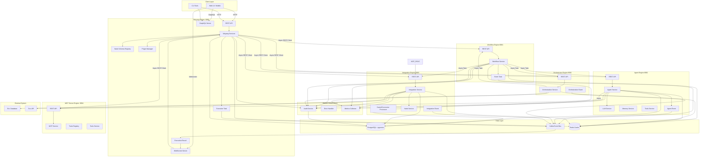
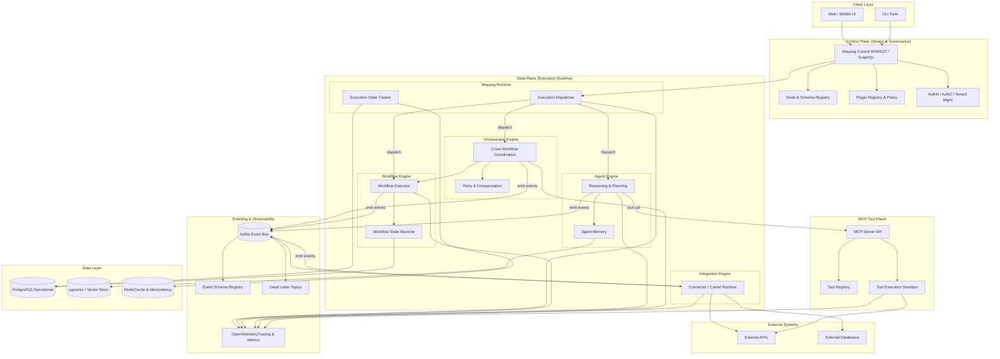
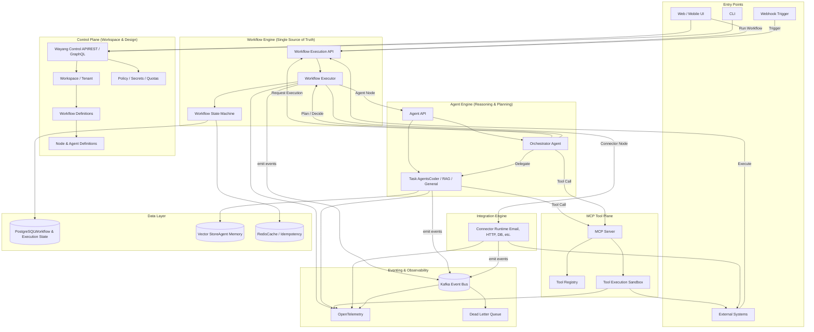

# Wayang Platform - Architecture Diagrams

## High-Level Service Architecture

Low Code Agentic AI & Integration Platform

```mermaid
graph TB
    subgraph "Client Layer"
        UI[Web UI / Mobile]
        CLI[CLI Tools]
    end
    
    subgraph "Wayang Engine :8080"
        WE_RA[REST API]
        WE_GQL[GraphQL Server]
        WE_WS[WebSocket Server]
        WE_SVC[Wayang Services]
        WE_SCH[Node Schema Registry]
        WE_PLG[Plugin Manager]
        WE_TASK[Execution Task]
        WE_RESULT[Execution Result]
    end
    
    subgraph "Workflow Engine:8081"
        WF_RA[REST API]
        WF_SVC[Workflow Service]
        WF_EVENT[Event Task]
    end

    subgraph "Agent Engine:8082"
        AE_RA[REST API]
        AE_SVC[Agent Service] 
        AE_LLM[LLM Service]
        AE_MEM[Memory Service]
        AE_TOOL[Tools Service]
        AE_EVENT[Agent Event]
    end

    subgraph "Orchestrator Engine:8082"
        OE_RA[REST API]
        OE_SVC[Orchestration Service]
        OE_EVENT[Orchestration Event]
    end
    
    subgraph "Shared Infrastructure"
        AUDIT[Audit Service]
        ERROR[Error Handler]
        METRICS[Metrics Collector]
    end
    
    subgraph "Data Layer"
        PG[(PostgreSQL + pgvector)]
        KAFKA[Kafka Event Bus]
        REDIS[(Redis Cache)]
    end

    subgraph "Integration Engine:8083"
        IE_RA[REST API]
        IE_CP[Camel/Connector Processor]
        IE_NODE[Node Service]
        IE_EVENT[Integration Event]
        IE_SVC[Integration Service]
    end

    subgraph "MCP Server Engine: 8084"
        MCP_RA[REST API]
        MCP_SVC[MCP Service]
        MCP_TR[Tools Registry]
        MCP_TSVC[Tools Service]
    end

    subgraph "External System"
        EXT_DB[Ext. Database]
        EXT_API[Ext. API]
    end

    UI -->|HTTP| WE_RA
    UI -->|Websocket| WE_WS
    UI -->|GraphQL| WE_GQL
    CLI -->|HTTP| WE_RA
    CLI --> WE_GQL
    
    WE_RA --> WE_SVC
    WE_SVC --> WE_TASK
    WE_TASK --> KAFKA
    WE_RESULT --> WE_WS

    WE_SVC --> WE_PLG
    WE_SVC --> WE_SCH
    WE_WS --> WE_SVC
    WE_SVC --> AUDIT
    WE_SVC --> PG
    WE_SVC --> REDIS
    WE_SVC -->|Async REST Client| MCP_RA
    WE_SVC -->|Async REST Client| IE_RA
    WE_SVC -->|Async REST Client| WF_RA
    WE_SVC -->|Async REST Client| OE_RA
    WE_SVC -->|Async REST Client| AE_RA

    KAFKA --> WE_RESULT

    WF_RA --> WF_SVC
    WF_SVC --> WF_EVENT
    WF_SVC -->|Async Task| AE_RA 
    WF_SVC -->|Async Task| IE_RA
    WF_SVC -->|Async Task| OE_RA
    WF_SVC --> AUDIT
    WF_EVENT --> KAFKA
    WF_SVC --> PG
    WF_SVC --> METRICS
    WF_SVC --> AUDIT
    WF_SVC --> REDIS

    AE_RA --> AE_SVC
    AE_SVC --> AE_LLM
    AE_SVC --> AE_EVENT
    AE_SVC --> METRICS
    AE_SVC --> AUDIT
    AE_SVC --> PG
    AE_SVC --> REDIS
    AE_EVENT --> KAFKA
    AE_SVC -->|Async| MCP_RA


    OE_EVENT --> KAFKA
    OE_RA --> OE_SVC
    OE_SVC --> METRICS
    OE_SVC --> AUDIT
    OE_SVC --> REDIS
    OE_SVC -->|Async Task| WF_RA

    IE_EVENT --> KAFKA
    IE_RA --> IE_SVC
    IE_SVC --> IE_NODE
    IE_SVC --> METRICS
    IE_SVC --> AUDIT
    IE_SVC --> REDIS
    IE_SVC --> PG

    IE_SVC --> EXT_DB
    IE_SVC --> EXT_API
  
    MCP_RA --> MCP_SVC
    MCP_RSVC --> IE_RA


    

    AUDIT --> PG

```

```mermaid
graph TB

%% =========================
%% Client Layer
%% =========================
subgraph Client_Layer["Client Layer"]
    UI[Web / Mobile UI]
    CLI[CLI Tools]
end

%% =========================
%% Control Plane
%% =========================
subgraph Control_Plane["Control Plane (Design & Governance)"]
    CP_API[Wayang Control APIREST / GraphQL]
    CP_SCHEMA[Node & Schema Registry]
    CP_PLUGIN[Plugin Registry & Policy]
    CP_AUTH[AuthN / AuthZ / Tenant Mgmt]
end

%% =========================
%% Data Plane - Execution
%% =========================
subgraph Data_Plane["Data Plane (Execution Runtime)"]

    subgraph Wayang_Runtime["Wayang Runtime"]
        WE_EXEC[Execution Dispatcher]
        WE_STATE[Execution State Tracker]
    end

    subgraph Workflow_Engine["Workflow Engine"]
        WF_EXEC[Workflow Executor]
        WF_STATE[Workflow State Machine]
    end

    subgraph Agent_Engine["Agent Engine"]
        AE_REASON[Reasoning & Planning]
        AE_MEM[Agent Memory]
    end

    subgraph Orchestrator_Engine["Orchestrator Engine"]
        OE_COORD[Cross-Workflow Coordination]
        OE_COMP[Retry & Compensation]
    end

    subgraph Integration_Engine["Integration Engine"]
        IE_EXEC[Connector / Camel Runtime]
    end

end

%% =========================
%% MCP Tool Plane
%% =========================
subgraph MCP_Plane["MCP Tool Plane"]
    MCP_API[MCP Server API]
    MCP_REG[Tool Registry]
    MCP_EXEC[Tool Execution Sandbox]
end

%% =========================
%% Eventing & Observability
%% =========================
subgraph Eventing["Eventing & Observability"]
    KAFKA[(Kafka Event Bus)]
    SCHEMA_REG[Event Schema Registry]
    OTEL[OpenTelemetryTracing & Metrics]
    DLQ[Dead Letter Topics]
end

%% =========================
%% Data Layer
%% =========================
subgraph Data_Layer["Data Layer"]
    PG_OP[(PostgreSQLOperational)]
    PG_VEC[(pgvector / Vector Store)]
    REDIS[(RedisCache & Idempotency)]
end

%% =========================
%% External Systems
%% =========================
subgraph External["External Systems"]
    EXT_API[External APIs]
    EXT_DB[External Databases]
end

%% =========================
%% Client to Control Plane
%% =========================
UI --> CP_API
CLI --> CP_API

%% =========================
%% Control Plane Internals
%% =========================
CP_API --> CP_SCHEMA
CP_API --> CP_PLUGIN
CP_API --> CP_AUTH

%% =========================
%% Control → Data Plane
%% =========================
CP_API --> WE_EXEC

%% =========================
%% Wayang Runtime Flow
%% =========================
WE_EXEC -->|dispatch| WF_EXEC
WE_EXEC -->|dispatch| AE_REASON
WE_EXEC -->|dispatch| OE_COORD

WE_STATE --> PG_OP
WE_STATE --> REDIS

%% =========================
%% Workflow Engine
%% =========================
WF_EXEC --> WF_STATE
WF_STATE --> PG_OP
WF_EXEC -->|emit events| KAFKA

%% =========================
%% Agent Engine
%% =========================
AE_REASON --> AE_MEM
AE_MEM --> PG_VEC
AE_REASON -->|tool call| MCP_API
AE_REASON -->|emit events| KAFKA

%% =========================
%% Orchestrator Engine
%% =========================
OE_COORD --> OE_COMP
OE_COORD -->|emit events| KAFKA
OE_COORD --> WF_EXEC

%% =========================
%% Integration Engine
%% =========================
KAFKA --> IE_EXEC
IE_EXEC --> EXT_API
IE_EXEC --> EXT_DB
IE_EXEC -->|emit events| KAFKA

%% =========================
%% MCP Tool Plane
%% =========================
MCP_API --> MCP_REG
MCP_API --> MCP_EXEC
MCP_EXEC --> EXT_API

%% =========================
%% Event Governance
%% =========================
KAFKA --> SCHEMA_REG
KAFKA --> DLQ

%% =========================
%% Observability
%% =========================
WE_EXEC --> OTEL
WF_EXEC --> OTEL
AE_REASON --> OTEL
OE_COORD --> OTEL
IE_EXEC --> OTEL
MCP_EXEC --> OTEL
```

```mermaid
graph TB

%% =====================================================
%% Client & External Entry Points
%% =====================================================
subgraph Entry["Entry Points"]
    UI[Web / Mobile UI]
    CLI[CLI]
    WEBHOOK[Webhook Trigger]
    EXT_SYS[External Systems]
end

%% =====================================================
%% Control Plane (Design-Time)
%% =====================================================
subgraph ControlPlane["Control Plane (Workspace & Design)"]
    CP_API[Wayang Control APIREST / GraphQL]
    WORKSPACE[Workspace / Tenant]
    WF_DEF[Workflow Definitions]
    NODE_DEF[Node & Agent Definitions]
    POLICY[Policy / Secrets / Quotas]
end

%% =====================================================
%% Workflow Engine (Execution Authority)
%% =====================================================
subgraph WorkflowEngine["Workflow Engine (Single Source of Truth)"]
    WF_API[Workflow Execution API]
    WF_EXEC[Workflow Executor]
    WF_STATE[Workflow State Machine]
end

%% =====================================================
%% Agent Engine (Intelligence Only)
%% =====================================================
subgraph AgentEngine["Agent Engine (Reasoning & Planning)"]
    AGENT_API[Agent API]
    ORCH_AGENT[Orchestrator Agent]
    TASK_AGENT[Task AgentsCoder / RAG / General]
end

%% =====================================================
%% MCP Tool Plane (All Tools)
%% =====================================================
subgraph MCPPlane["MCP Tool Plane"]
    MCP_API[MCP Server]
    MCP_REG[Tool Registry]
    MCP_EXEC[Tool Execution Sandbox]
end

%% =====================================================
%% Integration Engine (Side Effects)
%% =====================================================
subgraph IntegrationEngine["Integration Engine"]
    INT_EXEC[Connector Runtime Email, HTTP, DB, etc.]
end

%% =====================================================
%% Eventing & Observability
%% =====================================================
subgraph Eventing["Eventing & Observability"]
    KAFKA[(Kafka Event Bus)]
    OTEL[OpenTelemetry]
    DLQ[Dead Letter Queue]
end

%% =====================================================
%% Data Layer
%% =====================================================
subgraph DataLayer["Data Layer"]
    PG_OP[(PostgreSQLWorkflow & Execution State)]
    PG_VEC[(Vector StoreAgent Memory)]
    REDIS[(RedisCache / Idempotency)]
end

%% =====================================================
%% Control Plane Flow
%% =====================================================
UI --> CP_API
CLI --> CP_API

CP_API --> WORKSPACE
WORKSPACE --> WF_DEF
WF_DEF --> NODE_DEF
CP_API --> POLICY

%% =====================================================
%% Execution Triggers
%% =====================================================
UI -->|Run Workflow| WF_API
WEBHOOK -->|Trigger| WF_API
EXT_SYS -->|Execute| WF_API
ORCH_AGENT -->|Request Execution| WF_API

%% =====================================================
%% Workflow Execution
%% =====================================================
WF_API --> WF_EXEC
WF_EXEC --> WF_STATE
WF_STATE --> PG_OP
WF_STATE --> REDIS

WF_EXEC -->|emit events| KAFKA
WF_EXEC --> OTEL

%% =====================================================
%% Node Execution Model
%% =====================================================
WF_EXEC -->|Agent Node| AGENT_API
WF_EXEC -->|Connector Node| INT_EXEC

%% =====================================================
%% Agent Behavior
%% =====================================================
AGENT_API --> ORCH_AGENT
AGENT_API --> TASK_AGENT

ORCH_AGENT -->|Plan / Decide| WF_EXEC
ORCH_AGENT -->|Delegate| TASK_AGENT

TASK_AGENT -->|Tool Call| MCP_API
ORCH_AGENT -->|Tool Call| MCP_API

TASK_AGENT --> PG_VEC
TASK_AGENT -->|emit events| KAFKA
TASK_AGENT --> OTEL

%% =====================================================
%% MCP Tool Execution
%% =====================================================
MCP_API --> MCP_REG
MCP_API --> MCP_EXEC
MCP_EXEC --> EXT_SYS
MCP_EXEC --> OTEL

%% =====================================================
%% Integration Execution
%% =====================================================
INT_EXEC --> EXT_SYS
INT_EXEC -->|emit events| KAFKA
INT_EXEC --> OTEL

%% =====================================================
%% Event Governance
%% =====================================================
KAFKA --> DLQ
KAFKA --> OTEL
```