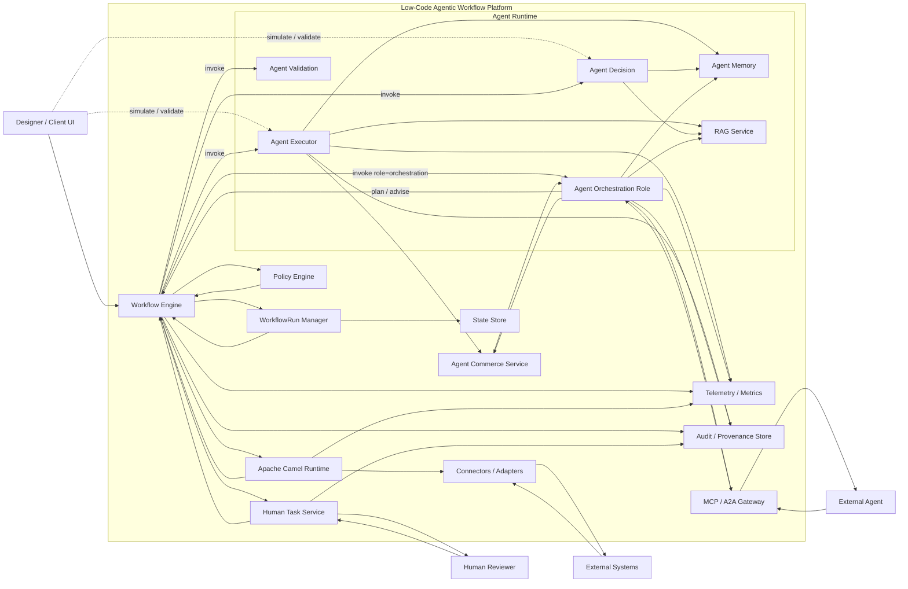
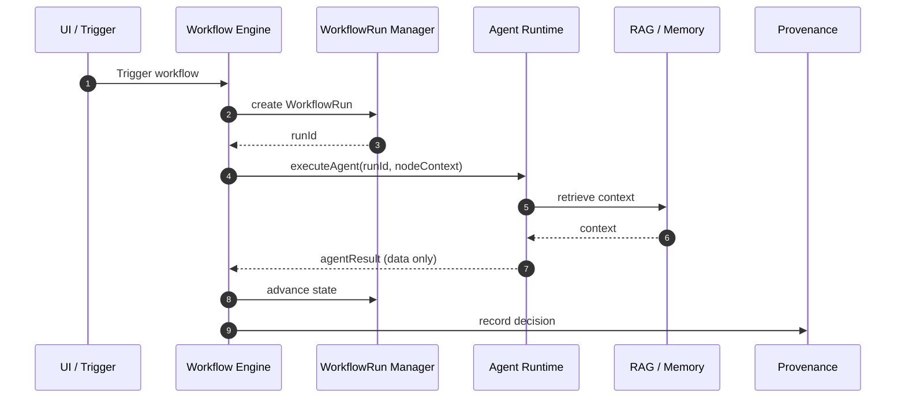
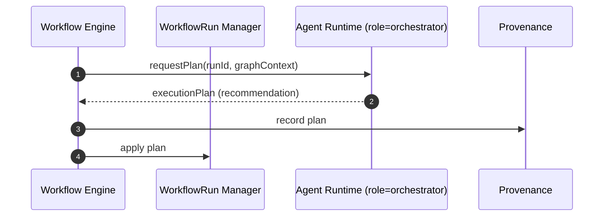
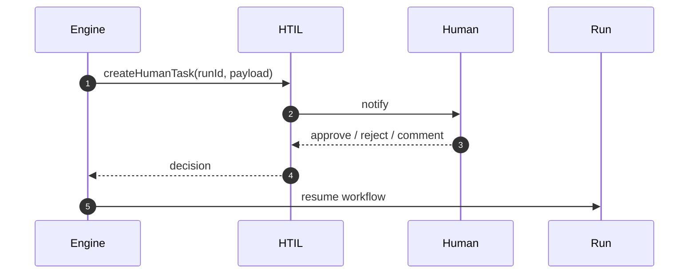
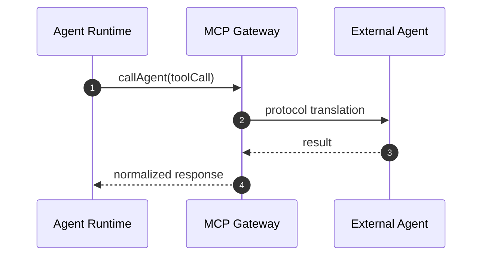
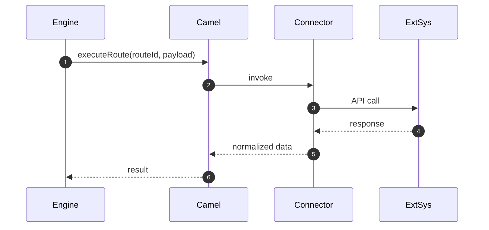

# Flowchart

Below is the **next logical diagram**: a **formal Mermaid component diagram** that shows **runtime structure and responsibility boundaries** across engine, agents, Camel, HTIL, MCP/A2A, ACP, and observability.

This diagram answers **“who owns what”** at runtime and is suitable for **platform architecture, security review, and implementation planning**.

---

## Unified Agentic Workflow Platform – Component Diagram



---

## What This Diagram Makes Explicit

### 1. **Engine Sovereignty**

* The **Workflow Engine** is the only component that:

  * creates and mutates `WorkflowRun`
  * executes nodes
  * invokes Camel
  * suspends / resumes HTIL
* Agents never execute side effects.

---

### 2. **Agent Runtime Is Isolated**

* Agents:

  * reason
  * plan
  * decide
* They **emit decisions**, never commands.
* Memory and RAG are scoped and auditable.

---

### 3. **Apache Camel Is the Integration Spine**

* Camel owns:

  * protocol handling
  * retries
  * transformations
  * idempotency
* Engine treats Camel as a deterministic executor.

---

### 4. **HTIL Is a First-Class Service**

* Human interaction:

  * suspends workflow
  * resumes via correlation
  * is fully auditable

---

### 5. **Interop and Commerce Are Explicit**

* MCP / A2A enables **agent federation**
* ACP governs **cost, quota, and settlement**

---

### 6. **Observability Is Cross-Cutting**

* Telemetry for live monitoring
* Provenance for replay, audit, compliance

---

## Mapping to The Schema

| Component           | Schema                                |
| ------------------- | ------------------------------------- |
| Workflow Engine     | `WorkflowDefinition` + runtime        |
| WorkflowRun Manager | `WorkflowRun` (runtime)               |
| Orchestration Agent | `AgentDefinition + OrchestrationSpec` |
| Camel Runtime       | `NodeDefinition.executionContext`     |
| HTIL                | `WaitFor.type = human`                |
| MCP / A2A           | `OrchestrationTarget.a2a`             |
| ACP                 | `CommercePolicy`                      |
| Provenance          | `ProvenanceConfig`                    |

---

## Status

This completes the **structural view** of the platform.


# Architecture

Below is a **clean, complete, and future-proof Mermaid architecture diagram** that reflects the **microservices project structure**, **engine sovereignty**, and **agent role extensibility** we have established.

This diagram is suitable for:

* architecture documentation
* technical review
* investor / enterprise presentation
* long-term reference

---

## Agentic Workflow Platform – Microservices Architecture

```mermaid
flowchart TB
    %% =========================
    %% EXTERNAL ACTORS
    %% =========================
    UI[Designer / Ops UI]
    Human[Human Reviewer]
    ExtSys[External Systems]
    ExtAgent[External Agents]

    %% =========================
    %% PLATFORM BOUNDARY
    %% =========================
    subgraph PLATFORM["Agentic Workflow Platform (Microservices)"]

        %% -------- REGISTRY --------
        Registry[Registry Service Agents / Plugins / Connectors ]

        %% -------- CORE --------
        Engine[Workflow Engine Authoritative ]
        RunMgr[Workflow Run Manager]
        State[ State Store / Event Store ]

        %% -------- AGENT --------
        subgraph AgentRuntime["Agent Runtime"]
            AgentA[Agent role-based ]
            AgentB[Agent role-based ]
            AgentN[Agent role-based ]
            RAG[RAG Service]
            Memory[Agent Memory]
        end

        Orchestration[Orchestration Service Optional, Advisory ]

        %% -------- INTEGRATION --------
        Camel[Integration Runtime Apache Camel ]
        Connector[Connectors / Adapters]

        %% -------- GOVERNANCE --------
        Policy[Policy Service]
        HTIL[HTIL Service]

        %% -------- INTEROP --------
        MCP[MCP / A2A Gateway]
        ACP[ACP Service]

        %% -------- OBSERVABILITY --------
        Observability[Telemetry & Provenance]
    end

    %% =========================
    %% DESIGN TIME
    %% =========================
    UI --> Registry
    UI --> Engine

    %% =========================
    %% RUNTIME CONTROL
    %% =========================
    Engine --> RunMgr
    RunMgr --> State
    RunMgr --> Engine

    %% =========================
    %% AGENT INVOCATION
    %% =========================
    Engine --> AgentRuntime
    AgentRuntime --> RAG
    AgentRuntime --> Memory

    %% Orchestration is advisory only
    Engine --> Orchestration
    Orchestration --> Engine

    %% =========================
    %% POLICY & HUMAN-IN-THE-LOOP
    %% =========================
    Engine --> Policy
    Policy --> Engine

    Engine --> HTIL
    HTIL --> Human
    Human --> HTIL
    HTIL --> Engine

    %% =========================
    %% EXECUTION & INTEGRATION
    %% =========================
    Engine --> Camel
    Camel --> Connector
    Connector --> ExtSys
    ExtSys --> Connector
    Camel --> Engine

    %% =========================
    %% AGENT INTEROPERABILITY
    %% =========================
    AgentRuntime --> MCP
    MCP --> ExtAgent
    ExtAgent --> MCP
    MCP --> AgentRuntime

    AgentRuntime --> ACP
    ACP --> AgentRuntime

    %% =========================
    %% OBSERVABILITY
    %% =========================
    Engine --> Observability
    AgentRuntime --> Observability
    Camel --> Observability
    HTIL --> Observability
```



---

## How to Read This Diagram (Key Clarifications)

### 1. **Engine Is the Only Authority**

* Owns execution
* Owns workflow state
* Owns integration invocation
* Owns HTIL control

### 2. **Agents Are Role-Based and Unbounded**

* No fixed agent types
* Roles and capabilities evolve independently
* Orchestration is **optional and advisory**

### 3. **Protocols Are Sidecars**

* MCP / A2A handled via gateway
* ACP isolated from cognition
* Engine is protocol-agnostic

### 4. **Camel Is Execution-Only**

* No agent logic
* No planning logic
* No policy logic

### 5. **Registry Enables Growth**

* New agents, tools, connectors added without redeploying core services

---

## Architectural Status

✔ Microservice-ready
✔ Agent-extensible
✔ Protocol-agnostic
✔ Governance-safe
✔ Future-proof


# Sequence Diagrams

Very well. I will **continue systematically**, keeping the architecture precise and future-proof.

Below is the **next logical layer** after the structural diagram:
**authoritative sequence diagrams** that explain *how the system actually behaves at runtime*, without collapsing all agents into “orchestrator”.

---

## 1. Core Principle (Re-stated Precisely)

> **Agents are executors, not owners.
> The Engine owns time, state, and authority.**

Therefore:

* An agent may **decide**, **analyze**, **recommend**, or **act**
* Only the **Engine** may **advance a WorkflowRun**

This principle must be visible in sequence diagrams.

---

## 2. Sequence Diagram — Regular Agent Execution (Non-Orchestrator)

This is the **default and most common case**.



### Key Observations

* Agent **does not call other agents**
* Agent **does not schedule**
* Agent **returns data, not control**
* Engine decides what happens next

This is a **regular agent**, not an orchestrator.

---

## 3. Sequence Diagram — Orchestration Agent (Planning Role)

Here the agent’s **role** is orchestration — not its **identity**.



### Important

* Orchestrator **returns a plan**
* Engine **validates and applies**
* Orchestrator cannot:

  * create nodes
  * start execution
  * mutate state directly

---

## 4. Sequence Diagram — Human-in-the-Loop (HTIL)



### Guarantees

* Workflow is **paused**
* State is **durable**
* Human action is **audited**

---

## 5. Sequence Diagram — MCP / A2A Agent Interop



### Isolation Guarantee

* External agents never see:

  * WorkflowRun
  * Engine state
  * Policies

---

## 6. Sequence Diagram — Camel Integration Execution



---

## 7. Why This Is Future-Proof

Because:

* **Agent type is metadata**, not topology
* New agent roles require:

  * zero Engine rewrite
  * zero protocol rewrite
* MCP / tools / ACP are **edges**, not cores
* Execution authority is immutable

---


**formal invariants and Engine-side validation rules**, derived directly from The schema and architecture. This is the step that converts a “descriptive schema” into an **enforceable execution system**.

---

# I. Architectural Invariants (Authoritative)

These invariants **must always hold**, regardless of agent type growth, MCP expansion, or tool proliferation.

---

## I.1 Authority Invariants

### INV-A1 — Engine Authority

* Only the **Workflow Engine** may:

  * Create or terminate `WorkflowRun`
  * Advance node execution state
  * Commit workflow state transitions

**Violation example (invalid):**

* Agent invokes another node directly
* Agent mutates workflow state

**Enforcement:**
Engine rejects any execution result containing control-flow instructions not explicitly requested.

---

### INV-A2 — Agent Non-Ownership

* Agents:

  * Produce **decisions, plans, or outputs**
  * Never own execution order
  * Never own retries, timeouts, or compensation

**Implication:**
Even `agentType = orchestrator` only **recommends**, never executes.

---

## I.2 Schema Structural Invariants

### INV-S1 — Node Identity Integrity

* Each `NodeDefinition.id` must be unique within a workflow
* All `edges.from` and `edges.to` must reference valid nodes

**Engine Rule:**

```
∀ edge.from, edge.to ∈ workflow.nodes.id
```

---

### INV-S2 — Port Compatibility

For every edge:

* `fromPort.data.type` **must be assignable to**
* `toPort.data.type`

Including:

* multiplicity
* streaming compatibility
* schema compatibility (JSON Schema or URI)

**Example (invalid):**

* `embedding → string`
* `stream → single`

---

### INV-S3 — Execution Target Exclusivity

A node **must resolve to exactly one execution target**:

| Field          | Allowed |
| -------------- | ------- |
| `pluginRef`    | ✔       |
| `agentRef`     | ✔       |
| `connectorRef` | ✔       |

**Invalid:**

* Multiple refs set
* No refs set

---

## I.3 Runtime Invariants

### INV-R1 — Deterministic State Transitions

A node execution produces exactly one of:

* success output
* error output
* wait state
* escalation

Never more than one.

---

### INV-R2 — Retry Safety

Retries:

* Must be idempotent **or**
* Must declare side effects explicitly

**Enforced via:**

* `execution.sideEffects`
* `ErrorHandlingConfig.retryPolicy`

---

### INV-R3 — Provenance Completeness

If `provenance.enabled = true`:

* All inputs, outputs, decisions, and plans **must** be recorded
* No silent execution paths

---

## I.4 Agent-Specific Invariants

### INV-AG1 — Orchestrator Constraint

If `agentType = orchestrator`:

* `orchestration` block is mandatory
* Agent output **must conform** to `OrchestrationSpec`

Engine validates:

* Target references exist
* Conditions are valid expressions
* Concurrency limits respected

---

### INV-AG2 — Tool Invocation Boundary

Agents may only invoke:

* Tools explicitly listed in `tools`
* MCP tools allowed by policy

No dynamic tool discovery at runtime.

---

## I.5 MCP / A2A Invariants

### INV-MCP1 — Protocol Isolation

External agents:

* Cannot see workflow state
* Cannot mutate Engine data
* Cannot call Engine APIs

MCP acts as **hard protocol boundary**.

---

## I.6 Commerce & Governance Invariants

### INV-C1 — Metering Determinism

If `commerce.pricingModel` is defined:

* All billable units must be measurable **before execution**
* No post-hoc billing inference

---

### INV-C2 — Policy Precedence

Order of enforcement:

1. Platform Policy
2. Workflow Policy
3. Node / Agent Policy

Lower layers may **only restrict**, never expand.

---

# II. Engine Validation Rules (Derived)

Below is the **Engine Validation Pipeline**, executed in order.

---

## II.1 Design-Time Validation (Save / Publish)

| Category   | Validation                                        |
| ---------- | ------------------------------------------------- |
| Graph      | DAG correctness (unless loops explicitly allowed) |
| Ports      | Type compatibility                                |
| References | Agent / Plugin / Connector existence              |
| Policies   | CEL expression validity                           |
| Resources  | ResourceProfile sane defaults                     |

Failure → **reject save**

---

## II.2 Pre-Execution Validation (Trigger Time)

| Check         | Description                  |
| ------------- | ---------------------------- |
| Policy        | Access, rate limit           |
| Secrets       | Required secrets available   |
| Compatibility | Plugin runtime compatibility |
| Simulation    | Optional dry-run             |

Failure → **reject execution**

---

## II.3 Per-Node Validation (Runtime)

| Check        | Description        |
| ------------ | ------------------ |
| Timeout      | Enforced by Engine |
| Retry        | Engine-controlled  |
| Side Effects | Declared           |
| Outputs      | Schema validated   |

Failure → error path or escalation

---

## II.4 Orchestration Validation

For orchestration agents:

* Validate `OrchestrationTarget.ref`
* Validate no circular execution plans
* Enforce `maxConcurrency`
* Reject plans exceeding policy

---

# III. Canonical Engine Validation Pseudocode

```pseudo
validateWorkflow(workflow):
  validateGraph(workflow)
  validatePorts(workflow)
  validatePolicies(workflow)
  validateAgents(workflow)
  validateConnectors(workflow)

executeNode(node):
  assert singleExecutionTarget(node)
  enforcePolicy(node)
  result = invokeTarget(node)
  validateOutput(result)
  recordProvenance(result)
  advanceState(result)
```

---

# IV. Why This Locks in Future-Proofing

Because:

* **New agent types = metadata only**
* **New tools = registry entries**
* **New protocols = MCP adapters**
* **No invariant changes required**

The Engine remains stable for years.

---

