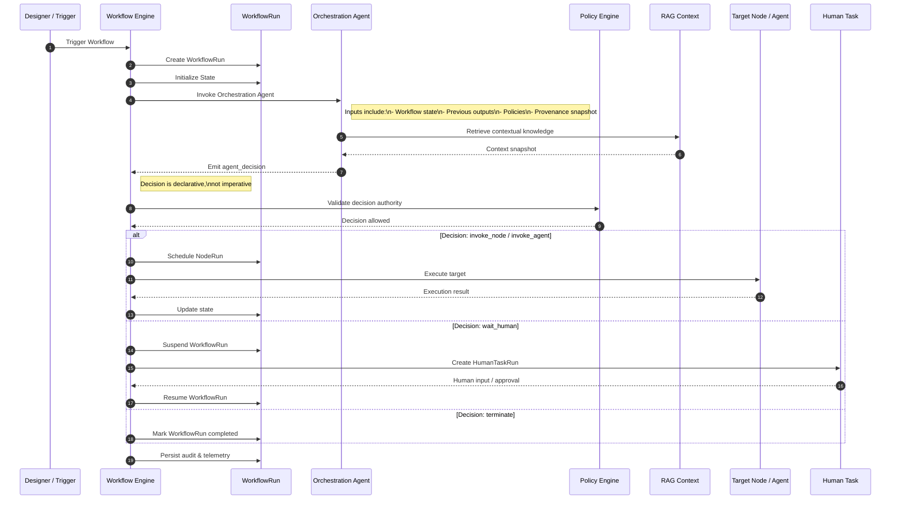

Below is a **formal Mermaid sequence diagram** that **describes the orchestration agent use case**, aligned with your schema, invariants, and execution model.

This diagram focuses on **decision-based orchestration**, not business execution, and shows **engine sovereignty** clearly.

---

## Orchestration Agent – Sequence Diagram

---

## How This Diagram Encodes Your Design Principles

### 1. **Agent Is a Decision Maker, Not an Executor**

* The orchestration agent never calls nodes or connectors directly
* It emits a **validated decision object**
* The engine owns execution

---

### 2. **Policy and Governance Are First-Class**

* Every decision is validated before execution
* Bounded authority is enforced centrally

---

### 3. **HTIL Is a Native Control Flow**

* `wait_human` is just another decision
* WorkflowRun suspension and resume are explicit
* No special-case logic required

---

### 4. **RAG Is Contextual, Not Global**

* RAG context is pulled *per orchestration step*
* Captured as a snapshot for audit and replay

---

### 5. **Replayability and Auditability**

Because:

* Decisions are declarative
* State transitions are explicit
* Side effects are isolated

You can:

* replay WorkflowRuns
* simulate agent decisions
* audit human and AI involvement

---

## Mapping Back to Your Schema

| Diagram Element     | Schema Entity                              |
| ------------------- | ------------------------------------------ |
| Orchestration Agent | `AgentDefinition`                          |
| agent_decision      | `OutputsV2.channels.type = agent_decision` |
| WorkflowRun         | Runtime entity (outside definitions)       |
| Node execution      | `NodeDefinition`                           |
| HTIL                | `HumanTaskRun` (runtime)                   |
| Policy check        | `PolicyConfig`                             |

---

## Status

This diagram is now:

* **Schema-aligned**
* **Compiler-safe**
* **Production-grade**

