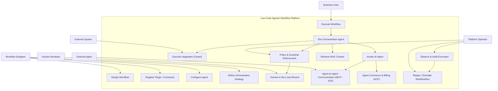

Below is a **formal Mermaid use case diagram** that captures the **core use cases of your unified low-code agentic workflow platform**, including **Camel-based integration, orchestration agents, HTIL, RAG, MCP/A2A, and ACP**.

This diagram is **capability-oriented**, not implementation-oriented, and is suitable for **architecture documents and governance reviews**.

---

## Unified Agentic Workflow Platform – Use Case Diagram

---

## How to Read This Diagram

### 1. **Primary Actors**

* **Workflow Designer**: Defines structure, agents, and orchestration logic
* **Business User**: Triggers workflows and consumes outcomes
* **Platform Operator**: Enforces policy, observability, and governance
* **Human Reviewer**: Participates only when HTIL is required
* **External Agent/System**: Integrated via MCP, A2A, or Camel

---

### 2. **Core Platform Capabilities**

| Capability              | Meaning                                |
| ----------------------- | -------------------------------------- |
| Design Workflow         | Graph, nodes, edges, triggers          |
| Configure Agent         | Model, memory, tools, policies         |
| Define Orchestration    | Sequential, parallel, dynamic planning |
| Execute Workflow        | Engine-owned runtime execution         |
| Run Orchestration Agent | Decision-making, not execution         |
| Execute Integration     | Camel routes, connectors, side effects |
| Retrieve RAG Context    | Scoped, auditable context retrieval    |
| Human-in-the-Loop       | Review, approve, correct, resume       |
| Policy Enforcement      | Centralized guardrails                 |
| Observability           | Telemetry, provenance, audit           |
| MCP / A2A               | Cross-agent interoperability           |
| ACP                     | Pricing, quota, settlement             |
| Replay / Simulation     | Deterministic re-execution             |

---

## Key Architectural Signals Encoded

### ✔ Engine Sovereignty

Execution (`Execute Workflow`, `Execute Integration`) is never delegated to agents.

### ✔ Agents as Cognitive Units

Agents participate only in:

* Planning
* Decision-making
* Evaluation
* Coordination

### ✔ HTIL Is an Extension, Not an Exception

Human involvement is triggered by:

* Policy
* Confidence
* Failure
* Escalation rules

### ✔ Commerce Is Explicit

Agent usage can be:

* Metered
* Quota-bounded
* Settled via ACP

---

## Alignment With Your Schema

| Diagram Use Case    | Schema Element                        |
| ------------------- | ------------------------------------- |
| Design Workflow     | `WorkflowDefinition`                  |
| Execute Workflow    | `WorkflowRun` (runtime)               |
| Orchestration Agent | `AgentDefinition + OrchestrationSpec` |
| Camel Integration   | `NodeDefinition + ExecutionContext`   |
| RAG                 | `ContextBinding`                      |
| HTIL                | `WaitFor.type = human`                |
| MCP / A2A           | `OrchestrationTarget.a2a`             |
| ACP                 | `CommercePolicy`                      |

---

## Status

This use case diagram is:

* **Complete**
* **Non-overlapping**
* **Enterprise-grade**
* **Consistent with your schema**

