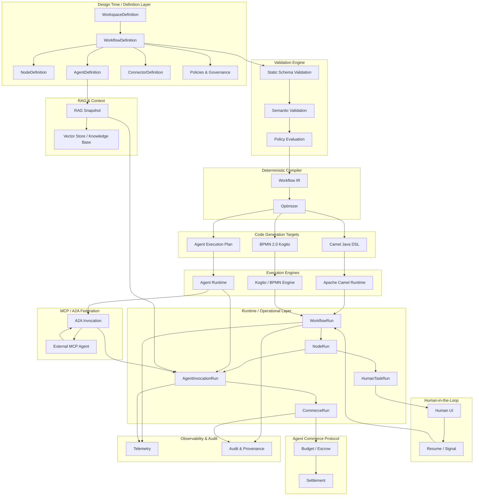

Below is a **complete, coherent Mermaid diagram** that captures the **entire platform architecture and lifecycle**, including:

* Design-time definitions
* Validation and compilation
* Runtime execution
* Camel, BPMN, and Agent targets
* HTIL, RAG, MCP/A2A, ACP
* Clear separation between **definition** and **runtime**

The diagram is intentionally **single-source-of-truth** and suitable for documentation, architecture reviews, or implementation alignment.

---

## Complete Platform Mermaid Diagram

---

## How to Read This Diagram (Key Points)

### 1. **Hard Separation of Concerns**

* **Top**: immutable *definitions*
* **Middle**: validation + deterministic compilation
* **Bottom**: mutable *runtime executions*

This enforces:

* Version safety
* Replayability
* Engine independence

---

### 2. **Multiple Execution Targets**

The same workflow definition can deterministically produce:

* Apache Camel routes
* BPMN (Kogito)
* Agent execution plans

This is a **compiler**, not a renderer.

---

### 3. **HTIL Is a First-Class Runtime Concern**

* Human tasks suspend `WorkflowRun`
* Resume happens via signals
* Requires persistence (enforced by invariants)

---

### 4. **Agents Are Both Local and Federated**

* Local agents run plans
* MCP/A2A enables external agents
* Trust and policy are enforced before invocation

---

### 5. **ACP Is Orthogonal but Enforced**

* Commerce is not embedded in logic
* It gates execution and settles after completion
* Clean economic isolation

---

## Architectural Status

With this diagram, your platform now has:

* A **formal execution model**
* A **clear compiler pipeline**
* A **runtime aligned with Camel, Kogito, and agentic AI**
* Explicit support for **HTIL, RAG, MCP/A2A, ACP**

This is a **complete reference architecture**.

---

### When ready, the next logical artifacts would be:

* Mermaid **sequence diagrams** (runtime behavior)
* A **single concrete JSON example** mapped to this diagram
* A **reference implementation skeleton**

Proceed when appropriate.
