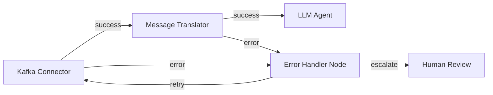

# Integration Nodes using EIP & Apache Camel for Wayang AI Agent Workflow Platform

## Overview

This specification integrates **Enterprise Integration Patterns (EIP)** via **Apache Camel** into the Wayang AI Agent Workflow Builder. This creates a hybrid platform where:

1. **AI-native nodes** (Planner, Critic, RAG, LLM, etc.) handle intelligent reasoning
2. **Integration nodes** (EIP-based) handle enterprise connectivity, routing, transformation, and orchestration
3. Both node types share the same **error-as-input semantics**, **audit trails**, and **HITL capabilities**

This allows workflows to:
- Route messages between systems (e.g., Kafka → LLM → Database → SOAP API)
- Transform data (JSON ↔ XML ↔ CSV ↔ Protocol Buffers)
- Aggregate, split, enrich, and filter data streams
- Connect to 300+ enterprise systems via Camel connectors
- Apply enterprise patterns (Scatter-Gather, Content-Based Router, Message Translator, etc.)

---

## Architecture Principles

### 1. **Node Type Hierarchy**

```
AbstractNode (base for all nodes)
├── AgenticNode (AI reasoning nodes)
│   ├── PlannerNode
│   ├── CriticNode
│   ├── RAGNode
│   └── ... (existing AI nodes)
└── IntegrationNode (EIP/Camel nodes)
    ├── AbstractRouterNode
    ├── AbstractTransformNode
    ├── AbstractEnricherNode
    └── AbstractConnectorNode
```

### 2. **Camel Integration Strategy**

- **Embedded Camel Context** per workflow execution
- **Route-per-node** pattern (each IntegrationNode = 1 Camel route)
- **Shared error handlers** with ErrorPayload schema
- **Unified observability** (OTel spans for both AI and Camel nodes)

### 3. **Error Handling Alignment**

All integration nodes emit `ErrorPayload` compatible with the existing error-as-input architecture:

```json
{
  "type": "IntegrationError",
  "subtype": "TransformationError | ConnectorError | RoutingError",
  "message": "...",
  "details": { "camelExchangeId": "...", "failedEndpoint": "..." },
  "retryable": true,
  "originNode": "integration-node-123",
  "timestamp": "2025-12-05T10:00:00Z"
}
```


**Example Usage**:

```json
{
  "id": "kafka-producer",
  "type": "Connector",
  "connector": {
    "component": "kafka",
    "uri": "kafka:orders?brokers=localhost:9092&serializerClass=org.apache.kafka.common.serialization.StringSerializer",
    "direction": "to"
  }
}
```


## Example: Hybrid AI + Integration Workflow

### Use Case: Invoice Processing with EIP + AI

```json
{
  "id": "invoice-processing",
  "nodes": [
    {
      "id": "kafka-source",
      "type": "Connector",
      "connector": {
        "component": "kafka",
        "uri": "kafka:invoices?brokers=localhost:9092",
        "direction": "from"
      }
    },
    {
      "id": "pdf-splitter",
      "type": "Splitter",
      "splitter": {
        "expression": "${body}",
        "streaming": true
      }
    },
    {
      "id": "ocr-node",
      "type": "MultimodalInference",
      "model": "tesseract-ocr"
    },
    {
      "id": "invoice-parser",
      "type": "LLMAgent",
      "prompt": "Extract invoice details: vendor, date, items, total",
      "model": "gpt-4"
    },
    {
      "id": "enricher",
      "type": "ContentEnricher",
      "enrichment": {
        "resourceUri": "sql:SELECT * FROM vendors WHERE id = ${body.vendorId}",
        "strategy": "merge"
      }
    },
    {
      "id": "validator",
      "type": "EvaluatorNode",
      "rules": ["total > 0", "vendorId exists"]
    },
    {
      "id": "router",
      "type": "ContentBasedRouter",
      "routingRules": [
        {
          "when": "${body.total} > 10000",
          "to": "direct:approval-queue"
        },
        {
          "when": "${body.total} <= 10000",
          "to": "direct:auto-process"
        }
      ]
    },
    {
      "id": "erp-connector",
      "type": "Connector",
      "connector": {
        "component": "http",
        "uri": "http://erp-system/api/invoices",
        "direction": "to"
      }
    }
  ],
  "connections": [
    { "from": "kafka-source", "to": "pdf-splitter", "fromPort": "output", "toPort": "input" },
    { "from": "pdf-splitter", "to": "ocr-node", "fromPort": "output", "toPort": "input" },
    { "from": "ocr-node", "to": "invoice-parser", "fromPort": "output", "toPort": "input" },
    { "from": "invoice-parser", "to": "enricher", "fromPort": "output", "toPort": "input" },
    { "from": "enricher", "to": "validator", "fromPort": "output", "toPort": "input" },
    { "from": "validator", "to": "router", "fromPort": "success", "toPort": "input" },
    { "from": "router", "to": "erp-connector", "fromPort": "output", "toPort": "input" }
  ]
}
```


## Integration with Existing Architecture

### 1. Node Registry Integration

Register integration nodes alongside AI nodes:

```json
{
  "nodeTypes": [
    {
      "id": "tech.kayys.wayang.nodes.integration.ContentBasedRouter",
      "category": "integration",
      "displayName": "Content Router",
      "icon": "router",
      "schema": "https://kayys.tech/schema/v1/nodes/integration/content-router.schema.json"
    },
    {
      "id": "tech.kayys.wayang.nodes.integration.MessageTranslator",
      "category": "integration",
      "displayName": "Message Translator",
      "icon": "transform",
      "schema": "https://kayys.tech/schema/v1/nodes/integration/translator.schema.json"
    }
  ]
}
```


### 2. Error Handling Integration

Integration nodes emit errors to the same error port:

