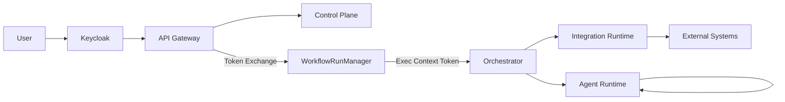

Short answer first (then the *why* and *how*):

> **Yes — security must exist in *all* components, including the workflow runtime — but NOT in the same way everywhere.**
> You implement **identity once**, **enforcement everywhere**, and **deep authorization where it matters**.

Below is a **Wayang-specific, multi-tenant, Keycloak-aligned security model** that avoids over-engineering while staying production-grade.

---

# 1. Core Principle for WAYANG Security

### ❌ Wrong approach

* “Every service talks to Keycloak”
* “Every runtime validates user JWTs”

### ✅ Correct approach

> **Control Plane = User security**
> **Execution Plane = System / Service security**

**Identity is resolved at the edge**, then **propagated as context**, not re-authenticated repeatedly.

---

# 2. Security Responsibility by Layer (Very Important)

## A. Edge & Control Plane (User-Facing)

### Components

* Wayang Studio (UI)
* API Gateway
* Workflow / Agent / Integration Definition Services

### Security Model

* **User JWT (OIDC)**
* **Keycloak realms = tenants**
* **RBAC / ABAC enforced here**

### Responsibilities

✔ Authenticate users
✔ Authorize design-time actions
✔ Enforce tenant boundaries
✔ Audit human actions

### Example

```text
User → Keycloak → JWT
JWT → API Gateway
Gateway → Control Plane services
```

**Only the Control Plane sees user identity.**

---

## B. Execution Plane (Workflow Runtime, Agent Runtime, Integration Runtime)

### 🔑 This is the critical part

### What execution services SHOULD NOT do

❌ Validate end-user JWTs
❌ Talk to Keycloak for login
❌ Care about UI roles

### What they MUST do

✅ Enforce **tenant isolation**
✅ Enforce **execution permissions**
✅ Validate **execution context**
✅ Use **service identity**

---

# 3. Correct Model: Execution Context Security

Instead of user JWTs, execution uses a **Signed Execution Context Token**.

---

## Execution Context Token (Internal)

Issued by **WorkflowRunManager**.

### Contains

```json
{
  "runId": "wf-run-123",
  "workflowId": "order-approval",
  "tenantId": "tenant-a",
  "environment": "prod",
  "initiator": {
    "type": "USER",
    "userId": "u-123",
    "roles": ["admin"]
  },
  "permissions": [
    "agent:invoke",
    "integration:call:sap"
  ],
  "issuedAt": 1710000000,
  "expiresAt": 1710003600
}
```

### Signed by

* Platform private key
* OR internal Keycloak client credentials

---

## Why this matters

* **Workflow Runtime is authoritative**
* Agent / Integration runtimes **trust WRM**, not the user
* Zero runtime dependency on Keycloak availability

---

# 4. Security Implementation per Component

## 1️⃣ API Gateway (MANDATORY)

### Enforces

* JWT validation (Keycloak)
* Realm / tenant resolution
* Rate limits per tenant
* Token exchange (User → Internal)

📌 *This is the only place that MUST talk to Keycloak for user auth.*

---

## 2️⃣ Control Plane Services

| Service                | Security          |
| ---------------------- | ----------------- |
| Workflow Definition    | RBAC + tenant     |
| Agent Definition       | RBAC + policy     |
| Integration Definition | Secret scope      |
| Schema Registry        | Read-only / admin |

✔ Uses Keycloak JWT
✔ Fine-grained permissions
✔ Full audit trail

---

## 3️⃣ Workflow Runtime (YES, IT NEEDS SECURITY)

### What it enforces

✔ Tenant isolation
✔ Execution ownership
✔ State access rules
✔ Retry & compensation permissions

### What it trusts

* **Only Execution Context Token**
* Never raw user JWT

📌 This is **non-negotiable** in multi-tenancy.

---

## 4️⃣ Agent Runtime

### Security responsibilities

✔ Validate execution context token
✔ Enforce tool permissions (MCP)
✔ Enforce model access policies
✔ Memory isolation per tenant

### Example

```text
Tenant A agent CANNOT:
- read Tenant B memory
- call Tenant B integration
```

---

## 5️⃣ Integration Runtime

### Enforces

✔ Connector allowlist
✔ Secret scope per tenant
✔ Data masking policies
✔ Rate limits

### Example

```text
Execution token → integration:sap:read
❌ integration:sap:write
```

---

# 5. Keycloak’s Exact Role in WAYANG

Keycloak is **NOT** your runtime security engine.

### Keycloak is responsible for:

* User identity
* Realm / tenant separation
* Human RBAC
* Token issuance

### WAYANG is responsible for:

* Execution authorization
* Runtime trust
* Agent autonomy boundaries

---

# 6. Recommended Architecture (Security View)



---

# 7. What NOT to Do (Common Mistakes)

❌ Pass user JWT deep into runtime
❌ Let agents talk directly to Keycloak
❌ Use UI roles inside execution logic
❌ Share secrets across tenants

---

